# Disabling Anonymous API Discovery in Your Kind Cluster

## Background

By default, Kubernetes grants unauthenticated users (in the system:unauthenticated group) access to certain non‑resource endpoints—specifically those used for API discovery. In hostile environments (e.g., a cluster exposed to the public internet), this can pose a serious risk, as it reveals API group/version information to anyone without credentials.

This default behavior is intended to facilitate initial API discovery, but it also creates a security weakness by providing potential attackers with valuable information about your cluster's API surface area. The discovery endpoints expose details about available API groups, versions, and resources that could be leveraged in reconnaissance phases of an attack. By knowing which APIs are available, an attacker might more efficiently target vulnerabilities or attempt privilege escalation.

## Objective

We want to configure our Kind cluster so that no anonymous requests—regardless of endpoint—are allowed. This closes the following non‑resource discovery paths to unauthenticated users:

- `/api` - Shows the available core API versions
- `/apis` - Lists all available API groups and their versions
- `/openapi/v2` - Exposes the OpenAPI schema documentation
- `/version` - Reveals Kubernetes version information
- `/healthz` - Provides cluster health status information

Securing these endpoints is particularly important for clusters that might have their API server exposed outside trusted networks, as these discovery endpoints provide a reconnaissance advantage to potential attackers who could use this information to plan more targeted attacks.

## Approach

In a Kind cluster, the API server is bootstrapped via kubeadm under the hood. We can inject additional API server arguments at startup by using a ClusterConfiguration patch within the kubeadmConfigPatches section of the control‑plane node definition.

### Technical Details of the Implementation

Kind (Kubernetes IN Docker) creates containerized Kubernetes clusters primarily for testing and development. The cluster configuration is specified in a YAML file that defines node roles, mounts, and kubeadm initialization parameters. For security hardening, we need to modify the API server configuration, which is managed by kubeadm.

### Control‑Plane Patch

**Where**: Under the control‑plane node's kubeadmConfigPatches in the Kind Cluster spec

**What**: A ClusterConfiguration fragment that sets the API server's anonymous-auth flag to false

**Why**: This flag tells the API server to reject any request that does not present valid credentials, including any non‑resource discovery URL.

### Example Configuration

```yaml
kind: Cluster
apiVersion: kind.x-k8s.io/v1alpha4
nodes:
- role: control-plane
  kubeadmConfigPatches:
  - |
    kind: ClusterConfiguration
    apiServer:
      extraArgs:
        anonymous-auth: "false"
```

This configuration modifies the Kubernetes API server startup parameters to disable anonymous authentication completely. The kubeadmConfigPatches mechanism injects this configuration into the kubeadm initialization process when the control-plane node is created.

## Expected Outcome

Once the cluster is created (or recreated) with this configuration:

- Anonymous requests to the discovery paths will return HTTP 401 or 403.
- Authenticated users with appropriate RBAC permissions will continue to access those endpoints normally.
- The cluster's API surface area is better protected from reconnaissance attempts.

For example, running a simple loop with curl against each endpoint—without providing a token or client certificate—will confirm they are all denied, ensuring no discovery information leaks to unauthenticated clients.

## Verification Steps

1. Start the Kind cluster with the updated config.
2. For each endpoint in `/api`, `/apis`, `/openapi/v2`, `/version`, `/healthz`:
    - Send an HTTPS request without credentials.
    - Observe that discovery endpoints now return 401 or 403.
3. Confirm that an authenticated kubectl session can still perform discovery as normal.

### Before vs. After Comparison

**Before the Change**:

- Anonymous users can access discovery endpoints
- API structure is exposed to anyone who can reach the API server
- Default ClusterRoleBinding for system:discovery allows this access

**After the Change**:

- All unauthenticated requests are rejected at the authentication layer
- Discovery endpoints return 401/403 responses
- API structure remains hidden from unauthenticated users

## Why kubectl auth can-i fails for non-resource URLs

The kubectl auth can-i command internally attempts to create a SelfSubjectAccessReview resource in the authorization.k8s.io API group. This is a resource API call (not a non-resource URL), and anonymous users are never granted permission to create SSRs. As a result, any invocation like:

```
kubectl auth can-i get /apis \
  --as=system:anonymous \
  --as-group=system:unauthenticated
```

will produce an error similar to:

```
Error: selfsubjectaccessreviews.authorization.k8s.io is forbidden: User "system:anonymous" cannot create resource "selfsubjectaccessreviews"...
```

This behavior makes kubectl auth can-i an unreliable tool for testing non-resource URL permissions, especially for anonymous users. The command fails not because the user lacks permission to access the URL itself, but because they lack permission to even check their access level.

## Alternative: using curl to test discovery endpoints

To accurately test access to non-resource discovery endpoints, use a credential-free HTTP request loop. For example:

```
API_SERVER=https://172.18.0.2:6443
for ep in /api /apis /openapi/v2 /version /healthz; do
  code=$(curl -k -o /dev/null -s -w "%{http_code}" $API_SERVER$ep)
  echo "$ep → HTTP $code"
done
```

On a correctly locked-down cluster, you might see:

```
/api → HTTP 403
/apis → HTTP 403
/openapi/v2 → HTTP 403
/version → HTTP 403
/healthz → HTTP 403
```

This output confirms that all discovery paths—including `/version` and `/healthz`—are denied to anonymous users. The HTTP status codes tell us that the authentication and authorization systems are correctly blocking access to these endpoints for unauthenticated requests.

## Additional Considerations

### ClusterRoleBinding Removal

As an extra precaution, you may delete the bootstrap system:discovery ClusterRoleBinding from system:unauthenticated. This revokes any remaining discovery permissions, even if other flags change in the future.

```
kubectl delete clusterrolebinding system:discovery
```

This step provides defense-in-depth by removing the RBAC permissions in addition to disabling anonymous authentication. If for some reason the anonymous-auth flag is re-enabled in the future, this deletion ensures discovery endpoints remain protected.

### Understanding the Authentication Layers

Kubernetes security operates through multiple layers:

1. **Authentication**: Determines who is making the request
2. **Authorization**: Determines what they can do
3. **Admission Control**: Additional policy enforcement

By setting anonymous-auth to false, we're rejecting unauthenticated requests at the first layer, before they even reach authorization or admission control stages.

### Recreation Requirement

Because this argument is applied at API server startup, you must recreate the Kind control‑plane node (i.e., recreate the cluster) for it to take effect. This is because the API server's configuration is read only during its initialization and cannot be changed without restarting the server.

For Kind clusters specifically, API server configuration changes require:

1. Saving your updated cluster configuration file
2. Deleting the existing cluster (`kind delete cluster`)
3. Creating a new cluster with the updated configuration (`kind create cluster --config your-config.yaml`)

### Security Best Practice

Always disable anonymous access in environments where the API server is reachable by untrusted networks. This approach aligns with the principle of least privilege and reduces the attack surface of your cluster.

Kubernetes security experts consider this configuration a fundamental baseline hardening step for any production-grade cluster deployment. For cluster environments that might be exposed to untrusted networks, this change is particularly critical as it prevents casual reconnaissance attempts.

## Kubernetes Authentication Architecture

The Kubernetes API server supports multiple authentication methods, including:

- Client certificates
- Bearer tokens
- Authentication proxies
- Basic auth (deprecated)
- Anonymous access (what we're disabling)

Each request to the API server goes through an authentication process where these methods are tried in sequence until one succeeds or all fail. By disabling anonymous authentication, we're removing the fallback that allows requests without credentials to proceed.

## Impact on Monitoring and Tooling

When disabling anonymous authentication, be aware that some monitoring tools, health checks, or load balancers might rely on unauthenticated access to endpoints like `/healthz`. In such cases, you'll need to configure these tools to use service account tokens or other forms of authentication.

Health probes from kubelet to the API server use separate authentication mechanisms and won't be affected by this change.

## Conclusion

This configuration change ensures that your Kind cluster—while easy to spin up—does not unintentionally expose its API structure to the world, aligning with best practices for API server hardening. By implementing this change, you've significantly improved your cluster's security posture and reduced its attackable surface area.

In environments where the Kubernetes API server might be exposed to untrusted networks, disabling anonymous access to discovery endpoints is an essential security measure that helps prevent information disclosure that could facilitate more targeted attacks.

```mermaid
flowchart TD
    subgraph "Default Kubernetes Authentication Flow"
        A[API Request] --> B{Authentication}
        B -->|Client Certificate| C[Authenticated]
        B -->|Bearer Token| C
        B -->|Basic Auth| C
        B -->|No Credentials| D[Anonymous User\nsystem:unauthenticated]
        
        C --> E{Authorization/RBAC}
        D --> E
        
        E -->|"system:discovery\nClusterRoleBinding"| F[Access Discovery Endpoints]
        F --> F1["api"]
        F --> F2["apis"]
        F --> F3["openapi/v2"]
        F --> F4["version"]
        F --> F5["healthz"]
    end
    
    subgraph "Secured Kind Cluster Configuration"
        G[API Request] --> H{--anonymous-auth=false}
        H -->|Client Certificate| I[Authenticated]
        H -->|Bearer Token| I
        H -->|No Credentials| J[Rejected\nHTTP 401]
        
        I --> K{Authorization/RBAC}
        K --> L[Access Based on\nAuthorized Permissions]
    end
    
    subgraph "Verification Methods"
        M[Testing Access] --> N{Method}
        N -->|"kubectl auth can-i\n(Unreliable for this)"| O[Creates SelfSubjectAccessReview\nRequires Authentication]
        N -->|"curl without credentials\n(Reliable test)"| P[Direct HTTP Request\nVerifies Auth Rejection]
    end
    
    subgraph "Implementation in Kind"
        Q[kind: Cluster] --> R[kubeadmConfigPatches]
        R --> S[ClusterConfiguration]
        S --> T[apiServer.extraArgs]
        T --> U["anonymous-auth: 'false'"]
    end
```

