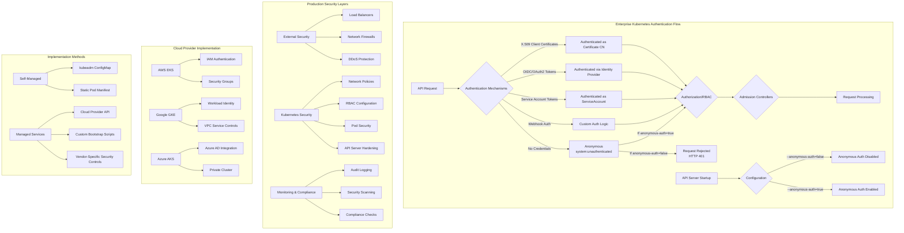

# Disabling Anonymous API Discovery in Production Kubernetes Clusters

## Background

By default, Kubernetes grants unauthenticated users (in the system:unauthenticated group) access to certain non‑resource endpoints—specifically those used for API discovery. In hostile environments (e.g., a cluster exposed to the public internet), this can pose a serious risk, as it reveals API group/version information to anyone without credentials.

This default behavior is intended to facilitate initial API discovery, but it creates a significant security weakness in production environments. The discovery endpoints expose details about available API groups, versions, and resources that could be leveraged during reconnaissance phases of an attack. Attackers can use this information to identify potential vulnerabilities, outdated API versions, or specific resources to target.

## Objective

We want to configure production Kubernetes clusters so that no anonymous requests—regardless of endpoint—are allowed. This closes the following non‑resource discovery paths to unauthenticated users:

- `/api` - Shows the available core API versions
- `/apis` - Lists all available API groups and their versions
- `/openapi/v2` - Exposes the OpenAPI schema documentation
- `/version` - Reveals Kubernetes version information
- `/healthz` - Provides cluster health status information

## Production Environments vs. Development (Kind)

While Kind clusters are primarily for local development and testing, production Kubernetes clusters have additional considerations:

|Aspect|Kind Cluster|Production Cluster|
|---|---|---|
|Deployment Method|Docker containers|Cloud provider (EKS, GKE, AKS), self-hosted, or bare metal|
|Configuration Management|Single YAML file|Infrastructure as Code (Terraform, etc.), GitOps pipelines, operator patterns|
|API Server Exposure|Local network|Potentially external/public endpoints|
|Security Requirements|Basic development needs|Compliance with organizational/industry standards (SOC2, PCI-DSS, HIPAA, etc.)|
|Bootstrapping|kubeadm inside containers|Various installers (kubeadm, kops, cloud-specific provisioning)|
|HA Considerations|Typically single control plane|Multiple control plane nodes, load balancing|

## Approach for Production Clusters

The approach varies based on how your production cluster is deployed:

### 1. For Self-Managed Kubernetes (kubeadm, kops, etc.)

Similar to Kind, you need to configure the API server's startup parameters. This is done through:

**kubeadm**: Edit the ClusterConfiguration manifest before cluster creation or update the API server static pod after creation.

```yaml
apiVersion: kubeadm.k8s.io/v1beta3
kind: ClusterConfiguration
apiServer:
  extraArgs:
    anonymous-auth: "false"
```

For existing clusters, the API server pod manifest is typically located at `/etc/kubernetes/manifests/kube-apiserver.yaml` on control plane nodes. You would add this parameter and the kubelet will recreate the API server pod:

```yaml
spec:
  containers:
  - command:
    - kube-apiserver
    - --anonymous-auth=false
    # other arguments...
```

### 2. For Managed Kubernetes Services

#### Amazon EKS

EKS doesn't directly expose the API server configuration. Instead, you can:

1. Create a custom Amazon Machine Image (AMI) for your EKS nodes that modifies the bootstrap script to update the API server settings.
2. Use EKS add-ons or custom admission controllers to enforce additional security policies.
3. For newer EKS versions, you can use the EKS API server configuration options when creating or updating a cluster:

```bash
aws eks create-cluster \
  --name production-cluster \
  --kubernetes-network-config apiServerConfig={anonymousAuthDisabled=true} \
  # other parameters...
```

#### Google GKE

GKE provides a control plane security setting:

```bash
gcloud container clusters create production-cluster \
  --enable-authentication \
  --no-enable-basic-auth \
  --security-posture=standard \
  # other parameters...
```

For existing clusters:

```bash
gcloud container clusters update production-cluster \
  --security-posture=standard
```

GKE's "standard" security posture includes disabling anonymous authentication.

#### Microsoft AKS

AKS offers API server security settings:

```bash
az aks create \
  --name production-cluster \
  --api-server-authorized-ip-ranges 203.0.113.0/24 \
  # other parameters...
```

You can also use Azure Policy to enforce security controls on your AKS clusters.

## Additional Production Security Measures

Beyond disabling anonymous API discovery, production clusters should implement:

### 1. Network Policies and API Server Exposure

Production clusters should restrict API server access at the network level:

- Place API server endpoints behind load balancers with strict firewall rules
- Implement network policies to control pod-to-pod communication
- Use mTLS for service-to-service communication with service meshes like Istio or Linkerd

Example network policy to restrict access to the API server:

```yaml
apiVersion: networking.k8s.io/v1
kind: NetworkPolicy
metadata:
  name: restrict-apiserver-access
  namespace: kube-system
spec:
  podSelector:
    matchLabels:
      component: kube-apiserver
  ingress:
  - from:
    - namespaceSelector:
        matchLabels:
          team: operations
    - podSelector:
        matchLabels:
          role: monitoring
  policyTypes:
  - Ingress
```

### 2. RBAC Hardening

Remove overly permissive default roles and bindings:

```bash
kubectl delete clusterrolebinding system:discovery
kubectl delete clusterrolebinding system:basic-user
```

Create more fine-grained role definitions:

```yaml
apiVersion: rbac.authorization.k8s.io/v1
kind: ClusterRole
metadata:
  name: limited-discovery
rules:
- apiGroups: [""]
  resources: [""]
  verbs: ["get"]
```

### 3. Authentication and Authorization Integration

Production clusters typically integrate with enterprise identity providers:

- OpenID Connect (OIDC) providers like Okta, Auth0, or Azure AD
- LDAP/Active Directory via auth proxies
- Custom authentication webhook implementations

Example for configuring OIDC with the API server:

```yaml
apiServer:
  extraArgs:
    oidc-issuer-url: "https://accounts.google.com"
    oidc-client-id: "kubernetes"
    oidc-username-claim: "email"
    oidc-groups-claim: "groups"
```

### 4. Audit Logging

Configure comprehensive audit logging for production clusters:

```yaml
apiServer:
  extraArgs:
    audit-log-path: "/var/log/kubernetes/audit.log"
    audit-log-maxage: "30"
    audit-log-maxbackup: "10"
    audit-log-maxsize: "100"
    audit-policy-file: "/etc/kubernetes/audit-policy.yaml"
```

With a detailed audit policy:

```yaml
apiVersion: audit.k8s.io/v1
kind: Policy
rules:
- level: Metadata
  resources:
  - group: ""
    resources: ["pods", "services", "configmaps"]
# additional rules...
```

### 5. Pod Security Standards

Enforce Pod Security Standards (successor to Pod Security Policies):

```yaml
apiVersion: pod-security.admission.kubernetes.io/enforce
kind: Namespace
metadata:
  name: production
  labels:
    pod-security.kubernetes.io/enforce: restricted
```

### 6. Container Image Security

Implement image scanning and signing requirements:

```yaml
apiVersion: admission.k8s.io/v1
kind: ValidatingAdmissionPolicy
metadata:
  name: require-signed-images
spec:
  failurePolicy: Fail
  matchConstraints:
    resourceRules:
    - apiGroups: [""]
      apiVersions: ["v1"]
      operations: ["CREATE", "UPDATE"]
      resources: ["pods"]
  validations:
  - expression: "object.spec.containers.all(c, c.image.matches('^registry.example.com/.*'))"
```

## Verification in Production Environments

### 1. External Penetration Testing

Contract security professionals to perform regular penetration tests against your Kubernetes API server.

### 2. Automated Security Scanning

Implement tools like kube-bench, Trivy, or commercial solutions (Aqua, Prisma Cloud) to regularly scan your cluster configuration.

### 3. Continuous Compliance Monitoring

Set up continuous monitoring to detect configuration drift or security policy violations:

```yaml
apiVersion: constraints.gatekeeper.sh/v1beta1
kind: K8sRequiredResources
metadata:
  name: pod-must-have-limits
spec:
  match:
    kinds:
    - apiGroups: [""]
      kinds: ["Pod"]
  parameters:
    containers:
    - resources: ["limits", "requests"]
```

### 4. API Server Access Testing

Routinely test API server access patterns with automated scripts:

```bash
#!/bin/bash
API_SERVER=$(kubectl config view --minify -o jsonpath='{.clusters[0].cluster.server}')
TOKEN=$(kubectl get secret -n monitoring prometheus-token -o jsonpath='{.data.token}' | base64 --decode)

# Test anonymous access
for ep in /api /apis /openapi/v2 /version /healthz; do
  echo -n "Anonymous $ep: "
  curl -k -s -o /dev/null -w "%{http_code}" $API_SERVER$ep
  echo
done

# Test authenticated access
for ep in /api /apis /openapi/v2 /version /healthz; do
  echo -n "Authenticated $ep: "
  curl -k -s -o /dev/null -w "%{http_code}" -H "Authorization: Bearer $TOKEN" $API_SERVER$ep
  echo
done
```

## Production Readiness Considerations

### 1. Load Balancers and Health Checks

When disabling anonymous authentication, ensure load balancers or monitoring systems that check `/healthz` are properly configured with authentication:

```yaml
readinessProbe:
  httpGet:
    path: /healthz
    port: https
    scheme: HTTPS
  httpHeaders:
  - name: Authorization
    value: Bearer <token>
```

### 2. Service Mesh Integration

If using a service mesh, configure appropriate authentication for API server communication:

```yaml
apiVersion: security.istio.io/v1beta1
kind: RequestAuthentication
metadata:
  name: kubernetes-api
  namespace: default
spec:
  selector:
    matchLabels:
      app: kubernetes
  jwtRules:
  - issuer: kubernetes/serviceaccount
    jwksUri: https://kubernetes.default.svc:443/openid/v1/jwks
```

### 3. Graceful Transition Strategy

For existing production clusters, implement these changes gradually:

1. Add monitoring to understand current anonymous access patterns
2. Create proper service accounts for any legitimate anonymous access
3. Apply stricter RBAC controls first
4. Finally disable anonymous authentication completely

### 4. Disaster Recovery Planning

Before making security changes, ensure you have:

- Multiple admin credentials stored securely
- Break-glass procedures for emergency access
- Documented rollback procedures
- Tested cluster recovery methods

## Cloud Provider-Specific Considerations

### AWS EKS

- Use AWS IAM integration with Kubernetes RBAC
- Configure AWS security groups as an additional layer of protection
- Implement AWS Network Firewall or AWS WAF if your API server is exposed

### Google GKE

- Use Workload Identity for authentication
- Implement VPC Service Controls to protect the API server
- Enable Binary Authorization for deployed workloads

### Azure AKS

- Use Azure AD integration for authentication
- Implement Private AKS clusters
- Use Azure Policy for Kubernetes to enforce security configurations

## Compliance and Governance

Production clusters often need to meet specific compliance requirements:

### SOC 2 Compliance

- Implement detailed access logging
- Enable encryption at rest for etcd
- Set up regular security assessments

### HIPAA Compliance (Healthcare)

- Ensure all API communication is encrypted
- Implement strict access controls with detailed audit trails
- Disable anonymous access completely

### PCI-DSS (Payment Industry)

- Implement network segmentation
- Regular vulnerability scanning
- Strong authentication requirements

## Operational Challenges and Solutions

### Challenge: Breaking Existing Workflows

**Solution**: Identify all components that rely on API server access and create appropriate service accounts:

```bash
# Create dedicated service account for monitoring
kubectl create serviceaccount monitoring
kubectl create clusterrolebinding monitoring \
  --clusterrole=view \
  --serviceaccount=default:monitoring
```

### Challenge: Performance Impact of Authentication

**Solution**: Implement proper caching for authentication:

```yaml
apiServer:
  extraArgs:
    authentication-token-webhook-cache-ttl: "10m"
```

### Challenge: Certificate Management at Scale

**Solution**: Implement cert-manager for automated certificate management:

```yaml
apiVersion: cert-manager.io/v1
kind: Certificate
metadata:
  name: apiserver-cert
  namespace: cert-manager
spec:
  secretName: apiserver-cert
  issuerRef:
    name: cluster-issuer
    kind: ClusterIssuer
  dnsNames:
  - "kubernetes.default.svc"
  - "kubernetes.default"
```

## Kubernetes Authentication Architecture in Production



## Testing for Anonymous Access in Production

It's critical to regularly test for anonymous access in production environments. Here's a comprehensive testing approach:

1. **External Testing**: From outside your network perimeter
2. **Internal Testing**: From within the cluster network
3. **Cross-Namespace Testing**: Between isolated namespaces
4. **Continuous Monitoring**: Automated detection of misconfigurations

Example testing script for production clusters:

```bash
#!/bin/bash
# Production API Server Anonymous Access Test

# Get cluster API endpoints (works with multiple control planes)
ENDPOINTS=$(kubectl get endpoints kubernetes -o jsonpath='{.subsets[*].addresses[*].ip}')

echo "Testing Kubernetes API Server Anonymous Access"
echo "=============================================="

# Test from various network perspectives
for EP in $ENDPOINTS; do
  echo "Testing endpoint $EP"
  
  # Discovery endpoints
  for PATH in /api /apis /openapi/v2 /version /healthz; do
    RESPONSE=$(curl -k -s -o /dev/null -w "%{http_code}" https://$EP:6443$PATH)
    echo "  $PATH: $RESPONSE (should be 401 or 403)"
    
    # If we get 200, alert on security issue
    if [ "$RESPONSE" == "200" ]; then
      echo "  ⚠️ SECURITY ISSUE: Anonymous access allowed to $PATH" 
    fi
  done
  
  # Try to list resources (should always fail for anonymous)
  PODS_RESPONSE=$(curl -k -s -o /dev/null -w "%{http_code}" https://$EP:6443/api/v1/pods)
  echo "  /api/v1/pods: $PODS_RESPONSE (should be 401 or 403)"
  
  echo ""
done

# Test with authentication for comparison
echo "Testing with valid authentication (should succeed)"
TOKEN=$(kubectl create token default)
for PATH in /api /apis /openapi/v2 /version /healthz; do
  AUTH_RESPONSE=$(curl -k -s -o /dev/null -w "%{http_code}" -H "Authorization: Bearer $TOKEN" https://$ENDPOINTS:6443$PATH)
  echo "  $PATH (authenticated): $AUTH_RESPONSE (should be 200)"
done
```

## Conclusion

Disabling anonymous API discovery in production Kubernetes clusters is a critical security measure that helps establish a strong security foundation. Unlike development environments, production clusters require a comprehensive approach that takes into account:

- Multi-layered security controls beyond just API server configuration
- Integration with enterprise authentication systems
- Compliance with industry and organizational standards
- Proper testing and verification across complex network topologies
- Consideration for operational impacts and dependencies

By combining API server hardening with proper network controls, RBAC configuration, and continuous security monitoring, you can substantially reduce your cluster's attack surface while maintaining operational effectiveness. Remember that security is a continuous process that requires regular assessment and improvement as threats and technologies evolve.