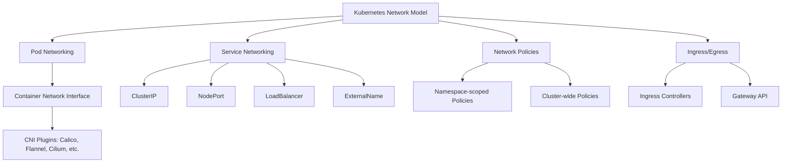
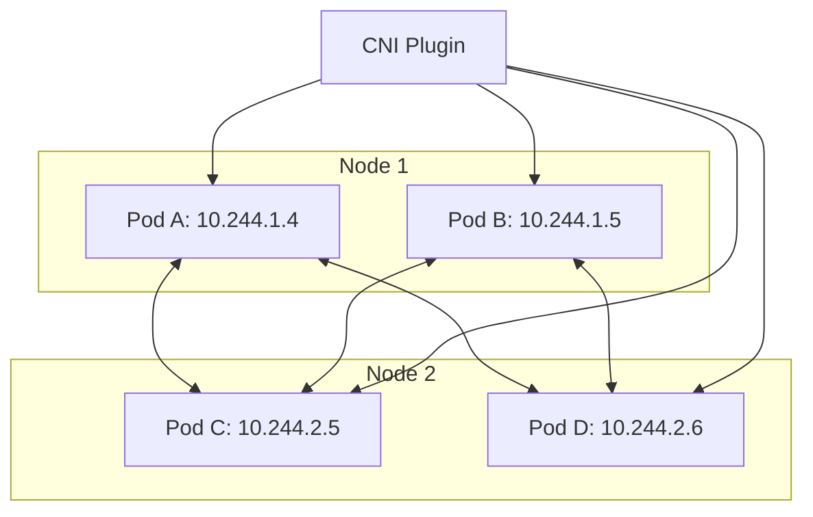
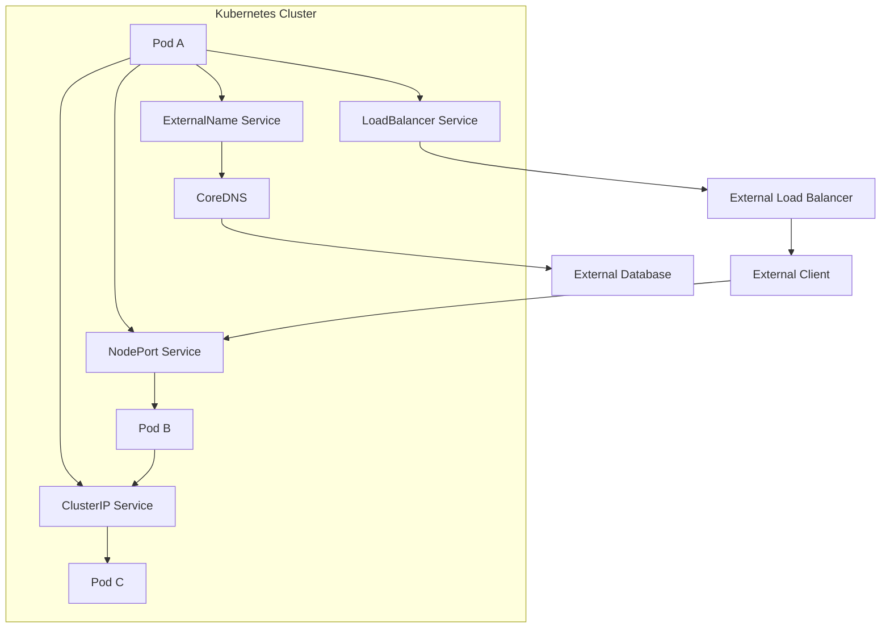
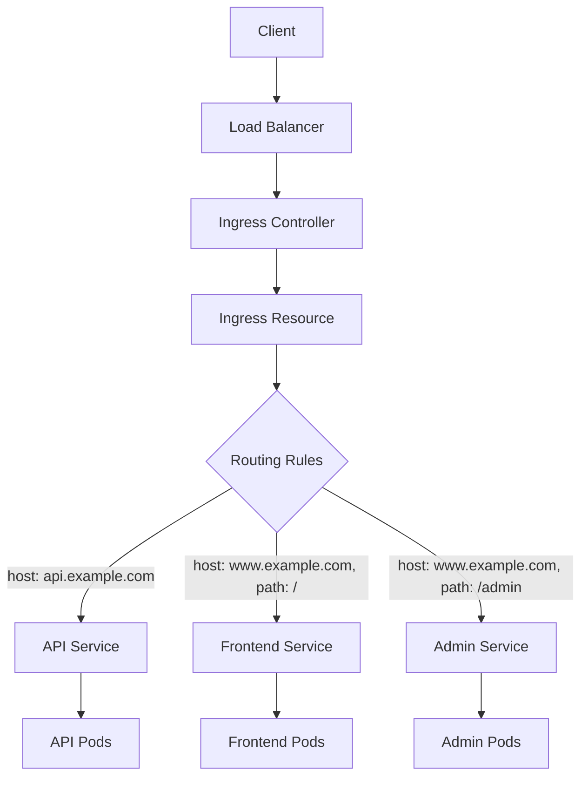
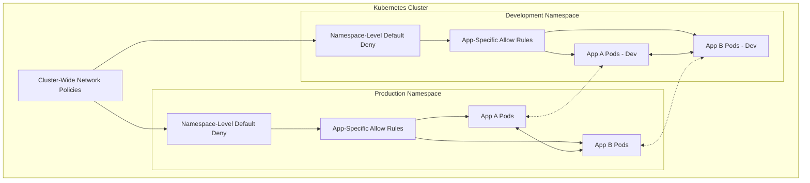
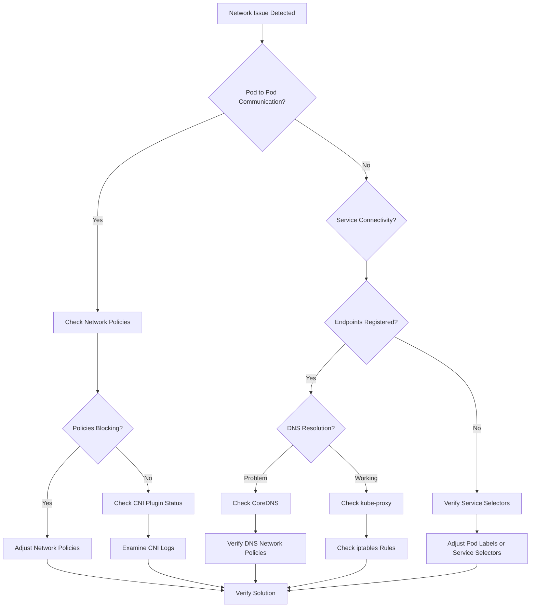
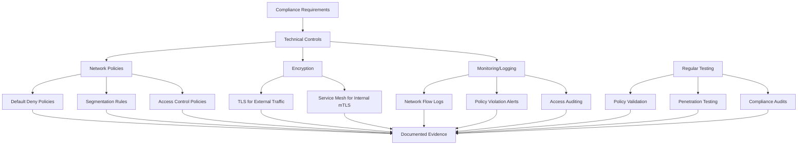
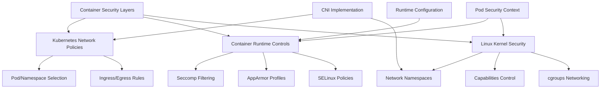
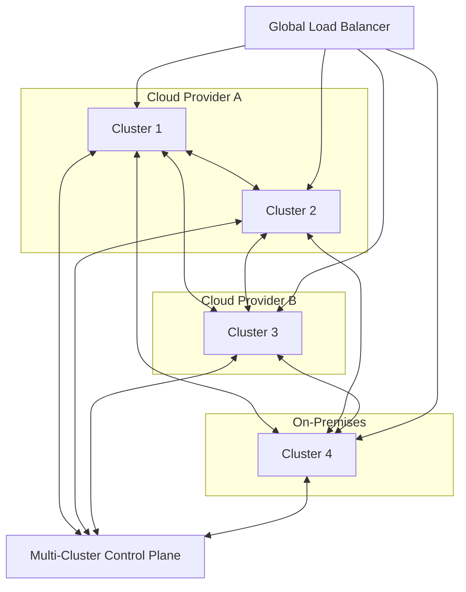
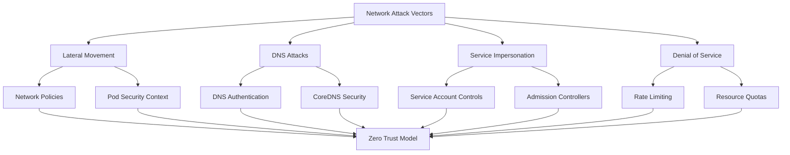

## Introduction to Kubernetes Networking

Kubernetes networking creates a sophisticated foundation that enables seamless communication between all components within a Kubernetes cluster. At its core, Kubernetes networking follows a fundamental principle: every Pod receives its own unique IP address, creating a virtual network that spans across all nodes in the cluster. This design decision eliminates the need for complex Network Address Translation (NAT) configurations and allows for direct Pod-to-Pod communication regardless of their physical location within the cluster.

Understanding Kubernetes networking is not merely beneficial—it's essential for architecting secure, efficient, and well-structured applications that can scale reliably in production environments. The networking layer touches every aspect of application deployment, from basic communication between microservices to implementing robust security boundaries and exposing services to external users.



## Core Networking Concepts

### Pod Networking: The Foundation

Pod networking forms the bedrock of Kubernetes communication architecture. When a Pod is created, the Kubernetes networking model assigns it a unique IP address drawn from a cluster-wide CIDR range. This IP addressing scheme creates a flat network space where any Pod can communicate directly with any other Pod using standard IP protocols, regardless of which nodes they're scheduled on.

For instance, imagine two Pods running on different nodes: Pod A with IP address 10.244.1.4 and Pod B with IP address 10.244.2.5. Despite being physically separated across different machines, Pod A can initiate a connection directly to Pod B using its IP address. The underlying Container Network Interface (CNI) plugin—such as Calico, Flannel, or Weave—handles the complex routing that makes this possible, creating overlay networks or configuring the host networking stack to route packets appropriately between nodes.

This model dramatically simplifies application architecture, as developers can design their systems assuming a consistent networking model without worrying about the physical topology of the underlying infrastructure. Services can communicate with each other using their Pod IP addresses just as they would in a traditional virtual machine or physical server environment.



#### Container Network Interface (CNI) Plugins

The Container Network Interface (CNI) is a specification and set of libraries for configuring network interfaces in Linux containers. CNI plugins implement the actual networking functionality in Kubernetes clusters. Understanding the differences between common CNI plugins is crucial for both exam preparation and production deployments:

1. **Flannel**:
    
    - Simple, lightweight overlay network
    - Easy to set up and manage
    - Limited policy support (requires additional components)
    - Good for basic clusters and learning environments
    - Limited performance compared to other CNI options
2. **Calico**:
    
    - High-performance, scalable networking
    - Strong network policy support with fine-grained control
    - Supports both overlay and non-overlay modes
    - Advanced features like BGP integration for direct routing
    - Excellent for production environments with security requirements
3. **Cilium**:
    
    - Identity-based security with BPF
    - Layer 7 (application layer) visibility and filtering
    - High performance with kernel-level enforcement
    - Advanced observability features
    - Excellent for microservices architectures
4. **Weave Net**:
    
    - Simple setup with good encryption support
    - Mesh overlay network with automatic discovery
    - Decent performance and policy support
    - Good for multi-cloud and hybrid deployments
5. **Antrea**:
    
    - Leverages Open vSwitch for networking
    - Strong integration with VMware environments
    - Good performance with flow-based networking
    - Growing ecosystem with strong corporate backing

The choice of CNI plugin significantly impacts performance, security capabilities, and operational complexity. For CKA and CKS exams, understanding how to identify and troubleshoot issues with different CNI plugins is important.

### Service Types: Creating Stable Communication Endpoints

While Pod IP addresses enable direct communication, they're ephemeral by nature—when a Pod is rescheduled or restarted, it receives a new IP address. This transient nature creates a challenge for building reliable applications. Kubernetes solves this problem with the Service abstraction, which provides stable networking endpoints that remain consistent even as the underlying Pods change.

#### ClusterIP Services: Internal Communication Backbone

ClusterIP is the default and most basic Service type, providing internal-only communication within the cluster. When you create a ClusterIP Service, Kubernetes assigns it a stable internal IP address that persists for the lifetime of the Service. This IP address is accessible only from within the cluster and serves as an internal load balancer, distributing incoming connections across all Pods that match the Service's selector.

A ClusterIP Service also creates a DNS entry in the cluster's internal DNS service following the pattern `service-name.namespace.svc.cluster.local`. This means other applications can discover and connect to the Service using a consistent DNS name rather than hardcoding IP addresses.

For example, if you have a database Service named "postgres" in the "data" namespace, any application within the cluster can connect to it using the hostname `postgres.data.svc.cluster.local`, regardless of which specific Pod is currently running the database or where it's scheduled.

This service discovery mechanism is fundamental to building resilient, loosely-coupled microservices architectures in Kubernetes. Services act as the glue that binds different components together while maintaining their independence.

#### NodePort Services: The Bridge to External Traffic

When applications need to be accessible from outside the cluster, NodePort Services provide a straightforward solution. A NodePort Service exposes the application on a static port (between 30000-32767 by default) on every node in the cluster.

When you create a NodePort Service, Kubernetes does three things:

1. Allocates a port from the NodePort range on every node
2. Sets up routing so that connections to this port on any node are forwarded to the backing Pods
3. Creates a corresponding ClusterIP Service for internal communication

This means your application becomes accessible through any node's IP address on the allocated port. For example, if your NodePort Service is allocated port 30007, your application would be accessible at `http://<any-node-ip>:30007`.

NodePort Services are particularly useful for development environments, demonstrations, or when you need a simple way to expose services without requiring additional infrastructure like load balancers. However, they do have limitations—they use non-standard high-numbered ports and require knowledge of node IP addresses, which can change if nodes are replaced.

#### LoadBalancer Services: Production-Grade External Access

For production workloads that need external accessibility, LoadBalancer Services provide the most robust solution. A LoadBalancer Service instructs Kubernetes to provision an external load balancer from your cloud provider infrastructure to direct traffic to your Service.

When you create a LoadBalancer Service in a cloud environment like AWS, GCP, or Azure, Kubernetes automatically:

1. Creates a cloud provider load balancer (like an AWS Elastic Load Balancer)
2. Configures it to forward traffic to the appropriate nodes and ports
3. Updates the Service with the external IP address assigned by the cloud provider

This integration gives you a dedicated, externally accessible IP address that distributes traffic across your application Pods, complete with health checking and other advanced features provided by the cloud load balancer. Users can connect to your application using a standard port (like 80 for HTTP or 443 for HTTPS) without needing to know anything about the underlying Kubernetes infrastructure.

LoadBalancer Services are the preferred method for exposing applications to the internet in production environments. They provide a clean abstraction that handles the complex integration between Kubernetes and external networking infrastructure.

#### ExternalName Services: Advanced Service Discovery

ExternalName services provide a Kubernetes native way to create a CNAME record to an external domain name. Unlike other service types, ExternalName doesn't create a cluster IP or proxy connections; it simply creates a DNS alias within the cluster.

This service type is useful for integrating external services with your Kubernetes applications. For example, if your application needs to connect to an external database at `database.example.com`, you can create an ExternalName service named `database` in your application namespace. Your application can then connect to `database.svc.cluster.local`, and Kubernetes DNS will resolve this to the external domain.

This allows for more flexible architecture where some components run in Kubernetes while others remain external, and applications don't need special configuration to handle this hybrid setup.



### Service Discovery and DNS

Kubernetes provides built-in service discovery mechanisms that are critical for application communication. The Kubernetes DNS service, implemented by CoreDNS, is a fundamental component that facilitates service discovery.

#### CoreDNS Architecture and Configuration

CoreDNS replaced kube-dns as the default DNS service in Kubernetes 1.13 and later. It runs as a deployment in the `kube-system` namespace and is configured through a ConfigMap that defines Corefile settings. Understanding CoreDNS configuration is essential for the CKA exam and production operations.

The basic structure of DNS names in Kubernetes follows this pattern:

- For services: `<service-name>.<namespace>.svc.cluster.local`
- For pods: `<pod-ip-with-dashes>.<namespace>.pod.cluster.local`

When troubleshooting DNS issues, you should check:

1. The CoreDNS pods are running correctly
2. The kube-dns service is correctly configured
3. Network policies aren't blocking DNS traffic
4. Pod DNS configuration (through the Pod spec's `dnsPolicy` and `dnsConfig` fields)

Common CoreDNS configurations include:

- Configuring forwarding for external domains
- Setting up custom domain handling
- Implementing DNS-based load balancing strategies
- Configuring caching parameters for performance optimization

#### Service Discovery Mechanisms

Kubernetes provides two main mechanisms for service discovery:

1. **Environment variables**: Kubernetes automatically injects environment variables for active services into new pods
2. **DNS**: The more flexible and commonly used approach

For environment variables, Kubernetes uses the pattern:

- `<SERVICE_NAME>_SERVICE_HOST` for the service IP
- `<SERVICE_NAME>_SERVICE_PORT` for the service port

These environment variables are created when the pod is started, so they only include services that existed before the pod was created. This limitation makes DNS the preferred service discovery mechanism in most cases.

### Ingress Controllers and Resources

While Services expose applications within the cluster or through basic external access mechanisms, Ingress provides a more sophisticated way to route HTTP and HTTPS traffic from outside the cluster to your services.

#### Ingress Resources

An Ingress resource defines rules for routing external HTTP/HTTPS traffic to internal services. It acts as a layer 7 load balancer, capable of routing based on paths, hostnames, and other application-level attributes.

Key components of an Ingress resource include:

- **Host rules**: Route traffic based on the requested hostname
- **Path rules**: Route traffic based on URL paths
- **TLS configuration**: Define certificates for HTTPS connections
- **Backend configuration**: Specify which services should receive traffic

#### Ingress Controllers

Ingress resources don't do anything on their own—they require an Ingress Controller that implements the rules defined in the resources. Multiple Ingress Controller implementations exist:

1. **NGINX Ingress Controller**: The most common implementation
    
    - High performance with extensive features
    - Supports complex routing rules and rewrite capabilities
    - Widely adopted in production environments
2. **Traefik**: Modern, cloud-native edge router
    
    - Automatic Let's Encrypt integration
    - Good observability features
    - Dynamic configuration capabilities
3. **HAProxy Ingress**: Based on the HAProxy load balancer
    
    - Excellent performance characteristics
    - Strong security track record
    - Advanced traffic management capabilities
4. **Istio Ingress Gateway**: Part of the Istio service mesh
    
    - Advanced traffic management with service mesh integration
    - Strong security features with mutual TLS
    - Complex but powerful for large-scale deployments

For the CKA exam, understanding how to deploy and configure the NGINX Ingress Controller is particularly important, as it's the most commonly used implementation.



#### Gateway API: The Future of Ingress

The Gateway API is a newer Kubernetes project that aims to evolve beyond the limitations of Ingress. While not yet as widely adopted as Ingress, it represents the future direction of Kubernetes traffic routing and is worth understanding for production environments.

Key advantages of the Gateway API include:

- More expressive routing capabilities
- Better support for multiple protocols (not just HTTP/HTTPS)
- Clearer separation of concerns between different roles (cluster operators vs. application developers)
- More extensible architecture for custom implementations

The Gateway API introduces several custom resources:

- **Gateway**: Defines an instance of infrastructure for traffic handling
- **GatewayClass**: Defines the controller implementation and configuration
- **HTTPRoute/TCPRoute/etc.**: Define protocol-specific routing rules
- **ReferencePolicy**: Controls cross-namespace routing permissions

For production environments planning long-term architecture, considering Gateway API adoption alongside or instead of traditional Ingress may be beneficial.

## Network Policies: Implementing Security Boundaries

While Kubernetes networking enables seamless communication, unrestricted connectivity poses significant security risks. Network Policies act as a distributed firewall within Kubernetes, allowing you to define rules that control which Pods can communicate with each other and on which ports. They're essential for implementing the principle of least privilege and creating security boundaries within your cluster.

### Namespace-Scoped Network Policies: Application-Level Controls

Namespace-scoped Network Policies apply only to Pods within a specific namespace, making them ideal for implementing isolation between different applications or environments. They allow you to create fine-grained rules based on Pod labels, namespace selectors, IP blocks, and ports.

For example, in a three-tier application with frontend, backend, and database components, you might implement Network Policies that:

1. Allow the frontend to communicate only with the backend on specific ports
2. Allow the backend to communicate only with the database on the database port
3. Deny all other traffic between components

This ensures that even if an attacker compromises one component, their ability to move laterally through your application is severely restricted. The compromised component can only communicate with the specific services it legitimately needs to function.

Namespace-scoped Network Policies are powerful tools for implementing defense-in-depth within individual applications or teams. They work by instructing the CNI plugin to implement appropriate packet filtering rules at the Pod level, effectively creating micro-segmentation within your cluster.

### Cluster-Wide Network Policies: Organization-Level Security

While Kubernetes' native NetworkPolicy resource is limited to a single namespace, most production environments require security controls that span multiple namespaces or apply cluster-wide. This is where extended Network Policy implementations from CNI providers like Calico, Cilium, or Antrea come into play.

These providers offer custom resource definitions (CRDs) that extend the native NetworkPolicy capabilities with cluster-wide policies. For example, Calico provides the GlobalNetworkPolicy resource, which can select Pods across all namespaces and implement consistent security controls throughout your cluster.

Cluster-wide policies are particularly valuable for implementing organizational security requirements, such as:

1. Default-deny rules that block all traffic unless explicitly allowed
2. Allowlisting access to critical infrastructure services like DNS or monitoring
3. Enforcing isolation between different environments (development, staging, production)
4. Implementing compliance requirements that mandate specific network segmentation

These policies work in conjunction with namespace-scoped policies, with the more restrictive policy taking precedence. This allows security teams to implement baseline controls at the cluster level while still giving application teams the flexibility to define more specific policies for their workloads.



### Network Policy Selectors: The Building Blocks of Policy

Network Policies use selectors to determine which pods they apply to and which traffic is allowed. Understanding these selectors is crucial for crafting effective policies:

1. **podSelector**: Determines which pods the policy applies to
    
    - Empty selector matches all pods in the namespace
    - Label-based selectors target specific applications
2. **namespaceSelector**: Identifies namespaces containing pods that can communicate
    
    - Often used with `podSelector` to create fine-grained rules
    - Can implement environment isolation (dev/test/prod)
3. **ipBlock**: Specifies CIDR ranges for external traffic
    
    - Useful for controlling traffic to/from external systems
    - Can include exception ranges with `except` field

These selectors can be combined in various ways to create sophisticated policies. For example, allowing traffic from specific pods in specific namespaces while also permitting connections from certain external IP ranges.

### Practical Network Policy Examples in Real-World Scenarios

#### Environment Isolation: Development vs. Production

In organizations with shared clusters running multiple environments, it's critical to prevent accidental or malicious cross-environment communication. Network Policies can create strict boundaries between environments.

A comprehensive approach involves:

1. Labeling namespaces with their environment (e.g., `environment: production`, `environment: development`)
2. Creating Network Policies in each production namespace that deny all ingress from namespaces not labeled as production
3. Implementing similar policies for other environments

This creates strong isolation while still allowing intended communication within each environment. If specific cross-environment communication is required (such as a test environment accessing a shared service), explicit policies can be created to allow just those specific paths.

#### Securing Database Access

Databases often contain sensitive information and should be accessible only to authorized services. Network Policies provide fine-grained control over database access.

A robust database security policy might:

1. Block all incoming connections to database Pods by default
2. Allow connections only from specifically authorized backend services
3. Restrict connections to only the necessary database ports
4. Potentially limit connections to specific paths if using HTTP-based databases

This ensures that even if other components in your cluster are compromised, attackers cannot directly access your database unless they first compromise the specifically authorized backend services.

#### DNS and Essential Services Access

Services like DNS are critical for cluster functionality. If Pods cannot resolve DNS names, applications will fail in mysterious ways. Similarly, monitoring and logging services need appropriate access to collect metrics and logs.

Cluster-wide policies (using CNI provider extensions) can ensure all Pods have access to these essential services without opening unnecessary communication paths. For example, you might create policies that:

1. Allow all Pods to access the CoreDNS service on port 53 for DNS resolution
2. Allow monitoring services to scrape metrics from all Pods on specific ports
3. Allow logging agents to forward logs to centralized logging services

These policies ensure critical infrastructure services function correctly while still maintaining the principle of least privilege for all other communication.

### Network Policy Audit Logging

For CKS exam preparation and production security, understanding how to audit and monitor Network Policy enforcement is crucial. Different CNI plugins offer varying levels of logging and auditing capabilities:

1. **Calico**:
    
    - GlobalNetworkPolicy resources can include `LogAction` to record policy decisions
    - Supports sending logs to standard Kubernetes logging infrastructure
    - Provides detailed metadata about denied connections
2. **Cilium**:
    
    - Hubble provides extensive observability for network flows
    - Can record Layer 7 (application) details for HTTP, gRPC, and Kafka
    - Supports real-time monitoring of policy enforcement
3. **Antrea**:
    
    - Supports flow export to monitoring systems
    - Can record detailed policy decisions
    - Integrates with standard logging infrastructure

When implementing audit logging, consider:

- Log storage and retention requirements
- Performance impact of detailed logging
- Integration with security information and event management (SIEM) systems
- Automated alerting for suspicious patterns

Network policy audit logs are invaluable both for security monitoring and for troubleshooting connectivity issues, making them an essential part of a production-grade network security implementation.

## Pod Security Context and Network Security

While Network Policies control traffic between pods, Pod Security Contexts control what network capabilities pods have at a more fundamental level. This is a critical topic for the CKS exam and for securing production environments.

### Network-Related Security Contexts

Several security context settings directly impact network security:

1. **Capabilities**: Linux capabilities control what privileged operations a container can perform
    
    - `NET_ADMIN`: Allows network configuration changes, often used by network plugins
    - `NET_RAW`: Allows raw socket access, which can be used for packet crafting
    - `NET_BIND_SERVICE`: Allows binding to privileged ports (<1024)
2. **Seccomp Profiles**: Filter system calls to limit container actions
    
    - Can restrict network-related syscalls to prevent certain types of attacks
    - Often used to implement defense-in-depth for network security
3. **readOnlyRootFilesystem**: Prevents modifying filesystem
    
    - Indirectly improves network security by preventing persistent backdoors
    - Reduces attack surface if network compromise occurs

Example security context configuration for network-hardened pods:

```
securityContext:
  capabilities:
    drop:
      - NET_RAW
      - NET_ADMIN
  readOnlyRootFilesystem: true
  runAsNonRoot: true
```

### Pod Security Admission (PSA) and Network Security

Pod Security Admission (formerly Pod Security Policies) provides cluster-wide control over pod security settings. From a networking perspective, PSA can enforce:

1. Dropping dangerous network capabilities
2. Preventing privileged containers that could circumvent network policies
3. Enforcing namespace-level security standards

PSA uses three enforcement levels:

- **Privileged**: No restrictions
- **Baseline**: Prevents known privilege escalations
- **Restricted**: Enforces security best practices, including dropping `NET_RAW`

For production environments, implementing PSA at the "Restricted" level significantly enhances network security by preventing pods from having capabilities that could be used to bypass network policy enforcement.

## Troubleshooting Kubernetes Networking Issues

Troubleshooting network issues is a critical skill for the CKA exam and for production operations. A systematic approach is essential.

### Common Network Issues and Diagnoses

1. **Pod-to-Pod Communication Problems**:
    
    - Check Network Policies that might be blocking traffic
    - Verify the CNI plugin is functioning correctly
    - Check for routing issues between nodes
2. **Service Connectivity Issues**:
    
    - Verify endpoints are properly registered
    - Check service selectors match pod labels
    - Examine kube-proxy functionality and logs
3. **DNS Resolution Problems**:
    
    - Verify CoreDNS pods are running
    - Check pod DNS configuration
    - Look for Network Policies blocking DNS traffic
    - Examine CoreDNS logs for errors
4. **Ingress Not Routing Traffic**:
    
    - Check Ingress Controller deployment
    - Verify Ingress resource configuration
    - Examine Ingress Controller logs
    - Check service and pod health behind the Ingress

### Diagnostic Commands and Tools

For the CKA and CKS exams, knowing the right troubleshooting commands is essential:

1. **Basic Connectivity Testing**:
    
    - `kubectl exec -it <pod> -- ping <target-ip>` (if ping is available)
    - `kubectl exec -it <pod> -- curl <service-name>.<namespace>.svc.cluster.local`
    - `kubectl exec -it <pod> -- nslookup <service-name>.<namespace>.svc.cluster.local`
2. **Network Policy Verification**:
    
    - `kubectl get networkpolicy -A` to list all policies
    - `kubectl describe networkpolicy <name> -n <namespace>` to examine specific policy
    - For Calico: `calicoctl get networkpolicy -o wide` to see policy details
3. **Service Debugging**:
    
    - `kubectl get endpoints <service-name>` to verify endpoint registration
    - `kubectl get pods -o wide` to check pod IPs and verify they match endpoints
    - `kubectl describe service <service-name>` to check service configuration
4. **DNS Troubleshooting**:
    
    - `kubectl get pods -n kube-system -l k8s-app=kube-dns` to check CoreDNS pods
    - `kubectl logs -n kube-system -l k8s-app=kube-dns` to examine DNS logs
    - `kubectl exec -it <pod> -- cat /etc/resolv.conf` to check DNS configuration
5. **CNI Plugin Verification**:
    
    - `kubectl get pods -n kube-system -l k8s-app=calico-node` (for Calico)
    - `kubectl logs -n kube-system -l k8s-app=calico-node` to check for CNI errors
6. **Packet Capture (when available)**:
    
    - `kubectl exec -it <pod> -- tcpdump -i eth0 -n` to capture traffic
    - Requires appropriate capabilities or privileged mode

### Systematic Troubleshooting Approach

For effective network troubleshooting, follow this systematic process:

1. **Identify the specific failure**:
    
    - Which pods can't communicate?
    - What error messages are you seeing?
    - Is it intermittent or consistent?
2. **Check the network path**:
    
    - Pod configuration and status
    - Service configuration and endpoints
    - Network policies that might affect traffic
    - Ingress/egress configuration if external traffic is involved
3. **Validate basic networking**:
    
    - Can pods reach the Kubernetes DNS service?
    - Can pods communicate with the Kubernetes API?
    - Is the issue specific to certain namespaces or applications?
4. **Examine logs and events**:
    
    - Pod logs for application-level errors
    - CNI plugin logs for network issues
    - Kubernetes events for service or policy changes
5. **Test progressively**:
    
    - Start with the simplest test case
    - Gradually add complexity to isolate the issue
    - Compare working and non-working scenarios to identify differences



## Securing Kubernetes Network Communication with TLS

Securing network traffic with TLS is a critical component of production Kubernetes deployments and is important for the CKS exam.

### Pod-to-Pod TLS Communication

For sensitive communications between services, implementing mutual TLS (mTLS) provides strong security:

1. **Service Mesh Approach**:
    
    - Tools like Istio, Linkerd, or Consul provide automatic mTLS
    - Traffic is encrypted and authenticated without application changes
    - Certificates are managed and rotated automatically
2. **Application-Level TLS**:
    
    - Applications handle their own TLS implementation
    - Requires managing certificates at the application level
    - More complex but offers fine-grained control
3. **TLS Secrets Management**:
    
    - Store certificates in Kubernetes Secrets
    - Consider external secret management systems for production
    - Implement certificate rotation procedures

### Ingress TLS Configuration

Securing external traffic is typically handled at the Ingress level:

1. **Static Certificate Configuration**:
    
    - Create a TLS secret with certificate and private key
    - Reference the secret in Ingress TLS configuration
    - Manage certificate renewal processes
2. **Automated Certificate Management**:
    
    - Use cert-manager for automatic certificate issuance and renewal
    - Integrate with Let's Encrypt or internal certificate authorities
    - Define Certificate and Issuer resources to automate the process
3. **TLS Termination Options**:
    
    - Edge Termination: TLS terminates at Ingress, internal traffic unencrypted
    - Re-encryption: TLS terminates at Ingress, new TLS connection to backend
    - Passthrough: TLS passes through Ingress to backend for termination

For production environments and CKS preparation, understanding TLS configuration and certificate management is essential for maintaining secure network communications.

## Advanced Networking Topics for Production

### Multi-Cluster Networking

As organizations scale, they often deploy multiple Kubernetes clusters. Connecting these clusters securely requires specialized approaches:

1. **Cluster Federation**:
    
    - Kubefed (Kubernetes Cluster Federation) for multi-cluster management
    - Federated services for cross-cluster discovery
    - Challenges with network policy enforcement across clusters
2. **Service Mesh Federation**:
    
    - Istio multi-cluster setup for unified service mesh
    - Cross-cluster load balancing and failover
    - Consistent security policies across clusters
3. **Network Connectivity Options**:
    
    - Direct VPC peering for cloud deployments
    - VPN connectivity for hybrid deployments
    - Dedicated interconnects for high-performance requirements

### High Availability Networking Configurations

Production environments require robust HA configurations:

1. **Multi-Zone Deployments**:
    
    - Distributing nodes across availability zones
    - Properly configuring node affinity and anti-affinity
    - Understanding topology-aware routing implications
2. **Load Balancer Redundancy**:
    
    - Multiple ingress controllers across zones
    - Global load balancers for geographic distribution
    - Health checking and automated failover
3. **Network Failure Handling**:
    
    - Graceful degradation during network partitions
    - Properly configured readiness and liveness probes
    - Circuit breaking and retry policies

### Network Performance Optimization

Performance is critical for production environments:

1. **CNI Performance Considerations**:
    
    - IPVS vs. iptables mode for kube-proxy
    - eBPF-based solutions (Cilium) for improved performance
    - Direct routing vs. overlay networks trade-offs
2. **Network Policy Impact**:
    
    - Performance implications of complex policies
    - Optimizing rule evaluation order
    - Monitoring policy processing overhead
3. **Traffic Shaping and Quality of Service**:
    
    - Implementing Kubernetes QoS classes
    - Network bandwidth limits and guarantees
    - Prioritizing critical traffic during congestion

## Compliance and Governance for Network Security

### Regulatory Compliance Frameworks

Various industries have specific compliance requirements that affect network configuration:

1. **PCI DSS** (Payment Card Industry Data Security Standard):
    - Network segmentation requirements between cardholder data environments and other networks
    - Strict access control requirements for payment processing systems
    - Detailed logging and monitoring requirements for network access
    - Regular testing of security controls, including network segmentation
2. **HIPAA** (Health Insurance Portability and Accountability Act):
    - Encryption requirements for protected health information in transit
    - Access controls to limit network access to patient data
    - Audit logging requirements for all network access to sensitive data
    - Business Associate Agreement implications for shared clusters
3. **SOC 2** (Service Organization Control 2):
    - Network access controls aligned with the principle of least privilege
    - Monitoring and alerting for unusual network activity
    - Change management processes for network configuration changes
    - Regular testing and validation of network controls

### Implementing Compliance Controls with Network Policies

Translating compliance requirements into technical controls requires a structured approach:

1. **Policy-as-Code for Network Security**:
    - Defining network policies as YAML templates in version control
    - Automated validation and enforcement of policies
    - Integration with CI/CD pipelines for policy deployment
    - Regular compliance scanning and reporting
2. **Network Segmentation Strategies**:
    - Using namespaces as security boundaries
    - Implementing default-deny policies with explicit allows
    - Creating security zones based on data sensitivity
    - Documenting traffic flows for compliance audits
3. **Audit and Evidence Collection**:
    - Implementing network flow logs for traffic documentation
    - Centralized logging of policy violations and changes
    - Regular review of network accessibility
    - Creating audit-ready documentation of network controls

mermaid



### Network Observability for Compliance

Observability is essential for maintaining and demonstrating compliance:

1. **Network Flow Visualization**:
    - Tools like Cilium Hubble or Calico's Typha for visualizing traffic
    - Mapping actual communication patterns against allowed policies
    - Identifying unauthorized or unexpected traffic flows
2. **Compliance Dashboards**:
    - Real-time visibility into policy enforcement
    - Tracking metrics for compliance reporting
    - Alerting on potential compliance violations
3. **Continuous Verification**:
    - Automated testing of network controls
    - Regular validation of segmentation effectiveness
    - Synthetic transactions to verify policy enforcement

## Container Runtime Security and Networking

The container runtime interacts directly with the network stack and plays a crucial role in network security, making it an important topic for the CKS exam.

### Container Network Namespace Isolation

Container runtimes create isolation through Linux namespaces:

1. **Network Namespace Fundamentals**:
    - Each pod gets its own network namespace
    - Containers within a pod share the network namespace
    - Understanding how namespaces isolate network resources
2. **Container Runtime Interface (CRI) Implementation**:
    - How containerd, CRI-O, and other runtimes implement networking
    - Security implications of different runtime configurations
    - Interaction between runtime networking and CNI plugins
3. **Privileged Container Risks**:
    - How privileged containers can bypass network namespace isolation
    - Detecting and preventing privileged container usage
    - Risks of host network mode and NET_ADMIN capability

### Runtime-Level Network Controls

Beyond Kubernetes-level controls, the container runtime itself offers security mechanisms:

1. **Seccomp Profiles for Network Security**:
    - Restricting network-related system calls
    - Creating custom profiles for specific workloads
    - Default profiles provided by container runtimes
2. **AppArmor Profiles**:
    - Defining network access controls at the application level
    - Integrating AppArmor with Kubernetes security contexts
    - Implementation considerations for different runtimes
3. **SELinux Policies**:
    - Type enforcement for network access
    - Container-specific SELinux contexts
    - Integration with Kubernetes security mechanisms

mermaid



## Network Performance Monitoring and Optimization

Understanding and optimizing network performance is critical for production environments and may appear in the CKA exam.

### Monitoring Network Performance

Effective monitoring enables proactive management of network issues:

1. **Key Metrics to Monitor**:
    - Bandwidth utilization per pod, node, and service
    - Connection latency and packet loss
    - DNS resolution time and error rates
    - Connection establishment time
2. **Monitoring Tools and Approaches**:
    - Prometheus metrics for network performance
    - eBPF-based monitoring with tools like Cilium
    - Service mesh telemetry with Istio or Linkerd
    - Custom metrics via the Metrics API
3. **Visualizing Network Performance**:
    - Grafana dashboards for network metrics
    - Service mesh visualization with Kiali
    - Network topology mapping with Weave Scope or similar tools

### Performance Optimization Techniques

Fine-tuning network performance can significantly impact application responsiveness:

1. **CNI Plugin Optimization**:
    - Choosing the right plugin for your workload characteristics
    - Tuning MTU settings for optimal performance
    - Configuring direct routing when possible to avoid encapsulation overhead
2. **Node-Level Network Settings**:
    - TCP keepalive configuration
    - Connection tracking table sizing
    - Network interface offloading capabilities
3. **Service Mesh Performance**:
    - Selective proxying to reduce overhead
    - Proper resource allocation for proxy sidecars
    - Circuit breaking and retry configuration for resilience
4. **Load Balancer Efficiency**:
    - Session affinity configuration for stateful applications
    - Connection draining during updates
    - Proper health check configuration to avoid unnecessary failovers

## Multi-Cluster and Hybrid Cloud Networking

As organizations scale, they often implement multi-cluster architectures that require sophisticated networking solutions.

### Connecting Multiple Kubernetes Clusters

Several approaches exist for multi-cluster connectivity:

1. **Cluster Federation**:
    - KubeFed for managing multi-cluster resources
    - Federated services for cross-cluster discovery
    - Challenges with network policy consistency across clusters
2. **Multi-Cluster Service Mesh**:
    - Istio multi-primary or primary-remote configurations
    - Cross-cluster service discovery and load balancing
    - Consistent security policies across clusters
3. **Cluster API Approach**:
    - Using Cluster API for standardized cluster provisioning
    - Implementing consistent network configurations
    - Integration with infrastructure providers

mermaid



### Hybrid Cloud Networking Challenges

Connecting on-premises and cloud environments introduces complexity:

1. **Network Connectivity Options**:
    - VPN connections for secure tunneling
    - Direct Connect/ExpressRoute for dedicated links
    - Internet-based connectivity with enhanced security
2. **Addressing and DNS Considerations**:
    - Managing non-overlapping CIDR ranges
    - Global DNS strategy for service discovery
    - Handling different service exposure methods
3. **Consistent Security Controls**:
    - Extending network policies across environments
    - Implementing consistent encryption requirements
    - Unified authentication and authorization mechanisms
4. **Latency and Performance Management**:
    - Geographical distribution of services
    - Caching and content delivery strategies
    - Asynchronous communication patterns for high-latency links

### Edge Computing Extensions

Kubernetes at the edge introduces unique networking requirements:

1. **Edge-Specific Networking Solutions**:
    - Lightweight CNI options for resource-constrained environments
    - Intermittent connectivity handling
    - Local service discovery with limited central coordination
2. **Edge-to-Core Security**:
    - Zero-trust networking for edge devices
    - Certificate-based authentication for edge nodes
    - Secure tunneling for edge-to-core communication
3. **Traffic Management at the Edge**:
    - Local traffic prioritization
    - Bandwidth conservation techniques
    - Offline operation capabilities

## Exam-Specific Network Troubleshooting Scenarios

For CKA and CKS preparation, practice with common exam scenarios is invaluable.

### CKA Networking Scenarios

1. **Fix a Broken Service**:
    - Symptoms: Service exists but pods can't be accessed
    - Troubleshooting: Check service selectors, pod labels, and endpoints
    - Resolution: Align selectors with pod labels or fix port configurations
2. **Configure NodePort Access**:
    - Task: Expose an application via NodePort
    - Implementation: Create appropriate service definition
    - Validation: Test access from outside the cluster
3. **Diagnose and Fix DNS Issues**:
    - Symptoms: Application can't resolve service names
    - Troubleshooting: Check CoreDNS deployment, pod DNS config
    - Resolution: Fix CoreDNS configuration or pod DNS settings
4. **Implement Basic Network Policies**:
    - Task: Isolate namespaces with network policies
    - Implementation: Create default deny and specific allow policies
    - Validation: Test both allowed and denied connections

### CKS Security-Focused Scenarios

1. **Secure Cluster Communication**:
    - Task: Implement network policies to enforce segmentation
    - Implementation: Create comprehensive policy set
    - Validation: Verify policy enforcement with test connections
2. **Restrict Egress Traffic**:
    - Task: Limit outbound connections from specific pods
    - Implementation: Create egress network policies
    - Validation: Test both allowed and blocked external connections
3. **Implement TLS for Ingress**:
    - Task: Secure an Ingress with TLS
    - Implementation: Create certificates, secrets, and Ingress configuration
    - Validation: Test HTTPS access and certificate validity
4. **Audit Network Access**:
    - Task: Implement logging for network policy violations
    - Implementation: Configure CNI plugin for audit logging
    - Validation: Generate and verify logs for policy violations

## Network Attack Vectors and Mitigations

Understanding common network-based attacks and their mitigations is essential for the CKS exam and production security.

### Common Network-Based Attacks

1. **Lateral Movement Attacks**:
    - Description: Attackers move from one compromised pod to others
    - Detection: Unexpected traffic between namespaces or pods
    - Mitigation: Strict network policies implementing microsegmentation
2. **DNS Poisoning and Spoofing**:
    - Description: Attackers manipulate DNS responses to redirect traffic
    - Detection: Unusual DNS query patterns or unexpected DNS servers
    - Mitigation: DNS over TLS, DNSSEC, strict network policies for DNS
3. **Service Impersonation**:
    - Description: Malicious pods attempt to impersonate legitimate services
    - Detection: Unauthorized pods binding to service ports
    - Mitigation: Service account restrictions, network policies, admission controllers
4. **Denial of Service (DoS)**:
    - Description: Overwhelming services with excessive traffic
    - Detection: Sudden traffic spikes, resource exhaustion
    - Mitigation: Rate limiting, resource quotas, network policies limiting connections

mermaid



### Network Policy Best Practices for Security

Implementing effective network policies requires attention to detail:

1. **Defense in Depth Strategy**:
    - Layer multiple security controls for comprehensive protection
    - Combine network policies with pod security contexts
    - Implement both ingress and egress controls
2. **Policy Organization and Management**:
    - Use naming conventions that clearly indicate policy purpose
    - Organize policies by function (infrastructure, application-specific, etc.)
    - Document policy intent and testing procedures
3. **Regular Security Testing**:
    - Conduct network penetration testing against policies
    - Implement policy violation alerting
    - Regularly audit policy effectiveness with security scans
4. **Emergency Response Procedures**:
    - Create procedures for rapidly implementing emergency blocks
    - Establish processes for temporary policy exceptions
    - Document rollback procedures for policy changes

## Production-Grade Networking: Best Practices

For production environments, these best practices ensure reliable, secure, and performant networking.

### Network Architecture Planning

1. **CIDR Planning and IP Management**:
    - Allocate sufficient IP space for future growth
    - Plan for non-overlapping CIDR ranges across clusters
    - Consider IP management solutions for larger deployments
2. **Zone and Region Strategy**:
    - Distribute workloads across availability zones
    - Implement cross-zone load balancing
    - Plan for region failover for critical services
3. **Service Mesh Considerations**:
    - Evaluate performance impact against security benefits
    - Consider gradual adoption strategies
    - Plan for operational overhead of managing the mesh

### Operational Excellence

1. **Network Change Management**:
    - Implement GitOps workflows for network configuration
    - Test network changes in staging environments
    - Create rollback plans for network modifications
2. **Documentation and Diagramming**:
    - Maintain up-to-date network architecture diagrams
    - Document intended communication patterns
    - Create troubleshooting runbooks for common issues
3. **Capacity Planning**:
    - Monitor network bandwidth utilization trends
    - Plan for traffic growth and spikes
    - Implement auto-scaling for network components
4. **Disaster Recovery Planning**:
    - Document network recovery procedures
    - Regular testing of network failover capabilities
    - Plan for multi-region or multi-cluster recovery

## Conclusion: Building Robust Kubernetes Network Architecture

Kubernetes networking provides a powerful foundation for building modern distributed applications. By understanding the core concepts, implementing appropriate network policies, and following security best practices, you can create secure, scalable, and reliable network architectures.

For the CKA and CKS exams, focus on practical troubleshooting skills, understanding the security implications of different network configurations, and being able to implement and verify network policies. The hands-on practice with real-world scenarios is essential for success.

In production environments, remember that networking is not a set-it-and-forget-it component—it requires ongoing monitoring, testing, and refinement. As your applications evolve, your network architecture should evolve with them, continuously adapting to new requirements while maintaining security and performance.

By applying the comprehensive knowledge in this guide, you'll be well-prepared to tackle networking challenges in Kubernetes, whether in an exam setting or a production enterprise environment.