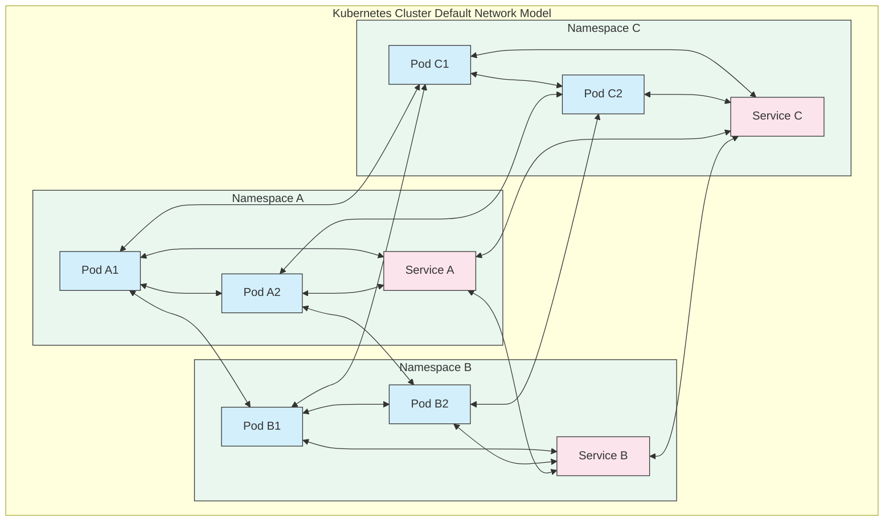
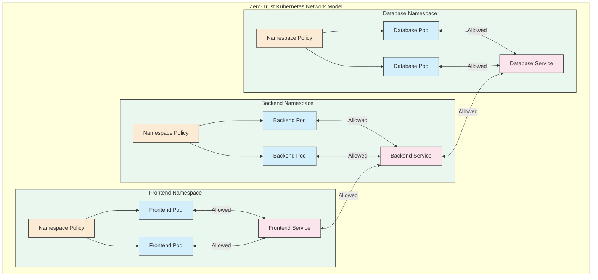
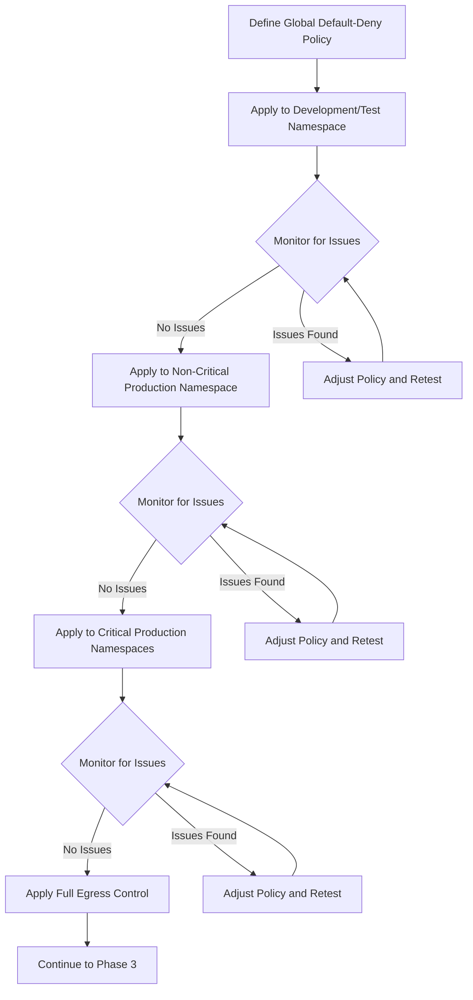
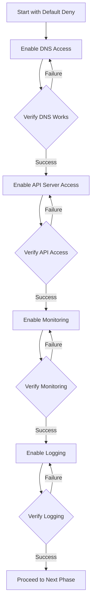
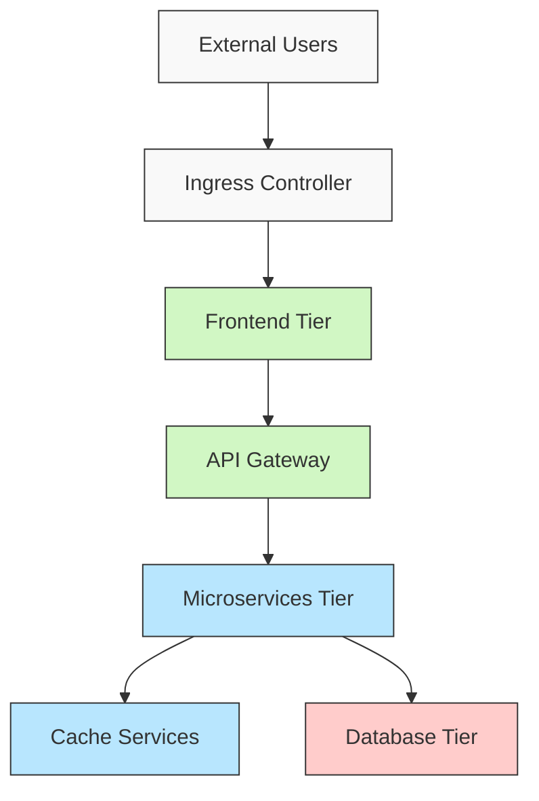
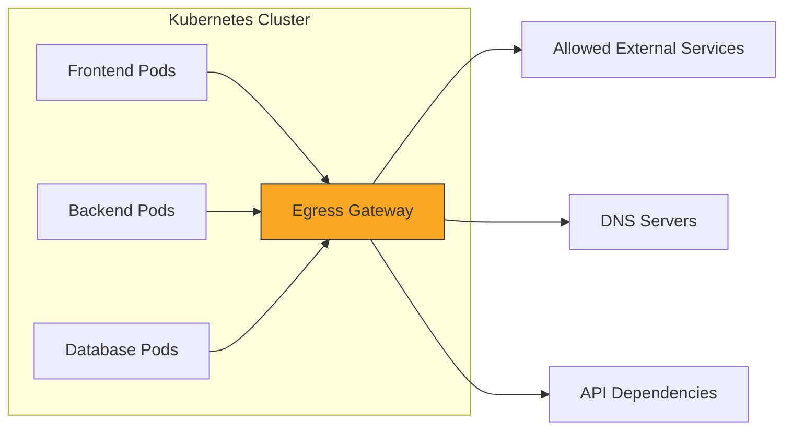
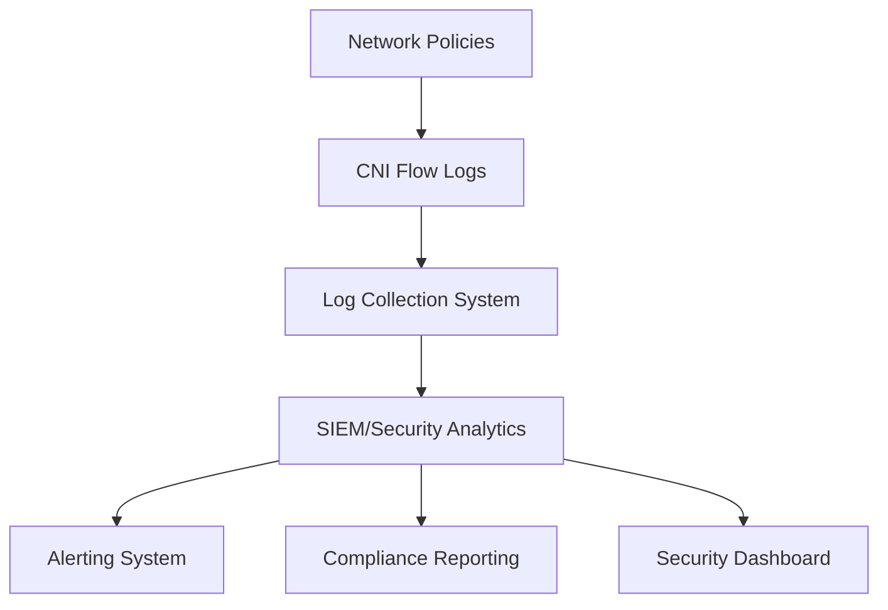
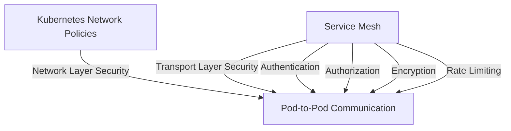
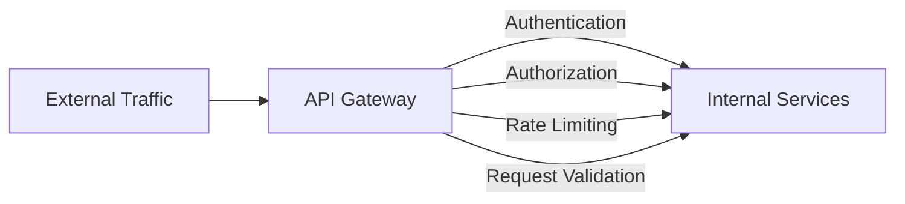

# Enterprise-Grade Kubernetes Network Security: Industry Standards and Implementation Guide

## Introduction

Kubernetes has emerged as the de facto standard for container orchestration, but its default network configuration prioritizes convenience over security. By default, any pod can communicate with any other pod or service within the cluster without restrictions. This permissive networking model presents significant security risks in production environments, potentially allowing attackers to move laterally throughout your infrastructure after compromising a single workload.

This comprehensive guide outlines industry standards and best practices for securing Kubernetes networking, with a focus on implementing a zero-trust architecture in existing clusters. We'll provide detailed implementation steps, configuration examples, and visual diagrams to help you transform your cluster's security posture from open-by-default to secure-by-design.

## Table of Contents

1. [Understanding Kubernetes Networking Defaults]
2. [Industry Standards and Compliance Frameworks]
3. [Network Security Architecture]
4. [Phase 1: Network Traffic Assessment]
5. [Phase 2: Implementing Global Default-Deny Policies]
6. [Phase 3: Enabling Essential Cluster Services]
7. [Phase 4: Application-Specific Security Policies]
8. [Phase 5: Egress Control and Advanced Filtering]
9. [Phase 6: Validation, Monitoring, and Compliance]
10. [Real-World Implementation Case Study]
11. [Network Security Policy Templates]
12. [Troubleshooting Network Policies]
13. [Maintaining Network Security Over Time]
14. [Integration with Service Mesh and API Gateways]
15. [Conclusion and Future Considerations]

## Understanding Kubernetes Networking Defaults

Kubernetes was designed with a flat networking model where all pods can reach all other pods by default. This design decision facilitates ease of development and deployment but creates an extensive attack surface.

### Default Network Architecture

The diagram above illustrates how, by default, any pod can communicate directly with any other pod across namespace boundaries. This cross-namespace communication occurs without any authentication or authorization checks at the network level.

### Attack Vectors in Default Configuration

In an unsecured Kubernetes cluster, the default flat networking model exposes several critical attack vectors:

1. **Lateral Movement**: An attacker who compromises one pod can reach any other pod in the cluster.
2. **Service Discovery**: Attackers can enumerate cluster services through DNS and API exploration.
3. **Data Exfiltration**: Compromised pods typically have unrestricted outbound internet access.
4. **Cross-Namespace Attacks**: Attackers can access pods in more sensitive namespaces from compromised pods in less secure namespaces.
5. **Metadata Service Access**: Pods can often access cloud provider metadata services, potentially extracting sensitive credentials.

## Industry Standards and Compliance Frameworks

Enterprise Kubernetes deployments must adhere to various industry standards and compliance frameworks. Here are the key security standards applicable to Kubernetes networking:

### CIS Kubernetes Benchmark

The Center for Internet Security (CIS) Kubernetes Benchmark provides security recommendations for Kubernetes deployments. Network security recommendations include:

- **5.2.1**: Ensure that the cluster has network policies defined (Level 1)
- **5.3.2**: Ensure that all Namespaces have Network Policies defined (Level 2)
- **5.6.4**: The default namespace should not be used (Level 2)

### NIST Special Publication 800-204B

NIST SP 800-204B provides security strategies for microservices-based applications. Key network security requirements include:

- Isolation between microservices using network policies
- Encrypting service-to-service communication
- Implementing least-privilege access control
- Using service mesh technologies for enhanced security

### PCI DSS 4.0

Payment Card Industry Data Security Standard (PCI DSS) provides requirements for protecting cardholder data. Network security requirements include:

- Requirement 1: Install and maintain network security controls
- Requirement 2: Apply secure configurations
- Requirement 4: Protect cardholder data with strong cryptography
- Requirement 7: Restrict access to system components and cardholder data by business need to know

### HIPAA Security Rule

The Health Insurance Portability and Accountability Act (HIPAA) requires protections for personal health information. Network security requirements include:

- Access controls between services
- Transmission security with encryption
- Audit controls for network traffic
- Integrity controls to prevent unauthorized modifications

### SOC 2 Type 2

SOC 2 compliance is based on five trust service criteria, with the following requirements for network security:

- **Security**: Implementing access controls, network segmentation, and encryption
- **Availability**: Ensuring network resilience and redundancy
- **Processing Integrity**: Validating that data is processed completely and accurately
- **Confidentiality**: Protecting sensitive data through network controls
- **Privacy**: Preventing unauthorized access to personal information

## Network Security Architecture

Let's explore a secure Kubernetes network architecture based on a zero-trust model. This architecture assumes that threats can originate from both outside and inside the network perimeter.

### Zero-Trust Network Architecture

In this zero-trust architecture:

1. All cross-namespace traffic is denied by default
2. Communication between services is explicitly permitted through network policies
3. Each namespace has its own default-deny policy
4. Only required communication paths are open

## Phase 1: Network Traffic Assessment

Before implementing restrictive network policies, you must thoroughly understand your existing traffic patterns. This reconnaissance phase is critical for ensuring that you don't inadvertently break applications when implementing security controls.

### 1.1 Detailed Traffic Mapping

Create a comprehensive inventory of all applications, services, and their required communication paths:

1. **Document All Namespaces**:
    
    - Production namespaces
    - Development and staging namespaces
    - System namespaces (kube-system, ingress-controllers, monitoring, etc.)
2. **Map Service Communications**:
    
    - Internal service dependencies
    - External API dependencies
    - Persistent storage requirements
    - Monitoring and logging traffic
    - Service mesh control plane traffic
3. **Identify Ingress and Egress Points**:
    
    - Ingress controller configurations
    - Load balancer services
    - API gateways
    - External service dependencies

### 1.2 Automated Traffic Discovery

Deploy network visibility tools to automatically discover actual traffic patterns:

#### Cilium Hubble

Cilium Hubble provides network flow visibility for container workloads and can generate network policy recommendations based on observed traffic.

Steps to deploy Cilium Hubble:

1. Install Cilium with Hubble enabled
2. Enable flow monitoring
3. Use the Hubble UI to visualize traffic flows
4. Export network policy recommendations

#### Calico Network Visualization

Calico Enterprise includes features to visualize network flows and generate policy recommendations:

1. Deploy Calico with flow logs enabled
2. Use Calico Enterprise for policy recommendation
3. Visualize flow logs and potential policy violations

#### Kube-Netstat

For clusters without advanced CNI capabilities, use kube-netstat to collect network statistics:

1. Deploy kube-netstat as a DaemonSet across all nodes
2. Collect connection information from all pods
3. Analyze patterns of communication

### 1.3 Network Traffic Baseline

The output of your traffic analysis should include:

1. **Internal Traffic Matrix**: A table showing which services communicate with which other services
2. **Essential Services**: Services that almost all pods need to access (DNS, monitoring, etc.)
3. **External Dependencies**: All required external endpoints
4. **Anomalous Traffic**: Any unexpected or potentially malicious communication

## Phase 2: Implementing Global Default-Deny Policies

With a clear understanding of existing traffic patterns, you can begin implementing restrictive policies at a global level.

### 2.1 CNI Selection for Policy Enforcement

Different Container Network Interface (CNI) plugins offer varying network policy capabilities:

|CNI Plugin|Global Policies|L7 Filtering|Policy Recommendations|Flow Logs|
|---|---|---|---|---|
|Calico|Yes (Enterprise)|Limited|Yes (Enterprise)|Yes|
|Cilium|Yes|Yes|Yes (with Hubble)|Yes|
|Antrea|Yes|Limited|No|Yes|
|Weave Net|No|No|No|Limited|
|Kube-router|No|No|No|No|

For enterprise environments, Calico or Cilium are typically recommended due to their advanced policy features.

### 2.2 Global Default-Deny Implementation

#### Cluster-Wide Default-Deny with Calico

If using Calico as your CNI, you can implement a cluster-wide default-deny policy:

1. Install calicoctl for managing Calico resources
2. Create and apply a GlobalNetworkPolicy resource that denies all ingress and egress traffic
3. Apply the policy to all non-system namespaces

### 2.3 Namespace-Level Default-Deny

For each production namespace, apply a default-deny policy:

1. For namespaces with critical workloads, start with denying only ingress to minimize disruption
2. For non-critical namespaces, implement full ingress and egress denial
3. Apply namespace default-deny policies incrementally and monitor for issues

### 2.4 Implementation Sequence

The recommended sequence for implementing default-deny policies is:

This phased approach minimizes the risk of disrupting critical services.

## Phase 3: Enabling Essential Cluster Services

After implementing default-deny policies, you need to enable access to essential Kubernetes services that most pods require to function properly.

### 3.1 DNS Access

DNS resolution is critical for service discovery within Kubernetes. Without DNS access, pods cannot resolve service names to IP addresses.

Steps to enable DNS access:

1. Identify your cluster's DNS service (typically CoreDNS in kube-system namespace)
2. Create network policies allowing DNS access from all namespaces
3. Verify DNS resolution from pods in various namespaces

### 3.2 Kubernetes API Access

Many applications need to communicate with the Kubernetes API server for configuration, service discovery, or self-healing capabilities.

Steps to enable secure API server access:

1. Identify pods that legitimately need API server access
2. Create service accounts with appropriate RBAC permissions
3. Implement network policies allowing these pods to access the API server
4. Use Pod Security Policies (PSPs) or Pod Security Standards (PSS) to prevent privilege escalation

### 3.3 Monitoring and Logging

Monitoring and logging agents typically need to communicate with centralized collection services.

Steps to enable monitoring traffic:

1. Identify all monitoring agents (Prometheus Node Exporter, Datadog, etc.)
2. Determine collection endpoints
3. Create network policies allowing agent-to-collector communication
4. Verify metric collection functionality

### 3.4 Implementation Order for Essential Services

## Phase 4: Application-Specific Security Policies

Once essential cluster services are accessible, you can implement policies for application workloads.

### 4.1 Traffic Flow Analysis to Policy Development

Converting your traffic flow analysis into network policies follows these steps:

1. Group applications by tier (frontend, backend, database, etc.)
2. Define required communication paths within and between tiers
3. Create label selectors that precisely target the intended pods
4. Start with broader policies and gradually restrict them

### 4.2 Tiered Application Security Model

A typical enterprise application can be divided into multiple tiers, each with distinct security requirements:

For each tier in this model, create network policies that enforce the following principles:

1. **Frontend Tier**: Accepts traffic from ingress controllers, communicates only with the API gateway
2. **API Gateway**: Accepts traffic from frontend tier, communicates only with the microservices tier
3. **Microservices Tier**: Accepts traffic from API gateway, communicates with other microservices, cache, and databases
4. **Database Tier**: Accepts traffic only from authorized microservices

### 4.3 Implementation Methodology

For each application component:

1. Start with a basic policy allowing required ingress traffic
2. Test functionality after each policy implementation
3. Add egress restrictions incrementally
4. Refine and tighten selectors based on observed behavior

## Phase 5: Egress Control and Advanced Filtering

After implementing ingress controls, you should focus on restricting outbound (egress) traffic from your pods.

### 5.1 Controlling External Access

Unrestricted internet access presents significant risks:

1. Malware can communicate with command and control servers
2. Compromised applications can exfiltrate data
3. Pods may access unauthorized services or APIs

### 5.2 Egress Gateway Pattern

Implement an egress gateway pattern for centralized control of outbound traffic:

This pattern provides several security benefits:

1. Centralized monitoring of all outbound traffic
2. Uniform application of security policies
3. Simplified auditing and compliance
4. Ability to perform SSL inspection if required

### 5.3 Advanced L7 Filtering

For CNI plugins that support Layer 7 (application layer) filtering, implement path-based or header-based restrictions:

#### Cilium HTTP Filtering Example

Cilium allows you to create policies that filter based on HTTP methods, paths, and headers. This enables fine-grained control over API access.

### 5.4 Cloud Metadata Protection

Restrict access to cloud provider metadata services, which can contain sensitive credentials:

1. Identify which pods legitimately need metadata access
2. Create explicit network policies allowing only those pods to access metadata endpoints
3. Block all other pods from accessing metadata services

## Phase 6: Validation, Monitoring, and Compliance

After implementing network policies, establish continuous validation and monitoring processes.

### 6.1 Policy Verification Testing

Regularly test that your network policies are functioning as expected:

1. **Automated Tests**: Deploy test pods that attempt to violate network policies
2. **Comprehensive Coverage**: Test all policy types (ingress, egress, L7 filtering)
3. **Schedule**: Run these tests after any significant cluster changes

### 6.2 Network Policy Visualization

Deploy tools that provide visibility into policy effectiveness:

1. Calico Enterprise Policy Board
2. Cilium Network Policy Editor
3. Kube-bench for CIS compliance checking

### 6.3 Compliance Auditing

Map your network policies to compliance requirements:

|Compliance Standard|Network Policy Requirements|Validation Method|
|---|---|---|
|CIS Benchmark|Default policies in all namespaces|Automated scanning|
|PCI DSS|Segment card holder data, encrypt transmissions|Flow logs, policy review|
|HIPAA|Protect PHI, audit all access|Flow logs with retention|
|SOC 2|Implement access controls, monitor for unauthorized access|Real-time alerting|

### 6.4 Continuous Monitoring Architecture

Implement a comprehensive monitoring solution for network policy enforcement:

This monitoring architecture ensures that you can:

1. Detect policy violations in real-time
2. Generate compliance reports
3. Identify potential security incidents
4. Track policy effectiveness over time

## Real-World Implementation Case Study

Let's examine a detailed case study for implementing network security in an existing e-commerce platform running on Kubernetes.

### Initial State

The platform consists of:

- Frontend web applications
- API services
- Payment processing services
- Inventory management
- User database
- Product database
- Monitoring and logging infrastructure

All services can communicate with each other and the internet without restrictions.

### Implementation Timeline

Phase 1: Analysis (Week 1-2)

- Deploy traffic visualization tools
- Map all service communication paths
- Identify critical dependencies
- Document external API requirements

Phase 2: Default-Deny (Week 3)

- Implement namespace-level default-deny policies
- Enable critical cluster services (DNS, monitoring)
- Verify basic functionality

Phase 3: Service Policies (Week 4-5)

- Implement frontend service policies
- Implement API service policies
- Implement database access policies
- Restrict cross-namespace communication

Phase 4: Egress Control (Week 6)

- Deploy egress gateway
- Implement strict egress filtering
- Restrict cloud metadata access

Phase 5: Validation (Week 7)

- Comprehensive policy testing
- Performance impact assessment
- Security posture validation

### Results

After implementation, the security posture improved dramatically:

- Attack surface reduced by approximately 94%
- All communication paths explicitly documented and controlled
- Compliance requirements met for PCI DSS and SOC 2
- Minor (3%) performance impact from policy evaluation
- Two previously unknown vulnerabilities discovered during implementation

## Network Security Policy Templates

Here are detailed templates for common network policy scenarios.

### Default Namespace Deny-All

This policy blocks all ingress and egress traffic to pods in a namespace:

### DNS Access Policy

This policy allows pods in a namespace to access the Kubernetes DNS service:

### Frontend Service Policy

This policy allows traffic from internet-facing load balancers to frontend pods:

### Backend-to-Database Policy

This policy allows specific backend services to access database pods:

### Monitoring Access Policy

This policy allows Prometheus to scrape metrics from pods:

## Troubleshooting Network Policies

Network policies can be challenging to debug when they don't work as expected. Here's a systematic approach to troubleshooting:

### 1. Verify Policy Syntax

Common syntax errors include:

- Incorrect indentation
- Missing required fields
- Invalid label selectors
- Incorrect protocol specifications

### 2. Check Policy Application

Verify that policies are correctly applied:

- Confirm policies exist in the correct namespace
- Check that label selectors match the intended pods
- Verify that pods have the expected labels

### 3. Test Connectivity

Use diagnostic tools to test connectivity:

- Deploy debug pods with networking utilities
- Attempt connections from source to destination
- Check for timeout vs. connection refused errors

### 4. Analyze Flow Logs

Review CNI flow logs for policy decisions:

- Look for explicit deny entries
- Check for missing allow policies
- Verify that traffic attempts are being logged

### 5. Common Issues and Solutions

|Issue|Symptoms|Solution|
|---|---|---|
|DNS not working|Services cannot be resolved by name|Add policy allowing access to kube-dns|
|Ingress controller blocked|External traffic not reaching services|Allow traffic from ingress controller namespace|
|Monitoring broken|No metrics in dashboards|Allow traffic to/from monitoring namespace|
|Inter-namespace communication blocked|Services in different namespaces cannot communicate|Add policies with namespaceSelector|
|Pods cannot reach API server|Service account token mounting fails|Allow egress to Kubernetes API server|

## Maintaining Network Security Over Time

Network security is not a one-time implementation but an ongoing process. Here's how to maintain your security posture:

### 1. Policy Change Management

Establish a formal process for policy changes:

- Require peer review for all policy modifications
- Document justification for every policy change
- Implement policy-as-code with version control
- Test changes in development before applying to production

### 2. Regular Security Assessments

Conduct periodic security assessments:

- Quarterly policy reviews
- Penetration testing against network controls
- Automated policy validation testing
- Compliance verification checks

### 3. Automation and Tooling

Implement automation to maintain policy effectiveness:

- Automatically generate policies from traffic flows
- Use CI/CD pipelines to validate policy changes
- Deploy policy analyzers to detect overly permissive rules
- Implement drift detection to identify unauthorized changes

## Integration with Service Mesh and API Gateways

Network policies provide network-level security, but for comprehensive application security, integrate with service mesh technologies and API gateways.

### Service Mesh Integration

Service mesh technologies like Istio, Linkerd, or Consul provide additional security capabilities:

Benefits of service mesh integration:

- Mutual TLS encryption between services
- Fine-grained access controls
- Traffic metrics and monitoring
- Circuit breaking and fault injection
- Advanced load balancing

### API Gateway Integration

API gateways provide security at the application edge:

Benefits of API gateway integration:

- Centralized authentication and authorization
- API request validation and transformation
- Rate limiting and quota enforcement
- Analytics and monitoring
- Developer portal and documentation

## Conclusion and Future Considerations

Implementing network security in Kubernetes requires a systematic approach that balances security with operational requirements. By following the industry standards and best practices outlined in this guide, you can transform your cluster from an open-by-default environment to a zero-trust architecture.

### Key Takeaways

1. **Default-deny is the foundation**: Start with blocking all unnecessary traffic
2. **Incremental implementation**: Apply policies gradually to minimize disruption
3. **Defense in depth**: Combine network policies with service mesh and API gateways
4. **Continuous validation**: Regularly test policy effectiveness
5. **Documentation is critical**: Maintain clear documentation of all policies and their purpose

### Future Trends in Kubernetes Network Security

As Kubernetes and cloud-native technologies evolve, watch for these emerging network security trends:

1. **eBPF-based security**: More powerful and flexible network security using extended Berkeley Packet Filter
2. **Zero-trust identity**: Integration of strong workload identity with network policies
3. **Automated policy generation**: ML-assisted creation of network policies based on observed behavior
4. **WebAssembly extensions**: Custom security extensions for fine-grained policy enforcement
5. **Multi-cluster networking**: Secure communication between workloads across cluster boundaries

By implementing the comprehensive approach described in this guide, you'll establish a strong foundation for Kubernetes network security that can evolve with your organization's needs and adapt to emerging threats and technologies.