# Introduction

Kubernetes has become the de facto standard for container orchestration, providing a powerful platform for deploying and managing containerized applications. While Kubernetes comes with a rich set of built-in resource types (like Pods, Deployments, and Services), its true power lies in its extensibility.

This document explores three key concepts that enable this extensibility:

- **Custom Resources (CRs)**
- **Custom Resource Definitions (CRDs)**
- **Kubernetes Operators**

These extension mechanisms allow you to adapt Kubernetes to your specific needs without modifying its core code. Whether you're managing databases, monitoring systems, or specialized workloads, understanding these concepts will help you build more sophisticated, self-managing applications on Kubernetes.

## The Extension Hierarchy: How Everything Fits Together

Before diving into details, it's helpful to understand how these concepts relate to each other:

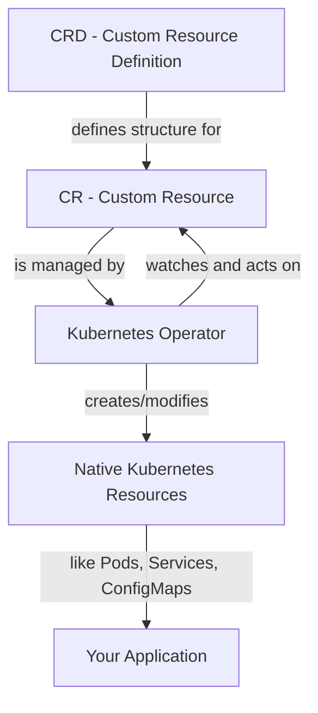

Think of this relationship like building and managing properties:

- **CRDs** are the architectural blueprints that define what can be built
- **CRs** are the actual buildings constructed from those blueprints
- **Operators** are the property managers that maintain the buildings according to your specifications

Let's explore each concept in depth.

## Custom Resources (CRs): Extending the Kubernetes API

### What Are Custom Resources?

A Custom Resource (CR) is an extension of the Kubernetes API that represents a customized resource or endpoint in your Kubernetes cluster. Custom Resources allow you to store and retrieve structured data in Kubernetes just like you would with built-in resources such as Pods or Deployments.

### Key Characteristics of Custom Resources

1. **API Extensions**: Custom Resources extend the Kubernetes API without modifying the core Kubernetes code.
2. **Declarative Configuration**: Like native Kubernetes objects, Custom Resources follow the declarative model where you define the desired state.
3. **Namespace Scoped or Cluster Scoped**: CRs can be limited to a namespace or available across the entire cluster.
4. **Full Kubernetes Integration**: CRs participate in the Kubernetes object lifecycle and can be managed using standard tools like `kubectl`.
5. **Versioned**: CRs support API versioning, allowing for evolution over time.

### The Anatomy of a Custom Resource

A Custom Resource follows the same structure as native Kubernetes resources:

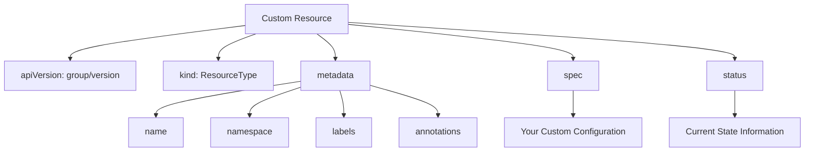

For example, a Custom Resource representing a database instance would include:

- **apiVersion**: Like `database.example.com/v1`
- **kind**: Such as `Database`
- **metadata**: Including name, namespace, and labels
- **spec**: With fields like engine type, version, storage size, and replica count
- **status**: Reporting the current state, connection details, and health

### When to Use Custom Resources

Custom Resources are ideal when:

- You need to store configuration data in a Kubernetes-native way
- You want to leverage Kubernetes' declarative model for your application
- You require version control and history for your application's configuration
- You want to integrate with Kubernetes' authorization mechanisms
- Your application configuration can be represented as structured data

## Custom Resource Definitions (CRDs): The Blueprint for Custom Resources

### What Are Custom Resource Definitions?

A Custom Resource Definition (CRD) is a Kubernetes resource that defines a new Custom Resource type. CRDs describe the structure and validation rules for Custom Resources. When you create a CRD, Kubernetes dynamically adds a new API endpoint to accept and serve the Custom Resource you defined.

Think of a CRD as a schema or template that tells Kubernetes what fields your Custom Resource can have, what types they should be, and how they should be validated.

### Key Components of a CRD

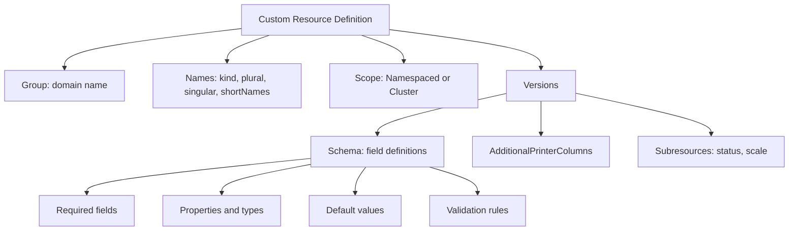

1. **Group, Version, Kind (GVK)**: These fields uniquely identify the resource in the Kubernetes API.
    
    - **Group**: Usually a domain name (e.g., `database.example.com`)
    - **Version**: API version (e.g., `v1`, `v1beta1`)
    - **Kind**: The resource type name (e.g., `Database`)
2. **Schema**: Defines the structure of the Custom Resource using OpenAPI v3 schema (JSON Schema).
    
    - Field definitions
    - Required fields
    - Validation rules
    - Default values
3. **Scope**: Determines if the Custom Resource is namespaced or cluster-wide.
    
4. **Additional Printer Columns**: Customizes how the resource appears in `kubectl get` output.
    
5. **Validation**: Rules to ensure the Custom Resource contains valid data.
    
    - Field type validation
    - Enum values for fields with a limited set of options
    - Pattern matching for strings
    - Minimum and maximum values for numbers
6. **Subresources**: Enables status and scale capabilities.
    
    - Status subresource allows updating status separately from spec
    - Scale subresource enables integration with Horizontal Pod Autoscaler

### The Class-Object Analogy

The relationship between CRDs and CRs is similar to classes and objects in object-oriented programming:

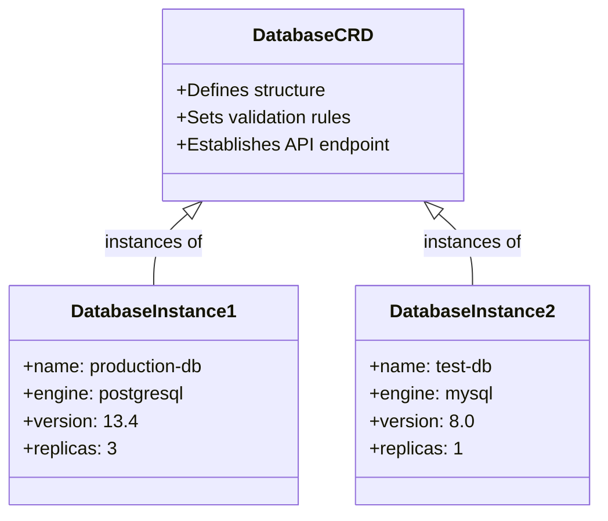

- **CRD**: Acts as a "class" or template that defines the structure and validation rules
- **CR**: Acts as an "object" or instance created according to the template

Once you apply a CRD to your cluster, you can then create multiple Custom Resources of that type, each representing a unique instance.

## Kubernetes Operators: Bringing Intelligence to Automation

### What Are Kubernetes Operators?

A Kubernetes Operator is a method of packaging, deploying, and managing a Kubernetes application using custom resources. An Operator extends Kubernetes to automate the management of complex applications that require human operational knowledge.

An Operator consists of:

1. Custom Resources that define the desired state of your application
2. A controller that continuously monitors these resources and takes actions to ensure the actual state matches the desired state

### The Control Loop: The Heart of Operators

At the core of every Operator is the control loop (also called the reconciliation loop), which follows these steps:

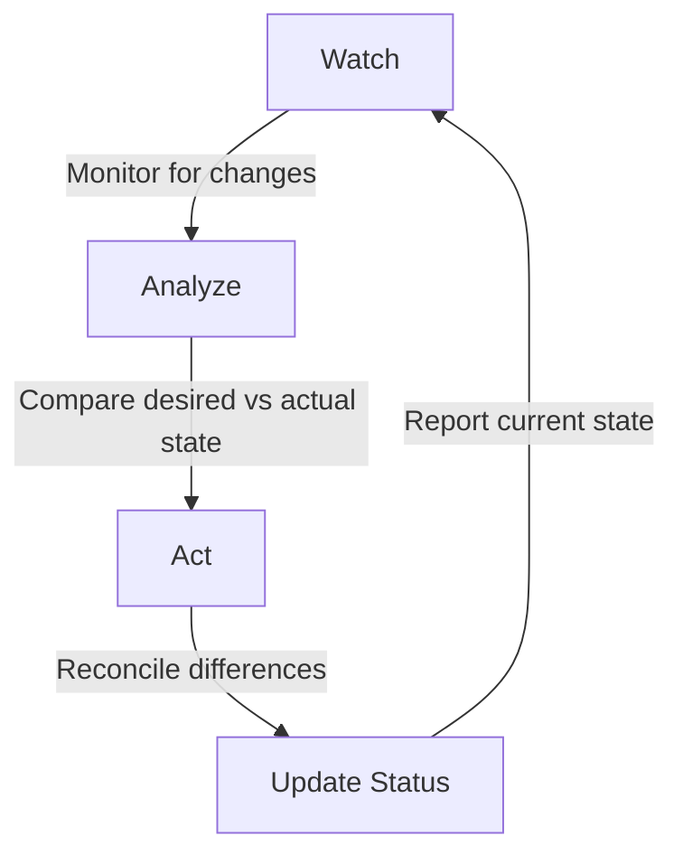

1. **Watch**: Monitor Custom Resources for changes
2. **Analyze**: Compare the current state with the desired state
3. **Act**: Take actions to reconcile differences between current and desired states
4. **Update Status**: Report back the current state and any issues

This pattern allows Operators to continuously ensure your application is running as desired, even in the face of failures or changes.

### Why Use Operators?

Operators help solve the "Day 2 operations" problem - the ongoing maintenance tasks required after an application is deployed:

- **Automated Provisioning**: Creating all necessary resources for an application
- **Automated Remediation**: Detecting and fixing issues without human intervention
- **Automated Updates**: Handling version upgrades safely with domain-specific knowledge
- **Backup and Restore**: Automating data protection tasks
- **Scaling**: Managing complex scaling operations beyond what Horizontal Pod Autoscaler can do
- **Configuration Management**: Reconfiguring applications as needed
- **Operational Knowledge Codification**: Embedding best practices into software

### Example: A Database Operator in Action

Let's see how a Database Operator would manage a PostgreSQL database:

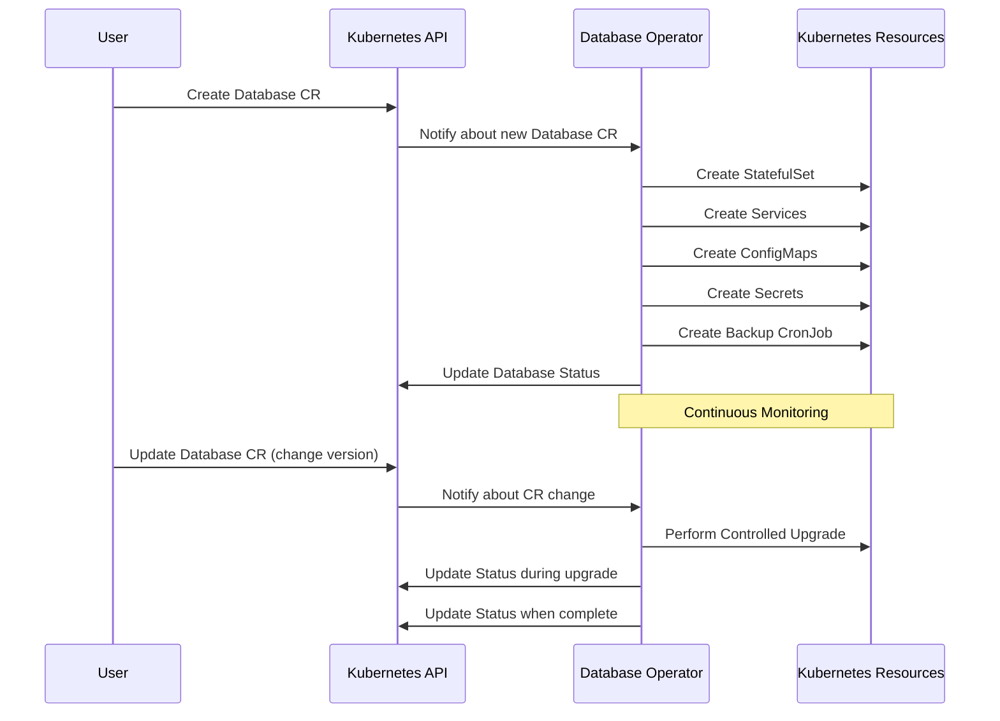

When a user creates a Database Custom Resource, the Operator:

1. Creates a StatefulSet for the database replicas
2. Creates Services for database access
3. Sets up ConfigMaps for database configuration
4. Creates Secrets for authentication
5. Sets up a CronJob for the backup schedule
6. Configures monitoring and health checks

The Operator continues to monitor the Database CR and responds to changes:

- If replicas are increased, it scales up the database
- If version is changed, it performs a safe upgrade procedure
- If a Pod fails, it ensures proper failover and recovery
- It verifies backups are completing successfully

The Operator also updates the status with current information:

- The current phase (Running, Upgrading, etc.)
- Connection details for applications
- Conditions like Available, Degraded, or Progressing
- The current number of replicas
- The current version
- The timestamp of the last successful backup

This example illustrates how an Operator codifies the operational knowledge required to run a database system. It's not just creating resources; it's actively managing them and responding to changes with domain-specific intelligence.

### The Operator Maturity Model

The Operator Capability Levels define five levels of sophistication:

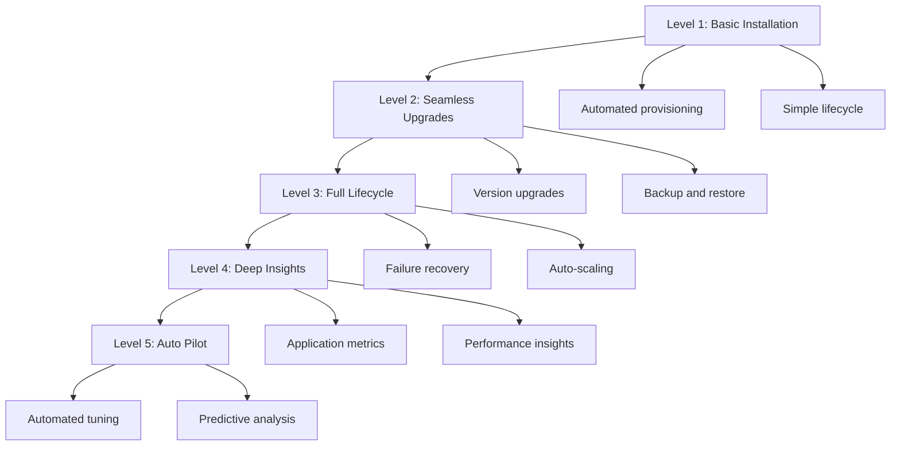

#### Level 1: Basic Installation

- Automated application provisioning and configuration
- Simple lifecycle capabilities (create/delete)
- Example: An Operator that can deploy and destroy a database instance

#### Level 2: Seamless Upgrades

- Version upgrades (patch and minor versions)
- Backup and restore capabilities
- Operational reconfiguration
- Example: An Operator that can upgrade a database from version 13.4 to 13.5

#### Level 3: Full Lifecycle

- Advanced application lifecycle management
- Auto-scaling based on metrics
- Failure detection and automated recovery
- Example: An Operator that can detect a failing database node and automatically replace it

#### Level 4: Deep Insights

- Application-specific metrics collection
- Alerting based on application state
- Performance optimization
- Example: An Operator that monitors query performance and suggests index improvements

#### Level 5: Auto Pilot

- Automated tuning based on workload
- Predictive analysis and proactive management
- Cross-instance optimization
- Example: An Operator that automatically adjusts resource allocation based on daily usage patterns

Most Operators begin at Level 1 and evolve to higher levels as they mature. The goal is to progressively automate more of the operational tasks that would normally require human expertise.

### Building Operators: Frameworks and Tools

Several frameworks simplify the process of building Operators:

1. **Operator SDK**: A framework from the Operator Framework project that helps you build, test, and package Operators using Go, Ansible, or Helm.
    
2. **Kubebuilder**: A framework from the Kubernetes SIG (Special Interest Group) for building Kubernetes APIs using CRDs and controllers in Go.
    
3. **KUDO (Kubernetes Universal Declarative Operator)**: A toolkit that lets you create Kubernetes Operators using a declarative approach, without writing code.
    
4. **Metacontroller**: A framework that simplifies writing controllers by separating the logic (which can be written in any language) from the Kubernetes integration.
    
5. **Kopf (Kubernetes Operator Pythonic Framework)**: A framework for writing Kubernetes operators in Python.
    

Each framework has its strengths, and the choice depends on your expertise and requirements.

## Practical Implementation Guide

### When to Use CRDs vs. Operators

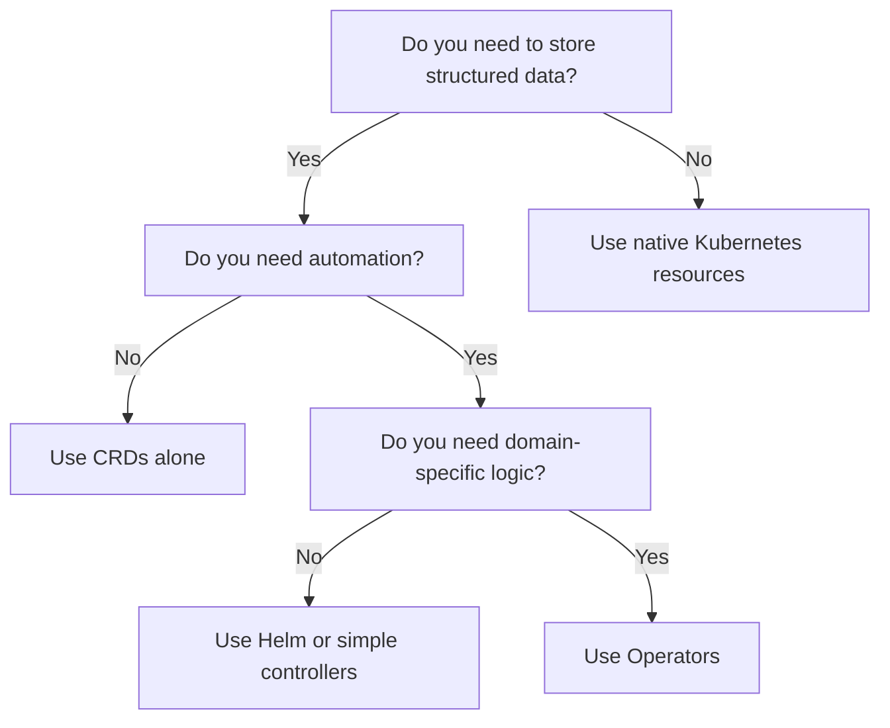

- **Use CRDs Alone When**:
    
    - You need to store and validate structured data in Kubernetes
    - Your resources don't require complex reconciliation logic
    - You just need a data structure, not automation
    - Example: Storing application configuration that other systems read
- **Use Operators When**:
    
    - Your application requires specific domain knowledge to operate
    - You need to automate complex operational tasks
    - You want to encode operational best practices into software
    - Example: Managing stateful applications like databases or message queues

### CRD Best Practices

1. **Version Your API**: Plan for future changes by using proper versioning strategies
    
    - Start with `v1alpha1` or `v1beta1` if your API might change
    - Use `v1` when your API is stable
2. **Validate Input**: Use comprehensive schema validation to prevent invalid resources
    
    - Define required fields
    - Use enums for fields with a limited set of values
    - Add pattern validation for string fields
    - Set min/max values for numeric fields
3. **Document Your Fields**: Use descriptions in the OpenAPI schema to help users understand the purpose of each field
    
4. **Consider Conversion Webhooks**: If you need to support multiple versions of your API, implement conversion webhooks to translate between versions
    
5. **Design for Future Growth**: Leave room for extension in your API
    
    - Consider which fields might be added later
    - Use nested objects to group related fields
6. **Use Semantic Status Conditions**: Report the state of your resources using consistent status conditions
    
    - Follow Kubernetes conventions like Available, Progressing, Degraded
7. **Add Helpful Printer Columns**: Make your resources easier to understand with custom columns in `kubectl get` output
    

### Operator Best Practices

1. **Focus on Reconciliation**: Design your controller around reconciling the current state with the desired state
    
    - Make your reconciliation loop idempotent
    - Handle partial failures gracefully
2. **Use Owner References**: Properly manage the lifecycle of created resources
    
    - Set owner references for all resources created by your Operator
    - Use cascading deletion when appropriate
3. **Implement Finalizers**: Clean up resources when objects are deleted
    
    - Add finalizers when creating resources that need cleanup
    - Remove finalizers only after successful cleanup
4. **Update Status Frequently**: Provide clear status information about managed resources
    
    - Update the status subresource with current conditions
    - Include meaningful error messages
    - Add timestamps for important events
5. **Use Events**: Record significant actions for troubleshooting
    
    - Create Kubernetes Events for important operations
    - Include enough detail to understand what happened
6. **Follow Kubernetes Patterns**: Leverage existing Kubernetes concepts
    
    - Use labels and annotations consistently
    - Follow naming conventions
    - Respect resource quotas and limits
7. **Implement Graceful Degradation**: Handle failures in a way that minimizes impact
    
    - Continue operating in a degraded state when possible
    - Provide clear information about limitations during degradation
8. **Test Thoroughly**: Write comprehensive tests for your Operator
    
    - Unit tests for controller logic
    - Integration tests with a real Kubernetes cluster
    - Chaos tests to verify resilience

## Real-World Operator Examples

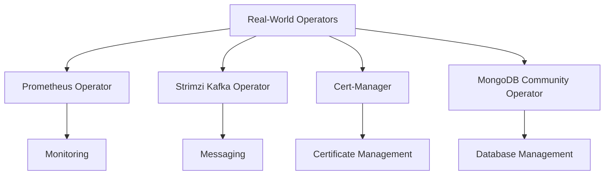

### Prometheus Operator: Monitoring Made Easy

The Prometheus Operator automates the deployment and management of Prometheus monitoring instances in Kubernetes. It introduces several Custom Resources:

- **Prometheus**: Defines a Prometheus deployment with configuration for retention, replicas, and resource limits
- **ServiceMonitor**: Declares how services should be monitored, using label selectors to find targets
- **PodMonitor**: Declares how pods should be monitored directly
- **AlertmanagerConfig**: Defines alerting rules and notification configurations
- **PrometheusRule**: Defines recording and alerting rules

The Operator handles complex tasks like:

- Generating configuration from ServiceMonitor and PodMonitor resources
- Automatically updating Prometheus when monitoring configurations change
- Managing highly available Prometheus and Alertmanager deployments
- Integrating with Kubernetes service discovery

### Strimzi Kafka Operator: Messaging Infrastructure Management

Strimzi is an Operator that manages Apache Kafka clusters on Kubernetes. It provides Custom Resources for:

- **Kafka**: Defines a Kafka cluster configuration including brokers, Zookeeper, and storage
- **KafkaTopic**: Manages topics including partitions and replication factors
- **KafkaUser**: Manages users and access control with authentication and authorization
- **KafkaConnect**: Manages Kafka Connect clusters for integrating with external systems
- **KafkaMirrorMaker**: Sets up mirroring between Kafka clusters

The Operator manages:

- Deploying and scaling Kafka brokers
- TLS certificate management
- Authentication and authorization
- Rolling updates with minimal downtime
- Automatic recovery from node failures
- Metrics collection and monitoring

### Cert-Manager: Certificate Management

Cert-Manager is an Operator that automates the management of SSL/TLS certificates in Kubernetes. Its Custom Resources include:

- **Certificate**: Requests a certificate with specific domains and renewal settings
- **Issuer/ClusterIssuer**: Defines how certificates are issued (ACME, self-signed, CA)
- **CertificateRequest**: Represents a request to a certificate authority

The Operator handles:

- Certificate issuance and renewal
- Challenge solving for domain validation
- Integration with Let's Encrypt and other issuers
- Secret management for certificates and private keys
- Certificate revocation

### MongoDB Community Operator: Database Management

The MongoDB Community Kubernetes Operator automates MongoDB deployments. Its main Custom Resource is:

- **MongoDB**: Defines a MongoDB deployment with configuration for replication, storage, and security

The Operator manages:

- Setting up replica sets with automatic leader election
- Storage provisioning and management
- User and role creation
- Backup and restore operations
- Rolling upgrades of MongoDB versions
- TLS configuration and certificate management

## Advanced Topics in Kubernetes Extensions

### Webhooks: Extending the Kubernetes API Server

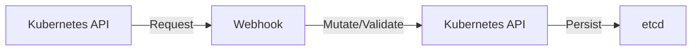

Webhooks allow you to intercept requests to the Kubernetes API server before they are processed or after they are processed but before they are persisted. There are two types:

1. **Validation Webhooks**: Validate custom resources before they are created or updated
2. **Mutation Webhooks**: Modify custom resources before they are processed

Webhooks enable powerful capabilities like:

- Complex validation that can't be expressed in an OpenAPI schema
- Dynamic defaults based on cluster state
- Policy enforcement across multiple resources
- Cross-field validation

### Aggregated APIs: Building Full-Featured APIs

While CRDs are the simplest way to extend Kubernetes, Aggregated APIs provide more control:

- They allow you to implement your own API servers
- They provide more flexibility in how requests are processed
- They can implement features that the core Kubernetes API supports but CRDs don't

Aggregated APIs are more complex to implement but necessary for some advanced use cases.

### Service Catalog: Extending Beyond Kubernetes

The Kubernetes Service Catalog extends the concept of Operators to services outside of Kubernetes:

- It provides a way to consume services from external providers
- It uses Open Service Broker API to communicate with service brokers
- It enables provisioning and binding to external services like databases, message queues, and more

### The Operator Ecosystem

The Operator ecosystem continues to grow with:

- **OperatorHub.io**: A central repository for community and vendor Operators
- **Operator Lifecycle Manager (OLM)**: A tool for managing Operators in a cluster
- **Operator Collections**: Curated sets of Operators for specific domains

## Conclusion: Building Your Extension Strategy

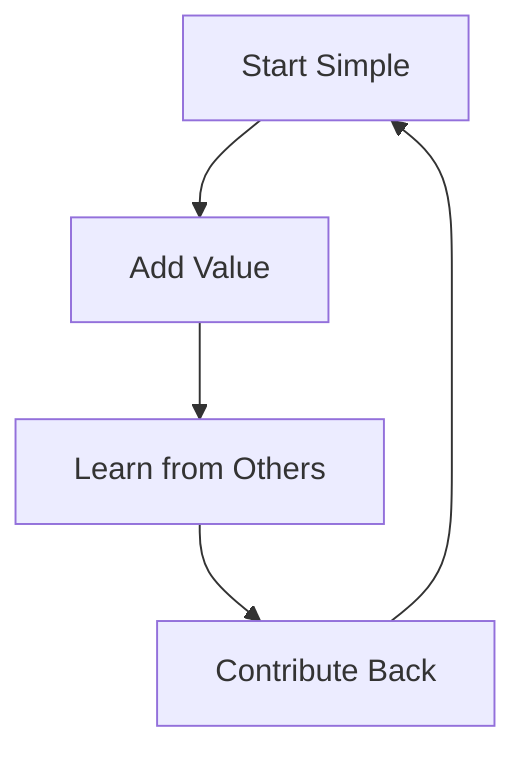

Custom Resources, CRDs, and Operators together form a powerful extension mechanism for Kubernetes. They allow you to extend Kubernetes beyond its core capabilities and build domain-specific abstractions that simplify complex application deployments.

- **Custom Resources** provide the data model
- **Custom Resource Definitions** register and validate those data models
- **Operators** bring these resources to life with automation

As you develop your Kubernetes extension strategy, consider:

1. **Start Simple**: Begin with Custom Resources and CRDs before moving to full Operators
2. **Focus on Value**: Build extensions that solve real operational problems
3. **Learn from Others**: Study existing Operators to understand best practices
4. **Contribute Back**: Share your Operators with the community when appropriate

By leveraging these extension mechanisms, you can create a more tailored, self-managing Kubernetes environment that meets your specific needs. As Kubernetes continues to evolve, these extension mechanisms will remain crucial for building specialized platforms that meet specific domain requirements.

## Further Learning Resources

1. **Official Documentation**:
    
    - Kubernetes Documentation: Custom Resources
    - Kubernetes Documentation: Operators
    - Operator SDK Documentation
2. **Books**:
    
    - "Kubernetes Operators: Automating the Container Orchestration Platform" by Jason Dobies and Joshua Wood
    - "Programming Kubernetes: Developing Cloud-Native Applications" by Michael Hausenblas and Stefan Schimanski
3. **Courses and Workshops**:
    
    - Kubernetes Extension Workshops by CNCF
    - "Kubernetes CRD Development" courses on learning platforms
4. **Community Resources**:
    
    - OperatorHub.io
    - Cloud Native Computing Foundation (CNCF) Landscape
    - Kubernetes Special Interest Groups (SIGs)
5. **Example Operator Repositories**:
    
    - Prometheus Operator
    - Strimzi Kafka Operator
    - Cert-Manager

By combining this theoretical knowledge with practical experience, you'll be well-equipped to extend Kubernetes to meet your organization's specific needs.
