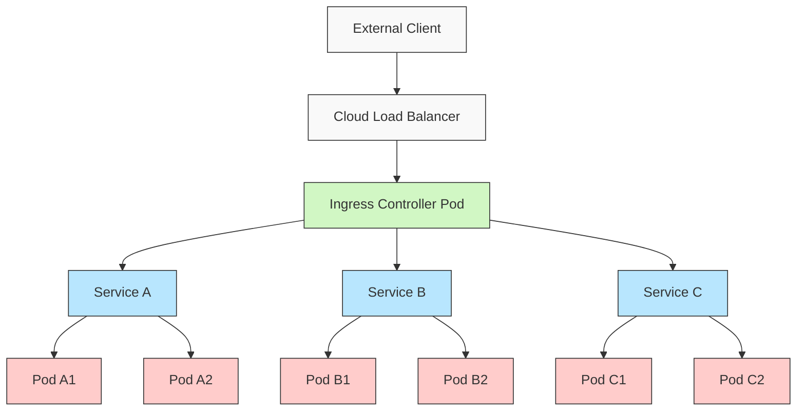
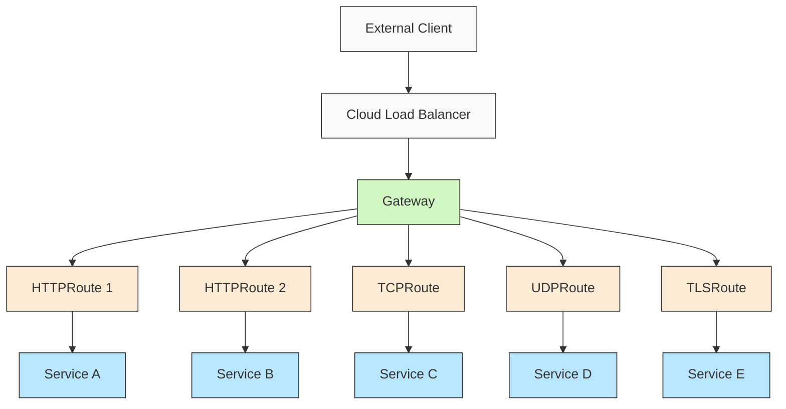
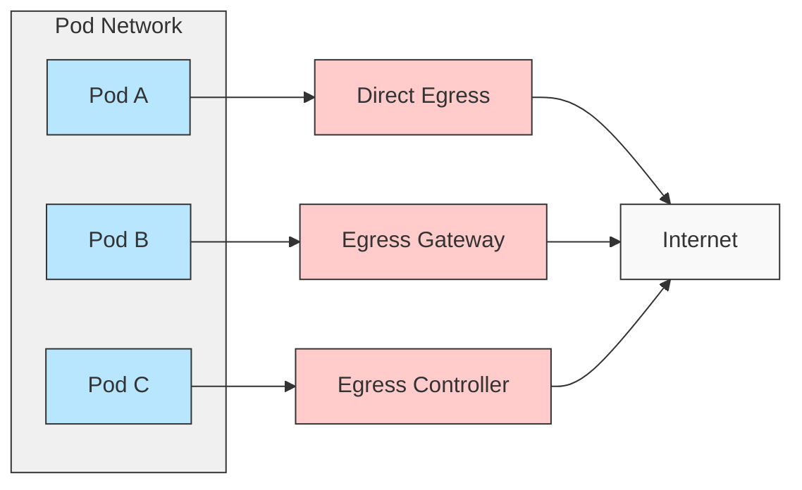
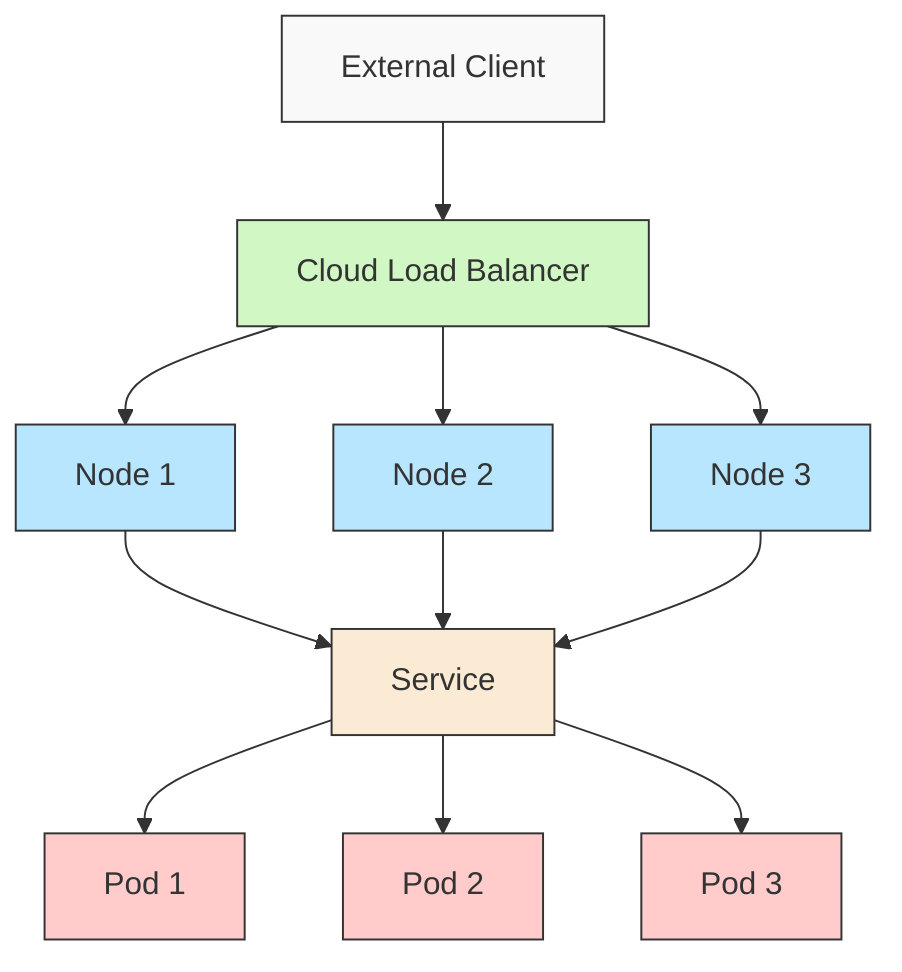
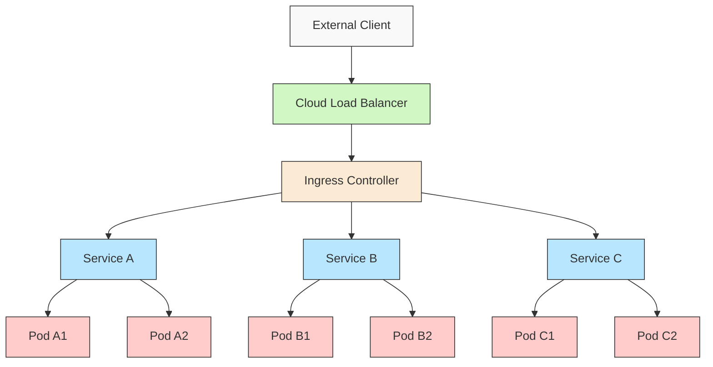

# Kubernetes Ingress and Egress Strategies: Traditional Controllers vs Gateway API

## Introduction

Managing traffic flow into and out of a Kubernetes cluster represents one of the most critical aspects of application deployment and security. How you control this traffic not only affects the performance and reliability of your applications but also forms a foundational element of your security posture. 

This document explores the various approaches to managing ingress and egress traffic in Kubernetes environments, comparing traditional ingress controllers with the newer Gateway API, examining their respective strengths and limitations, and providing guidance on industry best practices for implementation.

## Understanding Kubernetes Traffic Flow Fundamentals

Before diving into specific implementations, it's important to understand the fundamental concepts of traffic flow in Kubernetes.

### The Traffic Flow Lifecycle

```mermaid
flowchart LR
    A[External Client] --> B[Load Balancer/Ingress]
    B --> C[Service]
    C --> D[Pod]
    D --> E[Service]
    E --> F[Egress Controller]
    F --> G[External Destination]
    
    style A fill:#f9f9f9,stroke:#333,stroke-width:1px
    style B fill:#d1f7c4,stroke:#333,stroke-width:1px
    style C fill:#b8e6fe,stroke:#333,stroke-width:1px
    style D fill:#b8e6fe,stroke:#333,stroke-width:1px
    style E fill:#b8e6fe,stroke:#333,stroke-width:1px
    style F fill:#ffcccb,stroke:#333,stroke-width:1px
    style G fill:#f9f9f9,stroke:#333,stroke-width:1px
```

Traffic flow in Kubernetes follows a distinctive lifecycle:

1. **External Request Initiation**: Traffic originates from external clients and reaches the cluster perimeter.
2. **Ingress Processing**: Traffic is inspected, potentially transformed, and routed based on rules.
3. **Service Resolution**: Kubernetes Services provide stable endpoints for routing traffic to Pods.
4. **Pod Processing**: Application containers process the request and generate responses.
5. **Egress Handling**: Outbound traffic from Pods is processed by egress controllers or gateways.
6. **External Destination Delivery**: Traffic reaches external services or endpoints.

### Key Traffic Management Components

The Kubernetes ecosystem provides several components for managing traffic:

1. **Load Balancers**: External load balancers distribute traffic across nodes in the cluster.
2. **Ingress Controllers**: Specialized Pods that implement the Ingress specification to route HTTP/HTTPS traffic.
3. **Services**: Abstractions that define logical sets of Pods and policies to access them.
4. **Network Policies**: Kubernetes resources that control traffic flow between Pods and external endpoints.
5. **Egress Controllers**: Components that manage outbound traffic from the cluster.
6. **Gateway API Resources**: A modern set of APIs for managing traffic that extend beyond the capabilities of Ingress.

## Traditional Ingress Controllers: Capabilities and Limitations

Traditional ingress controllers implement the Kubernetes Ingress resource specification to manage external access to services within a cluster, typically over HTTP/HTTPS.

### Popular Ingress Controllers

1. **NGINX Ingress Controller**: One of the most widely adopted ingress controllers, offering robust HTTP routing capabilities and extensive customization options.

2. **Traefik**: A modern HTTP reverse proxy and load balancer that features automatic service discovery integration with Kubernetes.

3. **HAProxy Ingress**: Based on the high-performance HAProxy load balancer, offering advanced traffic management features.

4. **Contour**: Built on Envoy proxy, designed for high performance and security.

### Traditional Ingress Architecture

### Capabilities of Traditional Ingress Controllers

Traditional ingress controllers provide the following capabilities:

1. **HTTP/HTTPS Routing**: Path-based and host-based routing.
2. **TLS Termination**: Handling HTTPS connections and certificate management.
3. **Load Balancing**: Distribution of traffic across backend services.
4. **Rewriting Rules**: Modifying request paths before forwarding to backends.
5. **Rate Limiting**: Controlling the rate of incoming requests.
6. **Authentication**: Implementing basic authentication mechanisms.
7. **Session Affinity**: Maintaining client sessions with specific backend Pods.

### Limitations of Traditional Ingress Controllers

Despite their widespread adoption, traditional ingress controllers have several limitations:

1. **Protocol Restrictions**: Primarily designed for HTTP/HTTPS traffic, with limited support for other protocols.
2. **Annotation Proliferation**: Heavy reliance on implementation-specific annotations for advanced features.
3. **Multi-Tenancy Challenges**: Limited built-in isolation between different teams or applications sharing the same ingress controller.
4. **Complex Configuration**: Advanced scenarios often require intricate configuration.
5. **Inconsistent Implementation**: Different controllers implement the Ingress specification in varying ways.
6. **Limited Reusability**: Difficult to reuse configuration across multiple ingress resources.
7. **Namespace Constraints**: Ingress resources are namespace-scoped, creating challenges for cluster-wide routing rules.

## Kubernetes Gateway API: The Evolution of Traffic Management

The Kubernetes Gateway API represents a significant evolution in traffic management, designed to address the limitations of the traditional Ingress API and provide a more flexible, expressive, and extensible model.

### Gateway API Architecture

The Gateway API introduces several key resources:

1. **GatewayClass**: Defines the type of Gateway infrastructure to be used (similar to StorageClass for PVCs).
2. **Gateway**: Represents the deployed instance of a traffic gateway that processes incoming requests.
3. **Route Types**: Different route resources (HTTPRoute, TCPRoute, UDPRoute, TLSRoute, etc.) that define how traffic should be processed and routed.

### Key Advantages of Gateway API

The Gateway API offers several significant improvements over traditional Ingress:

1. **Multi-Protocol Support**: Not limited to HTTP/HTTPS; supports TCP, UDP, and TLS protocols.
2. **Role-Oriented Design**: Clear separation of concerns between infrastructure providers, cluster operators, and application developers.
3. **Cross-Namespace Routing**: Routes can direct traffic to services in different namespaces with explicit permissions.
4. **Sophisticated Traffic Management**: More powerful match conditions, weight-based traffic splitting, and header manipulation.
5. **Layered Architecture**: Different components can be managed by different teams with clear interfaces between layers.
6. **Extensibility**: Custom resource definitions for specialized routing needs.
7. **Consistent Implementation**: Clearer specification leads to more consistent behavior across implementations.
8. **Enhanced Security Model**: Explicit permissions for cross-namespace references.

### Gateway API Implementations

Several projects now implement the Gateway API:

1. **Contour**: Implements Gateway API on top of Envoy proxy.
2. **Istio**: Full Gateway API support integrated with service mesh capabilities.
3. **Kong**: Gateway API implementation with the Kong API gateway.
4. **Traefik**: Support for Gateway API with the Traefik proxy.
5. **NGINX Gateway Fabric**: Implementation by the NGINX team.

## Egress Traffic Management in Kubernetes

While ingress traffic often receives more attention, managing egress (outbound) traffic is equally important for security, compliance, and operational reliability.

### Egress Traffic Control Approaches

Several approaches exist for managing egress traffic:

1. **Network Policies**: Kubernetes native resources that control traffic flow to and from Pods at the IP and port level.
2. **Egress Gateways**: Centralized points for outbound traffic that enable monitoring, filtering, and control.
3. **Service Mesh Egress**: Using service mesh components to manage outbound traffic.
4. **Transparent Proxies**: Intercepting egress traffic without requiring explicit configuration in applications.
5. **Gateway API for Egress**: Using Gateway API resources for outbound traffic management (still evolving).

### Egress Control Implementation Options

#### 1. Traditional Egress with Network Policies

Network Policies provide basic egress control:

1. **IP Block Filtering**: Restricting egress to specific CIDR ranges.
2. **Port Restrictions**: Limiting which ports Pods can connect to.
3. **Namespace Controls**: Controlling which namespaces Pods can communicate with.

#### 2. Egress Gateway Pattern

For more advanced egress control, the egress gateway pattern offers:

1. **Centralized Traffic Management**: All outbound traffic flows through dedicated gateways.
2. **Enhanced Monitoring**: Visibility into all external connections.
3. **Single Point for Security Controls**: Easier implementation of security measures.
4. **IP Allowlisting**: Restricting which external services can be accessed.
5. **Protocol Validation**: Ensuring traffic adheres to expected protocols.

#### 3. Service Mesh Egress Control

Service meshes like Istio, Linkerd, and Consul provide sophisticated egress capabilities:

1. **Traffic Shifting**: Gradual migration between external service versions.
2. **Circuit Breaking**: Preventing cascading failures from external dependencies.
3. **Enhanced Security**: mTLS for external connections.
4. **Retry Logic**: Automatically retrying failed requests to external services.
5. **Request Timeouts**: Setting timeouts for external service calls.

## Load Balancers vs. Ingress Controllers: Understanding the Differences

One common source of confusion is the relationship between load balancers and ingress controllers. While they both facilitate access to services, they serve different purposes and operate at different layers.

### Load Balancers in Kubernetes

Load Balancers in Kubernetes:

1. **Layer 4 Operation**: Work primarily at the transport layer (TCP/UDP).
2. **Direct Service Exposure**: Directly expose a single Kubernetes Service externally.
3. **One-to-One Mapping**: Each Service of type LoadBalancer typically requires its own cloud load balancer.
4. **Limited Routing Capabilities**: Cannot route traffic based on application-layer information like HTTP paths or host headers.
5. **Cloud Integration**: Usually provided by cloud providers and integrated with their infrastructure.
6. **Simplicity**: Straightforward to use but limited in functionality.

### Ingress Controllers

Ingress Controllers in Kubernetes:

1. **Layer 7 Operation**: Work at the application layer, understanding HTTP/HTTPS protocols.
2. **Path-Based Routing**: Can route traffic based on URL paths, hostnames, and headers.
3. **Many-to-One Relationship**: Multiple services can be exposed through a single ingress controller.
4. **Advanced Traffic Management**: Support for rewriting, redirection, SSL termination, and authentication.
5. **Resource Efficiency**: More efficient use of cloud resources by sharing a single external load balancer.
6. **Configuration Complexity**: More complex to configure but offer greater functionality.

### Relationship Between Load Balancers and Ingress

In most Kubernetes implementations, the relationship follows this pattern:

1. A cloud load balancer (Service type LoadBalancer) directs traffic to the ingress controller Pods.
2. The ingress controller then routes traffic to backend services based on Ingress rules.
3. This creates a two-tier architecture that combines the cloud integration of load balancers with the routing capabilities of ingress controllers.

## Industry Standards for Kubernetes Traffic Management

Organizations implementing traffic management in Kubernetes should adhere to established industry standards and best practices.

### Security Standards

1. **CIS Kubernetes Benchmark**:
   - Recommendation 5.7: Configure network policies as appropriate
   - Recommendation 5.4: Restrict access to the control plane
   - Recommendation 5.2.3: Prefer NodePort Services over LoadBalancer type

2. **NIST Special Publication 800-204B**:
   - Section 4.5: Implementing API Gateway patterns
   - Section 5.2: Security recommendations for microservices communication

3. **OWASP Kubernetes Security Cheat Sheet**:
   - Use network policies to restrict pod-to-pod communication
   - Implement proper ingress security controls
   - Use TLS for all ingress traffic

4. **Cloud Security Alliance (CSA)**:
   - Securing cloud load balancers
   - Implementing defense in depth for container environments

### Compliance Frameworks

1. **PCI DSS**:
   - Requirement 1: Install and maintain a firewall configuration
   - Requirement 4: Encrypt transmission of cardholder data

2. **HIPAA**:
   - Technical safeguards for controlling access to ePHI
   - Transmission security requirements

3. **SOC 2**:
   - Access control requirements
   - Network monitoring and protection

### Industry Best Practices

1. **Traffic Encryption**:
   - Enforce TLS 1.2+ for all external traffic
   - Consider internal traffic encryption with service mesh
   - Implement proper certificate management

2. **Authentication and Authorization**:
   - Implement authentication at the ingress layer
   - Use OAuth2/OIDC for API authentication
   - Consider JWT validation at the gateway

3. **Traffic Monitoring and Observability**:
   - Capture detailed metrics on ingress/egress traffic
   - Implement logging for all traffic decisions
   - Set up alerts for abnormal traffic patterns

4. **Rate Limiting and DDoS Protection**:
   - Implement rate limiting at the ingress layer
   - Consider cloud provider DDoS protection
   - Set up progressive rate limiting policies

5. **Multi-Tenancy Considerations**:
   - Implement strict isolation between tenant traffic
   - Consider dedicated ingress controllers for sensitive workloads
   - Use namespace boundaries for traffic segmentation

## Comparing Traditional Ingress and Gateway API

To help organizations make informed decisions, here's a detailed comparison of traditional Ingress controllers and the Gateway API:

| Feature | Traditional Ingress | Gateway API |
|---------|-------------------|------------|
| **API Maturity** | Stable | Beta |
| **Protocol Support** | Primarily HTTP/HTTPS | HTTP, HTTPS, TCP, UDP, TLS |
| **Multi-Tenancy** | Limited | Strong support with role separation |
| **Cross-Namespace Routing** | Limited or via annotations | Native support with explicit permissions |
| **Traffic Splitting** | Varies by implementation | Native support |
| **Header Manipulation** | Via annotations | Native API support |
| **Route Reuse** | Limited | Strong support |
| **Extensibility** | Via annotations | Native extension points |
| **Implementation Consistency** | Varies significantly | More consistent |
| **Role Separation** | Not defined | Infrastructure, Cluster, Application roles |
| **Security Model** | Basic | Enhanced with explicit permissions |
| **Configuration Complexity** | Simpler for basic use cases | More complex initially, more power long-term |

## Common Gaps in Kubernetes Traffic Management

Organizations implementing traffic management in Kubernetes often overlook several critical aspects:

### 1. Egress Traffic Control

Many implementations focus solely on ingress traffic, neglecting egress controls. This creates security blindspots and potential compliance issues.

### 2. Comprehensive TLS Management

Improper TLS configuration, including:
- Inadequate certificate rotation
- Weak cipher suites
- Missing certificate validation

### 3. Traffic Visibility and Monitoring

Limited visibility into traffic patterns, leading to:
- Inability to detect anomalous behavior
- Missing insights for capacity planning
- Limited forensic capabilities

### 4. Disaster Recovery Planning

Insufficient consideration for:
- Regional failures affecting ingress/egress
- Load balancer failover scenarios
- Configuration backup and recovery

### 5. Multi-Cluster Traffic Management

Challenges with:
- Consistent policy enforcement across clusters
- Traffic routing between clusters
- Global load balancing

## Implementation Recommendations

Based on the current state of technology and industry best practices, here are strategic recommendations for implementing traffic management in Kubernetes:

### For New Deployments

1. **Embrace Gateway API**:
   - Adopt Gateway API for new deployments to benefit from its enhanced capabilities and future-proof your architecture.
   - Select implementations with strong community support and active development.

2. **Implement Comprehensive Egress Control**:
   - Deploy egress gateways for centralized control of outbound traffic.
   - Use network policies as a defense-in-depth measure.

3. **Consider Service Mesh Integration**:
   - Evaluate service mesh technologies that integrate with your chosen ingress/gateway solution.
   - Implement mTLS for all service-to-service communication.

### For Existing Deployments

1. **Assess Current Security Posture**:
   - Evaluate existing ingress configurations against security best practices.
   - Identify and remediate any gaps in egress controls.

2. **Plan Migration Strategy**:
   - For ingress controllers, consider incremental migration to Gateway API.
   - Implement parallel deployments during transition periods.

3. **Enhance Monitoring and Observability**:
   - Deploy comprehensive traffic monitoring solutions.
   - Implement automated compliance checking for network policies.

## Case Study: Enterprise Migration to Gateway API

A financial services organization with 200+ microservices deployed across multiple Kubernetes clusters faced challenges with their traditional NGINX Ingress Controller implementation:

1. **Initial Challenges**:
   - Complex annotation-based configuration
   - Limited multi-tenancy capabilities
   - Difficulties with cross-namespace routing
   - Inconsistent security policies

2. **Migration Approach**:
   - Pilot implementation with non-critical services
   - Development of automated conversion tools for Ingress to Gateway API resources
   - Phased rollout by application domain
   - Comprehensive monitoring during transition

3. **Results**:
   - 40% reduction in configuration complexity
   - Improved security posture with explicit permissions
   - Enhanced developer experience with clear role separation
   - Better scalability with distributed gateway deployments

## Conclusion

Traffic management in Kubernetes continues to evolve, with the Gateway API representing a significant advancement over traditional Ingress controllers. Organizations should evaluate their specific requirements, compliance needs, and operational capabilities when selecting an approach.

Key takeaways:

1. **Evolution, Not Revolution**: The Gateway API builds upon the lessons learned from traditional Ingress controllers.
2. **Security by Design**: Modern traffic management approaches emphasize security as a core principle.
3. **Comprehensive Approach**: Consider both ingress and egress traffic in your architecture.
4. **Standards Alignment**: Ensure your implementation adheres to industry standards and best practices.
5. **Future-Proofing**: Design with flexibility to adapt to the evolving Kubernetes ecosystem.

By implementing a thoughtful approach to traffic management that addresses both ingress and egress concerns, organizations can enhance their security posture, improve operational efficiency, and provide a better experience for both developers and end-users.