# Kubernetes v1.33 "Octarine" Feature Overview

Kubernetes v1.33, codenamed "Octarine" (a nod to Terry Pratchett's Discworld series where octarine is the "color of magic"), brings significant enhancements across the platform. This document provides a comprehensive look at all major features introduced or evolved in this release.

## Feature Maturity Overview

The Octarine release showcases Kubernetes' commitment to both innovation and stability with a balanced distribution of features across maturity levels.

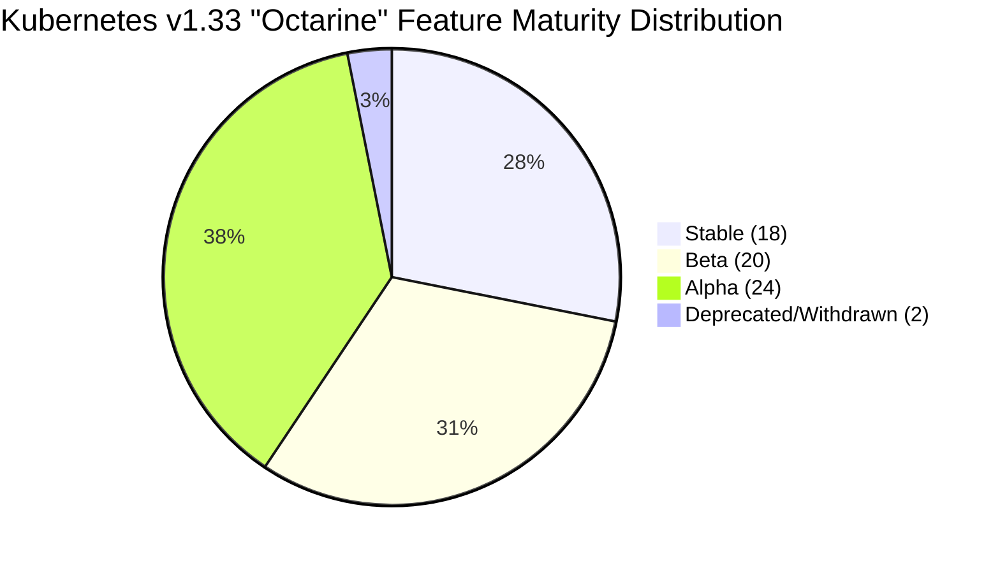

## Feature Timeline and Progression

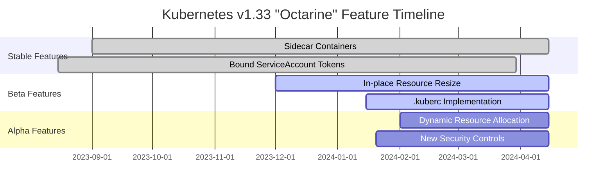

## Core System Enhancements

### 1. `.kuberc` User Preferences (Alpha)

The introduction of the `.kuberc` file creates a clean boundary between user preferences and cluster credentials.

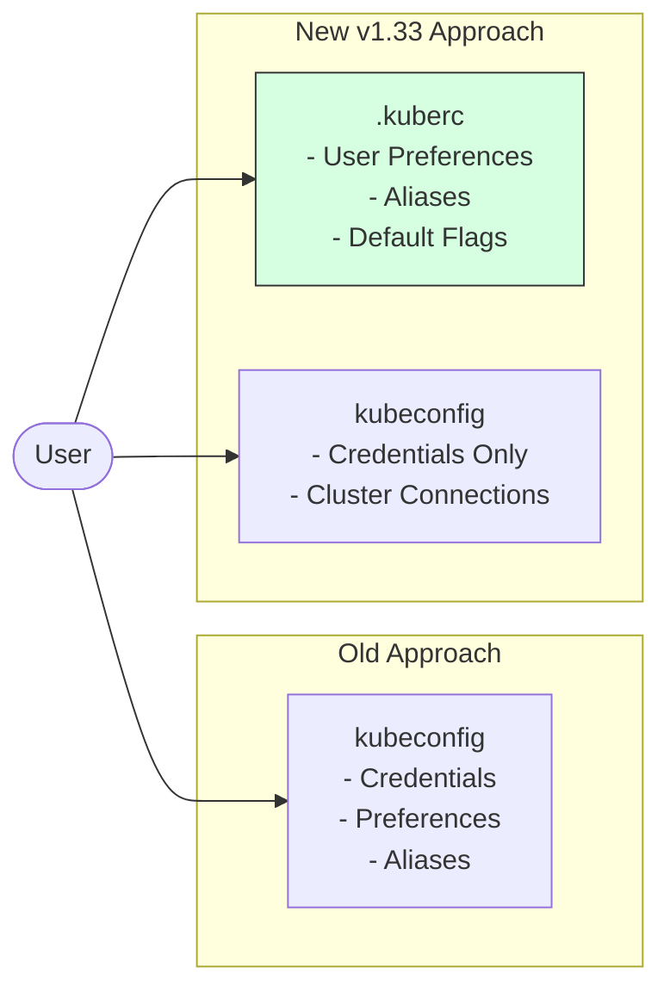

**Implementation Details:**

- Environment flag: `KUBECTL_KUBERC=true`
- Default location: `~/.kube/kuberc`
- Can specify custom path: `--kuberc /path/to/kuberc`
- Stored in YAML format
- Can contain aliases, default flags, output preferences

**Example `.kuberc` File:**

```yaml
aliases:
  k: kubectl
  kgp: kubectl get pods
  kga: kubectl get all

defaults:
  apply:
    server-side: true
  
output:
  format: yaml
  color: true
```

### 2. Sidecar Containers (Stable)

Sidecar containers, which share the same lifecycle and resources as the main container, have graduated to stable.

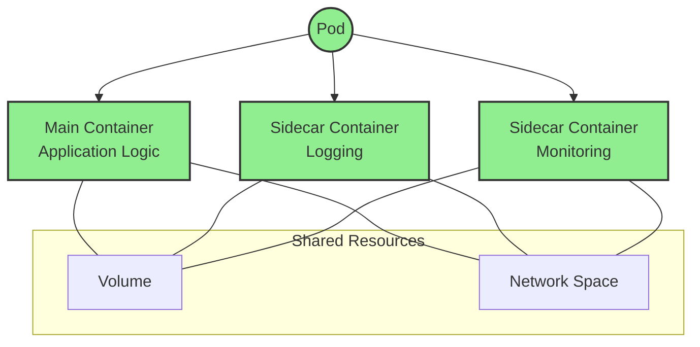

**Key Improvements:**

- Proper handling of container startup and shutdown sequences
- Improved resource sharing mechanisms
- Enhanced status reporting
- Better integration with other Kubernetes features

### 3. In-place Resource Resize (Beta)

This feature allows resources to be resized without restarting pods, providing more flexibility for applications.

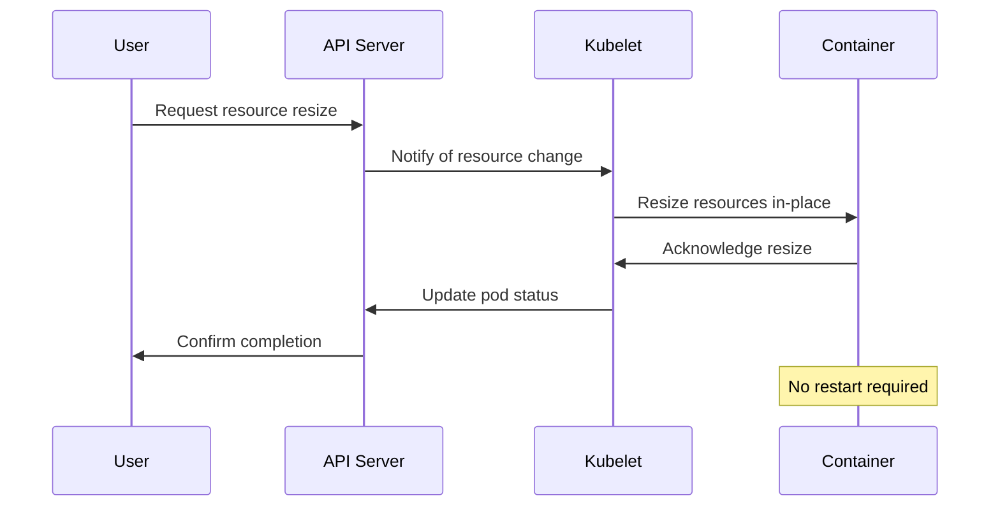

**Supported Resource Types:**

- CPU limits and requests
- Memory limits and requests
- Custom resources with resize capability

## Security Enhancements

### 1. Bound ServiceAccount Token Improvements (Stable)

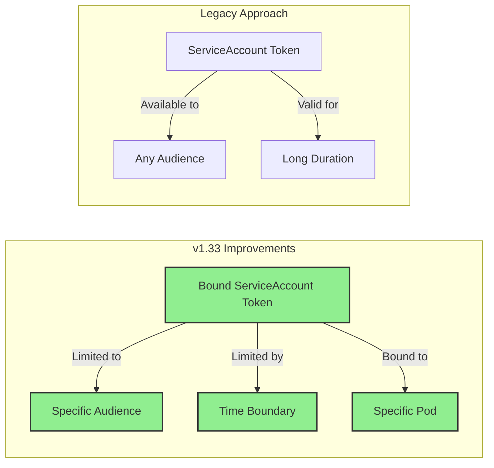

**Security Benefits:**

- Restricted token scope
- Time-limited exposure window
- Automatic rotation and cleanup
- Reduced risk from leaked credentials

### 2. Enhanced Authentication Controls (Beta)

New authentication enhancement features provide more granular control over API access.

## Dynamic Resource Allocation Enhancements (Alpha)

The Dynamic Resource Allocation (DRA) system receives significant updates in v1.33.

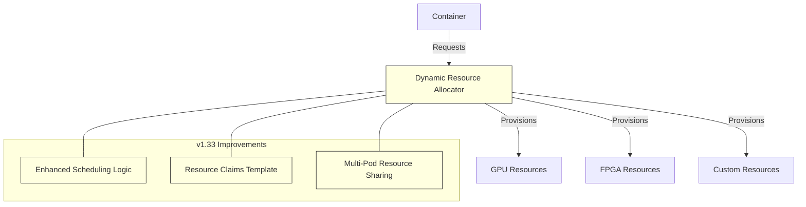

**Key DRA Improvements:**

- Resource claiming templates for simplified allocation
- Shared resource models for better utilization
- Enhanced scheduling integration
- Improved resource lifecycle management

## Network and API Improvements

### 1. Network Policy Enhancements (Beta)

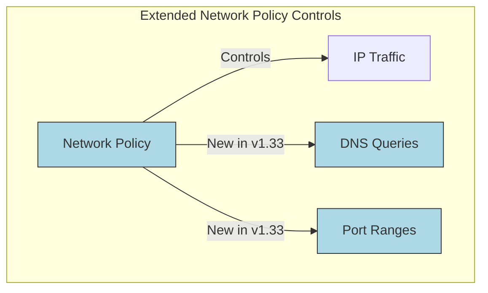

**New Capabilities:**

- DNS query filtering
- Expanded port range specifications
- Enhanced logging and auditing
- Better integration with external firewall systems

### 2. API Priority and Fairness Improvements (Stable)

The APF system is now stable with enhanced controls for API request management.

## Storage Enhancements

### 1. Volume Expansion Improvements (Beta)

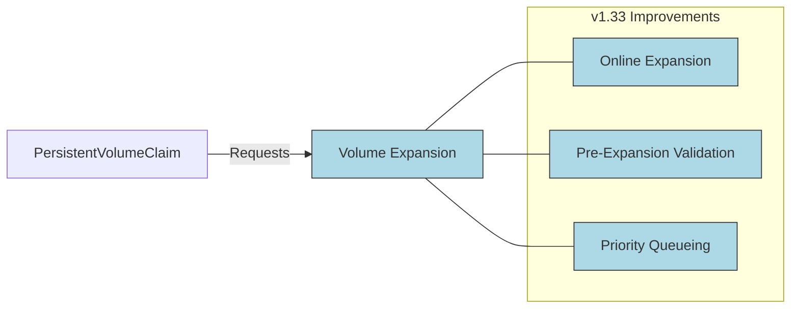

**New Features:**

- Improved online volume expansion
- Better handling of expansion failures
- Enhanced status reporting
- Cross-provider consistency

## Developer Experience Improvements

### 1. Enhanced kubectl Debugging Tools (Beta)

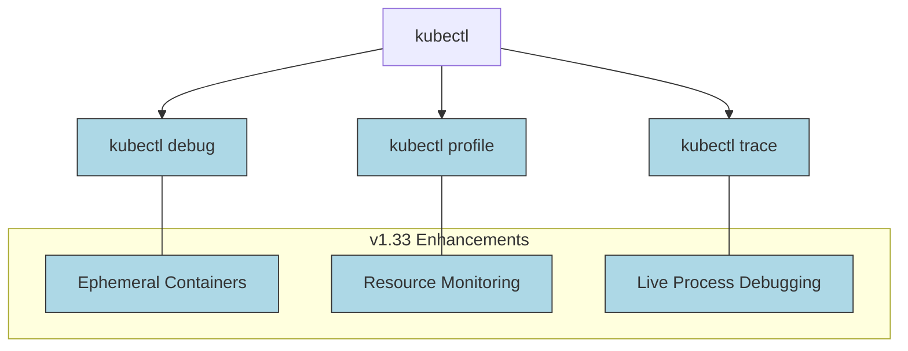

**New Debugging Capabilities:**

- Enhanced resource utilization visibility
- Simplified process debugging
- Better integration with cluster tooling
- Improved output formatting

### 2. Server-Side Apply Enhancements (Stable)

Server-side apply now includes better conflict resolution and field management.

## Feature Workflow and Lifecycle

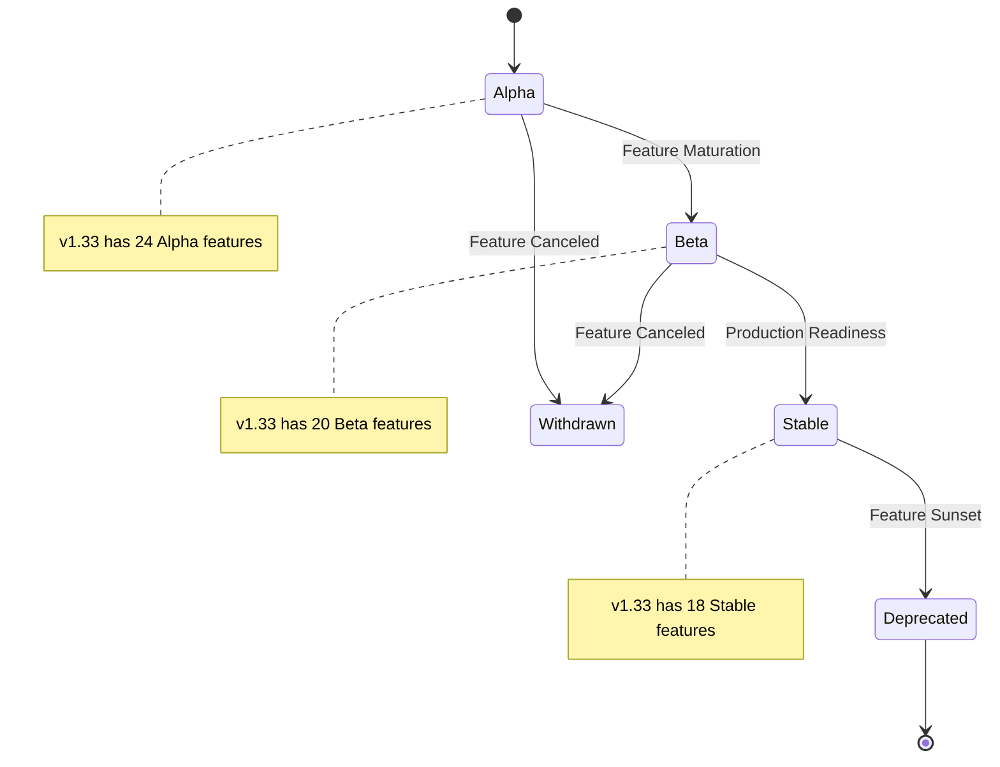

## Deprecations and Removals

Kubernetes v1.33 Octarine includes 2 deprecated or withdrawn items:

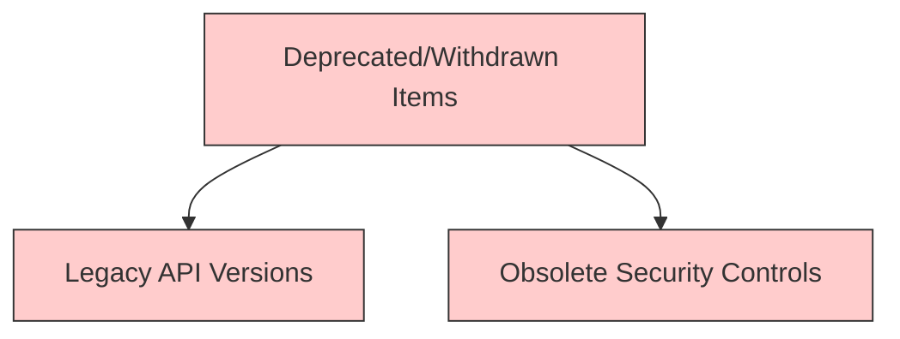

**Deprecation Details:**

- Removal of some legacy API versions
- Withdrawal of obsolete security controls superseded by newer mechanisms

## Cluster Operation Improvements

### 1. Enhanced Control Plane Metrics (Beta)

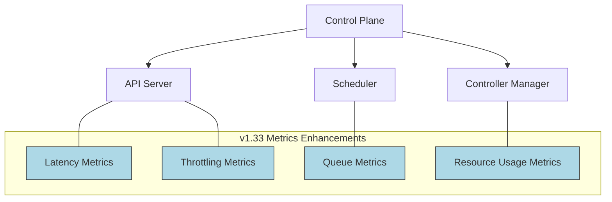

**New Metrics Available:**

- Enhanced request latency tracking
- Better resource utilization visibility
- Queue depth and processing metrics
- Throttling and backpressure indicators

### 2. Improved Resource Management (Beta/Stable)

Resource management sees significant improvements across several areas.

## Conclusion: The Octarine Magic

Kubernetes v1.33 "Octarine" balances stability and innovation, with significant improvements in user experience, security, and resource management. The `.kuberc` file stands out as a user-focused enhancement that will simplify configuration management for teams, while the graduation of 18 features to stable status reinforces the platform's enterprise readiness.

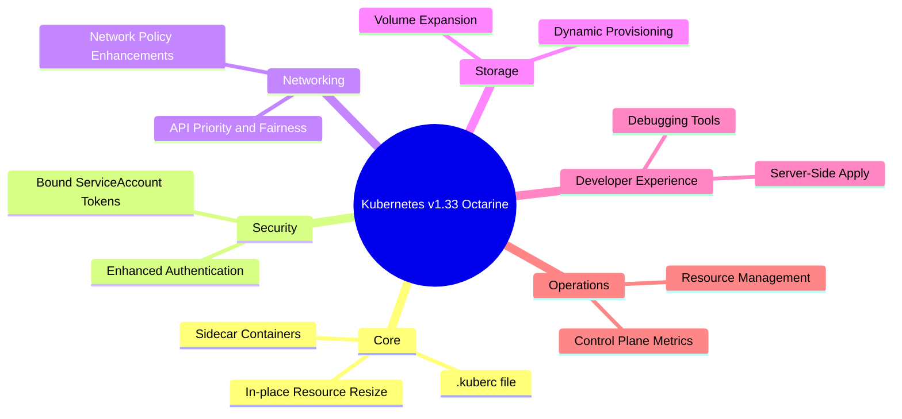

This release demonstrates Kubernetes' commitment to serving both current production requirements and future cloud-native advancements, with the "color of magic" evident in both practical improvements and forward-looking innovations.