# 📘 Kubernetes RBAC: Roles, ClusterRoles, Bindings & Aggregation (With Real-World Scenarios)

## 🔐 Introduction

Kubernetes uses **Role-Based Access Control (RBAC)** to define who can access what within a cluster. It controls access to resources such as Pods, Services, Secrets, Nodes, and more.

This document breaks down key RBAC components:

- `Role`
    
- `ClusterRole`
    
- `RoleBinding`
    
- `ClusterRoleBinding`
    
- Aggregated `ClusterRoles`
    

Each section includes **real-world scenarios** for practical understanding.

## 📊 RBAC Components Visualization

---

## 🎯 Role

**Scope**: Namespace-specific  
**Purpose**: Grant access to resources within a single namespace

### Use Case: Application Developer in a Dev Namespace

A team of developers is working in the `dev` namespace. You want them to view and troubleshoot deployments but not modify anything outside of that scope. You create a Role to allow access to list, get, and watch Pods and Deployments in the `dev` namespace.

This ensures:

- Developers stay limited to their environment
    
- They cannot accidentally affect production or other namespaces
    
- It adheres to the principle of least privilege
    

---

## 🌐 ClusterRole

**Scope**: Cluster-wide  
**Purpose**: Grant access across all namespaces or to non-namespaced resources

### Use Case: Monitoring System or Cluster Admin

A monitoring tool like Prometheus needs to scrape metrics from workloads across all namespaces. Since it operates at a global level, it requires permissions beyond a single namespace.

Alternatively, your cluster admin team needs access to resources like Nodes and PersistentVolumes that are not confined to any namespace. A ClusterRole provides this access.

This enables:

- Cross-namespace visibility
    
- Management of infrastructure-level resources
    
- Shared roles that multiple namespaces can reuse via bindings
    

---

## 🔗 RoleBinding

**Scope**: Namespace-specific  
**Purpose**: Assign a Role (or ClusterRole) to a user, group, or service account within a namespace

### Use Case: Service Account for CI/CD Job

A CI/CD pipeline running in the `staging` namespace needs to deploy applications and manage resources there. Using a RoleBinding, you can assign a Role that allows deploying apps, restarting Pods, and managing Services — **but only within `staging`**.

This:

- Keeps the service account sandboxed to its own namespace
    
- Prevents security risks from over-privileging
    
- Encourages separation of duties
    

---

## 🌍 ClusterRoleBinding

**Scope**: Cluster-wide  
**Purpose**: Assign a ClusterRole to a user, group, or service account across the entire cluster

### Use Case: SRE Team with Global Access

Your site reliability engineers (SREs) need to troubleshoot incidents in any namespace, review logs, and update deployments. You bind a ClusterRole with these privileges to their group using a ClusterRoleBinding.

This provides:

- Uniform access across all namespaces
    
- Simpler administration by avoiding namespace-specific bindings
    
- Efficient onboarding/offboarding by managing access at group level
    

---

## 🧩 Aggregated ClusterRoles

**Scope**: Cluster-wide (composed from other ClusterRoles)  
**Purpose**: Dynamically combine multiple `ClusterRoles` into one via label-based selectors

### Use Case: Building a Custom Read-Only Role

You want to create a custom "read-only observer" role that includes:

- Viewing core resources (Pods, Services)
    
- Viewing logs
    
- Accessing metrics
    

Instead of creating a large, monolithic ClusterRole, you define small ClusterRoles for each of these and label them consistently. Then, you define an aggregated ClusterRole that automatically pulls in rules from those smaller ones.

This approach:

- Promotes modularity and reusability
    
- Makes it easy to update access by adjusting labeled roles
    
- Ensures consistency across environments and teams
    

---

## 📊 RBAC Summary Table

|Type|Scope|Resources|Bound With|Use Case Scenario|
|---|---|---|---|---|
|`Role`|Namespace|Namespaced only|`RoleBinding`|Developers managing apps within one namespace|
|`ClusterRole`|Cluster-wide|All or non-namespaced|`RoleBinding`, `ClusterRoleBinding`|SREs, monitoring tools, and infrastructure access|
|`Aggregated ClusterRole`|Cluster-wide|Dynamically composed|Same as `ClusterRole`|Custom composite roles with reusable permissions|
|`RoleBinding`|Namespace|-|Binds Role or ClusterRole|CI/CD pipelines restricted to namespace resources|
|`ClusterRoleBinding`|Cluster-wide|-|Binds ClusterRole|Admin groups or tools needing access across cluster|

---

### Introduction to the RBAC Resource Scope Table

The table below provides a **concise summary of how Kubernetes RBAC rules apply to different resource types**, distinguishing between **namespaced** and **non-namespaced** resources. It explains:

- **When to use `Role` vs `ClusterRole`**
    
- **How to scope permissions using `RoleBinding` or `ClusterRoleBinding`**
    
- **Which Kubernetes resources require cluster-level access**
    

## Summary: RBAC Rule Application in Kubernetes

|Rule Type|Applies To|Scope Type|Resource Examples|Role Type Required|Notes|
|---|---|---|---|---|---|
|`Role`|**Namespaced only**|Namespaced|`pods`, `services`, `deployments`, `configmaps`, `secrets`|`Role`|Must be created in a specific namespace and used with `RoleBinding`|
|`ClusterRole`|**All namespaces**|Namespaced + Cluster-wide|All of the above plus `nodes`, `persistentvolumes`, `namespaces`|`ClusterRole`|Can be bound cluster-wide or per-namespace via `RoleBinding`|
|`RoleBinding`|Binds to a **Role or ClusterRole**|Namespaced|-|n/a|Grants access **within one namespace only**|
|`ClusterRoleBinding`|Binds to **ClusterRole**|Cluster-wide|-|n/a|Grants access **across all namespaces** and for cluster-scoped resources|

---

## 🔍 Examples by Resource Type

|Resource|API Group|Namespaced?|Needs Role or ClusterRole|Notes|
|---|---|---|---|---|
|`pods`|`""` (core)|✅ Yes|`Role` or `ClusterRole`|Most used in workload RBAC|
|`services`|`""` (core)|✅ Yes|`Role` or `ClusterRole`||
|`deployments`|`apps`|✅ Yes|`Role` or `ClusterRole`||
|`configmaps`|`""`|✅ Yes|`Role` or `ClusterRole`||
|`secrets`|`""`|✅ Yes|`Role` or `ClusterRole`|Sensitive—often scoped tightly|
|`nodes`|`""`|❌ No|`ClusterRole` only|Node-level access; never namespaced|
|`persistentvolumes`|`""`|❌ No|`ClusterRole` only||
|`namespaces`|`""`|❌ No|`ClusterRole` only|Used for managing namespaces themselves|
|`clusterroles`|`rbac.authorization.k8s.io`|❌ No|`ClusterRole` only|RBAC access to RBAC|

## 🧮 Permission Calculation and Accumulation

Kubernetes RBAC uses a purely additive model where permissions are combined rather than overridden:

---

## 🧠 Quick Guidelines

|Goal|Use This|Notes|
|---|---|---|
|Access only in one namespace|`Role` + `RoleBinding`|Most secure, least privilege|
|Share access across namespaces|`ClusterRole` + `RoleBinding`|Good for shared read-only or logging roles|
|Grant global or infra access|`ClusterRole` + `ClusterRoleBinding`|Needed for nodes, PVs, RBAC, etc.|

---

# Kubernetes RBAC: Understanding Role and Binding Precedence

## 🔐 Introduction

Kubernetes RBAC (Role-Based Access Control) allows fine-grained access control over Kubernetes resources using roles and bindings. One common point of confusion is whether one role or binding can **override**, **restrict**, or **take precedence** over another.

This document explains in detail:

- Whether `ClusterRole` can override a `Role`
    
- Whether `RoleBindings` or `ClusterRoleBindings` can override each other
    
- How Kubernetes RBAC actually computes effective permissions
    
- What mechanisms (if any) can restrict or deny access
    

---

## 🧩 Key Concepts

|Term|Scope|Description|
|---|---|---|
|`Role`|Namespace|Grants access to namespaced resources within a specific namespace|
|`ClusterRole`|Cluster-wide|Grants access to both namespaced and non-namespaced resources|
|`RoleBinding`|Namespace|Binds a `Role` or `ClusterRole` to a subject within a namespace|
|`ClusterRoleBinding`|Cluster-wide|Binds a `ClusterRole` to a subject across the entire cluster|

## 📝 RBAC Additive Nature Visualization

---

## ❓ Can a `ClusterRole` Override a `Role`?

**No**, Kubernetes does not support **override behavior** between `ClusterRoles` and `Roles`.

RBAC in Kubernetes is purely **additive**. This means:

- Permissions from all roles and bindings **accumulate**
    
- No role or binding can remove or restrict access granted by another
    
- Kubernetes calculates the **union of all granted permissions**
    

### Example:

Let's say a service account is:

- Bound to a `Role` in namespace `dev` allowing `list` pods
    
- Also bound (via `RoleBinding`) to a `ClusterRole` that allows `get` pods
    

Effective access in `dev`:

- ✅ `list` pods (from Role)
    
- ✅ `get` pods (from ClusterRole)
    

> 🔑 Result: The service account can perform both actions — **no role overrides or limits** the other.

---

## ❓ Can a `RoleBinding` Override a `ClusterRoleBinding`?

**No.** Again, the behavior is additive:

- A `RoleBinding` grants permissions **within a namespace**
    
- A `ClusterRoleBinding` grants permissions **cluster-wide**
    

If a subject is bound by both:

- They receive **combined** permissions in any namespace affected

### Example:

If `alvo-svc` is:

- Bound to a `Role` in namespace `frontend` with permission to `list pods`
    
- Also bound to a `ClusterRole` that grants `get` and `delete pods` via `ClusterRoleBinding`
    

Effective permissions:

- In namespace `frontend`: ✅ `list`, `get`, `delete` pods
    
- In other namespaces: ✅ `get`, `delete` pods (from `ClusterRoleBinding`)
    

> 🔑 No binding "wins" or overrides — **all valid bindings contribute to the final access profile**.

---

## 🚫 What You Cannot Do with RBAC

|Attempted Action|Supported by RBAC?|Explanation|
|---|---|---|
|Deny a specific action|❌ No|RBAC has no `deny` rules; only allows what is explicitly permitted|
|Override or restrict an existing role|❌ No|Roles and bindings cannot subtract or override previously granted access|
|Prioritize one binding over another|❌ No|Kubernetes merges all valid bindings and roles|

## 🔒 RBAC Limitations and Alternatives

---

## 🔐 How to Actually Restrict Access

Since RBAC does not support denying access or overriding, you need **complementary tools** to enforce restrictions:

### ✅ Use the following:

|Tool / Feature|Purpose|
|---|---|
|**Kyverno**|Enforce image policies, prevent exec access, etc.|
|**OPA/Gatekeeper**|Rego-based policies for validating and restricting cluster behavior|
|**PodSecurity Standards**|Restrict pod-level behavior like privileged access|
|**NetworkPolicies**|Restrict traffic between Pods|
|**Namespace isolation**|Create strong logical separation and avoid cross-binding|

## 📉 Role Escalation Prevention

---

## 🧠 Best Practices Summary

|Best Practice|Why It Matters|
|---|---|
|Avoid assigning multiple powerful roles to a single subject|Prevents unintended permission escalation|
|Use `Role` where possible before using `ClusterRole`|Follows least-privilege principle|
|Regularly audit bindings and permissions|Ensure no over-privileged accounts exist|
|Use Kyverno or Gatekeeper for restriction|Compensates for RBAC's additive-only design|

## 🔓 Common RBAC Pitfalls to Avoid

---

## ✅ Conclusion

Kubernetes RBAC is designed to **grant** access — not to deny, override, or restrict it. All permissions granted by `Roles`, `ClusterRoles`, `RoleBindings`, and `ClusterRoleBindings` are **cumulative**. This makes it easy to compose access for different use cases, but it also means you must be careful not to over-grant access inadvertently.

> To restrict access or enforce organizational policies, **pair RBAC with tools like Kyverno or OPA Gatekeeper**.

## 🔍 Advanced RBAC Patterns

```mermaid
graph TB
    subgraph "Advanced RBAC Implementation Patterns"
        P1["🔹 Tiered Access Model"]
        P2["🔹 Role Composition"]
        P3["🔹 Namespace Delegation"]
        P4["🔹 Temporary Elevated Access"]
        
        P1 -->|implements| T1["Multiple roles with<br>increasing privileges"]
        P2 -->|implements| T2["Small, focused roles<br>aggregated as needed"]
        P3 -->|implements| T3["Admin rights limited to<br>specific namespaces"]
        P4 -->|implements| T4["Just-in-time access<br>with time constraints"]
    end
    
    style P1 fill:#ddf,stroke:#333,stroke-width:2px
    style P2 fill:#ddf,stroke:#333,stroke-width:2px
    style P3 fill:#ddf,stroke:#333,stroke-width:2px
    style P4 fill:#ddf,stroke:#333,stroke-width:2px
```

## 🛠️ RBAC Troubleshooting Guide

When facing permission issues in Kubernetes, this troubleshooting flow can help identify and resolve the problem:

## 🎓 Understanding the Relationship Between RBAC Components

