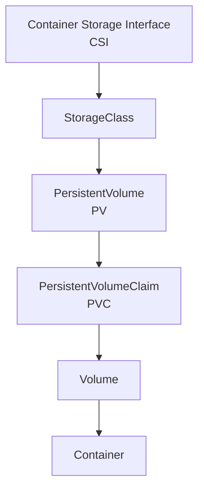
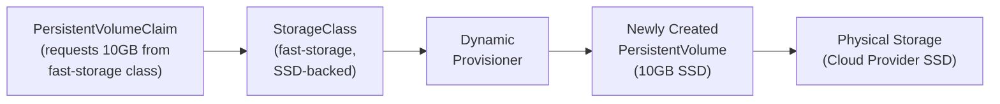
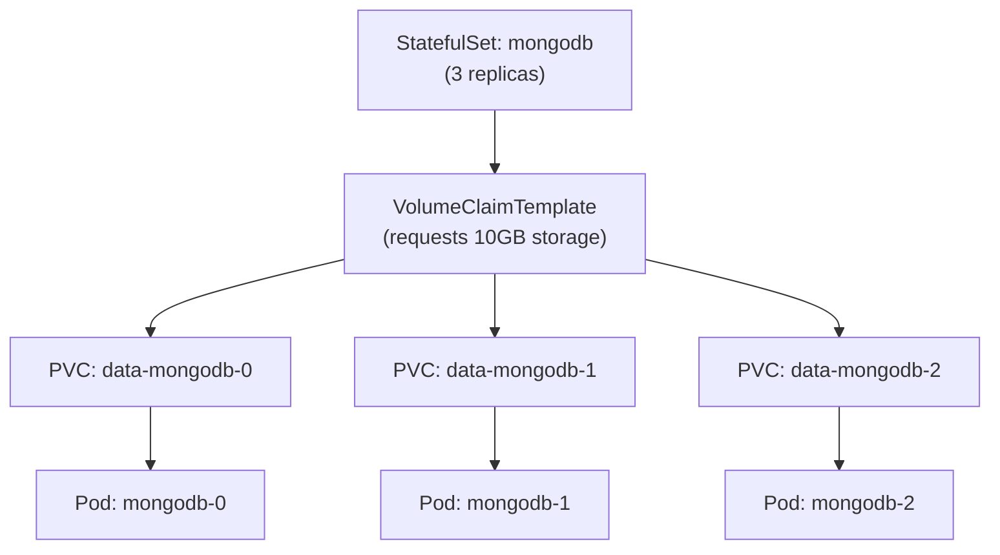

# Kubernetes Storage Solutions: A Comprehensive Guide

## Introduction

Storage management is a critical aspect of Kubernetes that enables stateful applications to function reliably in a containerized environment. Kubernetes offers a rich ecosystem of storage solutions, each designed to address specific requirements around data persistence, sharing, and lifecycle management. This guide explores all Kubernetes storage options, from basic volumes to advanced storage patterns, with detailed explanations of when and how to use each approach.

## Core Storage Concepts in Kubernetes

Before diving into specific storage types, it's important to understand the fundamental storage concepts in Kubernetes:

### Storage Hierarchy in Kubernetes

Kubernetes storage solutions follow a layered approach, with each layer building upon the previous one to provide increasing levels of abstraction and functionality:

## 1. Ephemeral Volumes

**What they are:** Temporary storage volumes that exist only for the lifetime of a pod.

**When to use:**

- For temporary data that doesn't need to survive pod restarts
- For sharing files between containers in the same pod
- For data that can be regenerated easily
- For caching and scratch space

**Types of Ephemeral Volumes:**

### emptyDir

**What it is:** Creates an empty directory volume when a pod is assigned to a node.

**Key characteristics:**

- Created when a pod is assigned to a node
- Initially empty
- Storage medium can be node's disk, SSD, or RAM (using `emptyDir.medium: Memory`)
- Deleted permanently when the pod is removed

**Best for:**

- Scratch space (e.g., for disk-based merge sorts)
- Checkpointing long computations
- Holding temporary files
- Sharing files between containers in the same pod

**Real-world example:** A content processing application might use emptyDir to temporarily store uploaded files while they're being processed by multiple containers in the same pod before being stored in permanent storage.

### hostPath

**What it is:** Mounts a file or directory from the host node's filesystem into your pod.

**Key characteristics:**

- Direct access to host filesystem
- Persists beyond pod lifecycle (on the same node)
- High performance (direct node access)
- No storage isolation between pods

**When to use:**

- For accessing host-level resources
- For system-level applications (monitoring, logging)
- Development and testing scenarios
- Running containers that need to access Docker internals

**Security considerations:**

- Potentially dangerous as it breaks pod isolation
- May expose host data to pods or allow pods to modify critical host files
- Requires careful permissions management

**Real-world example:** A node monitoring agent might use hostPath to access system metrics or log files from the underlying host to collect information about node health and performance.

### Projected Volumes

**What they are:** Volumes that map several existing volume sources into a single directory.

**Types include:**

- **secret:** Mounts a Kubernetes secret as a volume
- **configMap:** Mounts a ConfigMap as a volume
- **downwardAPI:** Exposes pod and container fields to applications
- **serviceAccountToken:** Provides a token for service account authentication

**Best for:**

- Mounting multiple data sources in a consistent way
- Providing configuration and secrets to applications
- Exposing metadata to containers

**Real-world example:** A web application pod might use projected volumes to combine TLS certificates (secrets), application configuration (configMap), and pod information (downwardAPI) into a single mounted directory structure.

## 2. Persistent Volumes and Claims

**What they are:** A resource abstraction that provides storage that outlives the pod lifecycle.

### PersistentVolume (PV)

**What it is:** A piece of storage in the cluster provisioned by an administrator or dynamically using Storage Classes.

**Key characteristics:**

- Cluster resource (not namespaced)
- Lifecycle independent of pods
- Can be provisioned statically or dynamically
- Has specific capacity, access modes, and reclaim policies

**Access modes:**

- **ReadWriteOnce (RWO):** Volume can be mounted as read-write by a single node
- **ReadOnlyMany (ROX):** Volume can be mounted read-only by many nodes
- **ReadWriteMany (RWX):** Volume can be mounted as read-write by many nodes
- **ReadWriteOncePod (RWOP):** Volume can be mounted as read-write by a single pod

**Reclaim policies:**

- **Retain:** Manual reclamation when PVC is deleted
- **Delete:** Automatically delete the storage asset when PVC is deleted
- **Recycle:** Basic scrub (`rm -rf /thevolume/*`) and make available again

### PersistentVolumeClaim (PVC)

**What it is:** A request for storage by a user that can be fulfilled by a PV.

**Key characteristics:**

- Namespaced resource
- Specifies size, access modes, and StorageClass
- Acts as an abstraction layer between pods and PVs
- Can request specific storage characteristics

**When to use PV and PVC:**

- For data that must survive pod restarts or rescheduling
- To decouple storage provision from consumption
- For standardized storage access across environments
- When applications need persistent storage

**Real-world example:** A database like PostgreSQL would use a PVC to request persistent storage for its data files. The PVC might be bound to a PV backed by high-performance SSD storage from the cloud provider. Even if the database pod is rescheduled to another node, it can reattach to the same storage volume with all data intact.

## 3. Storage Classes

**What they are:** Provide a way to describe different "classes" of storage offerings in a cluster.

**Key characteristics:**

- Define different tiers of storage (e.g., fast SSD vs. standard HDD)
- Enable dynamic provisioning of persistent volumes
- Allow administrators to define multiple storage options
- Include provisioner, parameters, reclaim policy, and volume binding mode

**Parameters typically include:**

- Type of storage (SSD, HDD)
- Replication settings
- Encryption requirements
- Performance characteristics

**When to use:**

- To offer different storage options based on performance needs
- For dynamic provisioning of volumes
- To standardize storage configuration across the cluster
- To implement storage policies aligned with business requirements

**Volume binding modes:**

- **Immediate:** Binding and provisioning happen when PVC is created
- **WaitForFirstConsumer:** Binding and provisioning delayed until pod uses the PVC

**Real-world example:** In a production cluster, you might define multiple StorageClasses:

- "fast-storage" for databases (SSD-backed with higher IOPS)
- "standard-storage" for general file storage (standard disks)
- "archival-storage" for backups and logs (cheaper, high-capacity storage)

Applications can then request the appropriate storage type through their PVCs.

## 4. Volume Types (Cloud and On-premises)

Kubernetes supports numerous volume types that integrate with various storage systems:

### Cloud Provider Volumes

#### AWS EBS (Elastic Block Store)

**What it is:** Block storage volumes for AWS EC2 instances.

**Characteristics:**

- Block storage (like virtual hard disks)
- Zone-specific (cannot be attached across zones)
- ReadWriteOnce access mode only
- Supports snapshots and encryption

**Best for:**

- Block storage needs in AWS environments
- Databases and other applications requiring dedicated disks

#### Azure Disk

**What it is:** Microsoft Azure's managed disks for Azure VMs.

**Characteristics:**

- Block storage volumes
- Zone-specific
- ReadWriteOnce access mode
- Various performance tiers (Standard HDD/SSD, Premium SSD)

**Best for:**

- Block storage in Azure environments
- Applications requiring predictable performance

#### Google Persistent Disk

**What it is:** Block storage for Google Compute Engine instances.

**Characteristics:**

- Block storage
- Regional or zonal options
- Multiple disk types (pd-standard, pd-ssd)
- ReadWriteOnce by default, some support for ReadOnlyMany

**Best for:**

- Block storage in Google Cloud environments
- Applications with varying performance requirements

### Network Storage Volumes

#### NFS (Network File System)

**What it is:** A distributed file system protocol allowing access to files over a network.

**Characteristics:**

- ReadWriteMany support (multiple pods can access simultaneously)
- Easy sharing across pods and nodes
- Lower performance than local storage
- Requires external NFS server

**Best for:**

- Shared read-write access from multiple pods
- Content management systems
- Development environments
- Legacy applications requiring file storage

#### iSCSI (Internet Small Computer Systems Interface)

**What it is:** Protocol for connecting to block storage over IP networks.

**Characteristics:**

- Block-level storage access over networks
- ReadWriteOnce typically
- Requires iSCSI target setup
- Direct block device access

**Best for:**

- Environments needing block storage without cloud providers
- Applications requiring direct disk access

#### CephFS

**What it is:** Distributed file system based on Ceph storage.

**Characteristics:**

- Highly scalable and redundant
- ReadWriteMany support
- Good performance at scale
- Open-source

**Best for:**

- Enterprise environments requiring scalable storage
- Applications needing shared file access with good performance

### Local Storage

#### Local PersistentVolume

**What it is:** A way to use local disks attached to nodes as PersistentVolumes.

**Characteristics:**

- High performance (direct disk access)
- No data redundancy (tied to specific node)
- Requires node affinity to schedule pods on the right node
- No dynamic provisioning (requires pre-planning)

**Best for:**

- High-performance applications where network latency is unacceptable
- Applications that manage their own replication
- Databases with built-in replication (e.g., Cassandra, Elasticsearch)

**Limitations:**

- Pod cannot be rescheduled to another node without data loss
- Requires careful capacity planning
- No built-in data protection

**Real-world example:** A high-performance database like Cassandra might use local PersistentVolumes for each node in its cluster. The database's own replication mechanism handles data redundancy, while the local storage provides maximum I/O performance by avoiding network overhead.

## 5. Container Storage Interface (CSI)

**What it is:** A standardized interface for container orchestration platforms to expose arbitrary storage systems to containerized workloads.

**Key advantages:**

- Storage vendor-provided plugins with out-of-tree development
- Standardized deployment method for storage drivers
- Dynamic plugin discovery and registration
- Advanced features like snapshots and cloning

**CSI capabilities:**

- Volume provisioning and deprovisioning
- Volume attachment and detachment
- Mount and unmount operations
- Volume snapshots and cloning
- Volume expansion
- Volume metrics

**Popular CSI drivers:**

- AWS EBS CSI driver
- Azure Disk CSI driver
- GCP Persistent Disk CSI driver
- VMware vSphere CSI driver
- NetApp Trident
- Pure Storage Pure Service Orchestrator
- Portworx

**When to use:**

- For all new storage integrations (preferred over in-tree volumes)
- When advanced storage features are needed
- For specialized storage requirements

**Real-world example:** A financial services application with strict data retention policies might use a CSI driver that supports snapshots to automatically create daily backups of database volumes. The CSI driver handles all the snapshot creation, management, and cleanup according to defined policies.

## 6. Advanced Storage Patterns

### Volume Snapshots

**What they are:** Point-in-time copies of volumes that can be used for backups, creating new volumes, or reverting to previous states.

**Use cases:**

- Data protection and backup
- Test/dev environments using production data
- Quick recovery from data corruption

**Components:**

- **VolumeSnapshotClass:** Defines parameters for snapshot creation
- **VolumeSnapshot:** Request for a snapshot of a PVC
- **VolumeSnapshotContent:** The actual snapshot resource

**Real-world example:** An e-commerce database might have hourly snapshots created automatically. If a bad deployment corrupts data, operators can quickly create a new volume from the last good snapshot and restore service.

### Volume Cloning

**What it is:** Creating a duplicate of an existing PersistentVolumeClaim.

**Use cases:**

- Creating test environments with production data
- Rapid provisioning of similar environments
- Data sharing between teams

**Real-world example:** A development team might clone a production database volume (sanitized for sensitive data) to have realistic data for testing new features without affecting the production environment.

### Volume Expansion

**What it is:** The ability to grow the size of an existing PersistentVolumeClaim.

**Key aspects:**

- Controlled by StorageClass allowVolumeExpansion parameter
- Only supports increasing size, not decreasing
- Some storage types require filesystem expansion after volume expansion

**Real-world example:** A growing application's database might start with a 100GB volume, but as data accumulates, administrators can expand it to 500GB without migrating data or experiencing downtime.

### Volume Topology

**What it is:** Constraints on which nodes a volume can be accessed from, based on topology domains like zones or regions.

**Use cases:**

- Ensuring volumes are scheduled in the same zone as pods
- Multi-zone clusters with zone-restricted storage
- Performance optimization by reducing network latency

**Components:**

- **WaitForFirstConsumer** binding mode in StorageClass
- **allowedTopologies** field in StorageClass
- Node labels for topology information

**Real-world example:** In a multi-zone Kubernetes cluster on AWS, EBS volumes are zone-specific. Volume topology ensures that pods are scheduled in the same availability zone as their volumes.

## 7. StatefulSets and Storage

**What they are:** Workload API objects used to manage stateful applications with unique identities and stable storage.

**Storage characteristics:**

- Stable, persistent storage per pod
- Predictable pod names and DNS hostnames
- Ordered deployment and scaling
- Automated handling of PVC creation and deletion

**VolumeClaimTemplates:**

- Define storage requirements for each StatefulSet pod
- Automatically create PVCs for each pod replica
- PVCs named with predictable pattern: `<volumeClaimTemplate-name>-<statefulset-name>-<ordinal>`
- PVCs retained when pods are deleted (data preservation)

**When to use:**

- Databases (MySQL, PostgreSQL, MongoDB)
- Distributed systems (Elasticsearch, Cassandra)
- Applications requiring stable network identities and storage
- Queue and messaging systems

**Real-world example:** A 3-node Elasticsearch cluster deployed as a StatefulSet would have three pods (elasticsearch-0, elasticsearch-1, elasticsearch-2), each with its own PVC created from the VolumeClaimTemplate. If elasticsearch-1 fails and is rescheduled, it reconnects to the same storage volume, preserving its data and state.

## 8. Ephemeral Volumes with Volume Population

**What they are:** A technique for pre-populating volumes with data from various sources.

**Volume populators:**

- **DataSourceRef:** Generic mechanism for specifying data sources
- Can populate from snapshots, other PVCs, or custom sources
- Allows for advanced data initialization

**Use cases:**

- Database cloning for test environments
- Initializing volumes with application data
- Creating pre-configured environments

**Example scenario:** A CI/CD pipeline might create a fresh test environment for each test run by cloning a "golden" database volume with sample data already loaded, saving initialization time.

## 9. Backup and Disaster Recovery

### Velero (formerly Heptio Ark)

**What it is:** An open-source tool to safely back up, restore, and migrate Kubernetes resources and persistent volumes.

**Key features:**

- Cluster resource backup and restore
- PV backup using snapshots
- Scheduled backups
- Cluster migration
- Disaster recovery

**When to use:**

- Regular cluster backups
- Before major upgrades
- Migrating applications between clusters
- Disaster recovery planning
- Compliance requirements

**Real-world example:** An enterprise might configure Velero to perform nightly backups of all production namespaces and their associated PVs to blob storage. If a cluster failure occurs, they can rapidly restore the entire application stack, including data, to a new cluster.

### CSI Volume Snapshots

**What they are:** CSI-specific implementation of taking point-in-time copies of volumes.

**Benefits over generic snapshots:**

- Storage vendor-optimized implementation
- Potentially more efficient
- Access to vendor-specific features

**Implementation components:**

- VolumeSnapshotClass with CSI driver
- VolumeSnapshot resources
- Storage-specific snapshot storage

## 10. Storage Performance Considerations

### Factors Affecting Storage Performance

**Access patterns:**

- Random vs. sequential access
- Read-heavy vs. write-heavy workloads
- Latency sensitivity

**Volume types:**

- Local vs. network storage
- SSD vs. HDD
- CSI driver efficiency

**Kubernetes factors:**

- Node resources
- Network configuration
- Storage class parameters
- Pod resource limits

### Performance Testing and Optimization

**Tools:**

- FIO (Flexible I/O Tester)
- ioping (I/O latency measurement)
- dbench (Database benchmark)

**Best practices:**

- Match storage type to workload requirements
- Consider using local storage for high-performance needs
- Use appropriate capacity and IOPS requests
- Monitor storage performance metrics

**Real-world example:** A team running MongoDB might perform benchmark tests with different storage classes and discover that their write-heavy workload performs significantly better with local SSDs compared to network-attached storage, leading them to redesign their StatefulSet to use local PersistentVolumes with node affinity.

## 11. Multi-container Storage Patterns

### Shared Volume Between Containers

**What it is:** A single volume mounted by multiple containers in the same pod.

**Use cases:**

- Shared configuration between containers
- Data exchange between application and sidecar
- Log collection

**Example implementations:**

- Sidecar container processing logs written by main container
- Init container populating data for main container
- Content management with separate processing containers

**Real-world example:** A web application container might write logs to an emptyDir volume, which is also mounted by a log-shipping sidecar container that processes and forwards the logs to a central logging system.

### Init Container Volume Preparation

**What it is:** Using init containers to prepare or populate volumes before application containers start.

**Use cases:**

- Database initialization
- Configuration generation
- Data validation or transformation
- Schema migration

**Real-world example:** Before a database container starts, an init container might run database migration scripts on the shared persistent volume to ensure the schema is up-to-date.

## 12. Storage Security

### Volume Encryption

**Types of encryption:**

- **At-rest encryption:** Data encrypted when stored
- **In-transit encryption:** Data encrypted when moving over network

**Implementation methods:**

- Storage provider encryption (e.g., AWS EBS encryption)
- CSI driver encryption support
- Node-level disk encryption
- Application-level encryption

**Real-world example:** A healthcare application handling patient data might use PVs backed by encrypted EBS volumes with customer-managed keys to satisfy HIPAA compliance requirements.

### Access Control

**Security mechanisms:**

- **PodSecurityPolicy:** Controlling which volumes a pod can use
- **RBAC:** Controlling who can create PVCs and PVs
- **SecurityContext:** Setting file permissions within volumes
- **fsGroup:** Controlling volume ownership

**Best practices:**

- Use read-only file systems where possible
- Apply appropriate file permissions
- Limit volume mount paths
- Use separate volumes for sensitive data

**Real-world example:** A financial services application might configure its volumes with specific fsGroup settings to ensure files are owned by a non-root user, while using read-only mounts for configuration volumes and applying strict RBAC policies to control who can create and access storage resources.

## 13. Troubleshooting Kubernetes Storage

### Common Issues and Solutions

**Volume mounting problems:**

- Check PV/PVC binding status
- Verify StorageClass exists and is properly configured
- Check for capacity issues or quota limits
- Inspect node-specific issues for local storage

**Performance issues:**

- Examine storage class parameters
- Check for node resource contention
- Review network configuration for network storage
- Verify CSI driver health

**Data loss scenarios:**

- Check reclaim policies
- Review deletion workflows
- Verify backup procedures
- Test recovery processes

**Debugging commands:**

- `kubectl describe pv/pvc <name>`
- `kubectl get events`
- `kubectl logs <storage-provisioner-pod>`
- `kubectl exec -it <pod> -- df -h`

**Real-world troubleshooting example:** When pods fail to start with "unable to mount volume" errors, an administrator might:

1. Check the PVC status to see if it's bound
2. Examine events for provisioning errors
3. Verify the storage class exists and the provisioner is running
4. Review capacity and quota limits
5. Check if the node has access to the storage backend

## 14. Storage Capacity Planning

### Capacity Management Strategies

**Resource planning:**

- Setting appropriate requests and limits
- Using namespace quotas
- Implementing LimitRanges

**Monitoring:**

- Volume usage metrics
- Growth rate tracking
- Capacity alerts and predictions

**Scaling strategies:**

- Volume expansion planning
- Storage class migration
- Data archival policies

**Real-world example:** A growing application might implement a tiered storage strategy, where hot data remains on fast SSD-backed PVs, while historical data is automatically migrated to cheaper, high-capacity storage classes after 30 days of inactivity.

## 15. Storage Migration Scenarios

### Migration Strategies

**Volume data migration:**

- Snapshot and restore to new storage class
- Application-level data replication
- Backup and restore

**Storage class migration:**

- Creating new PVCs with desired class
- Moving data between volumes
- Updating workload references

**Real-world migration example:** A company migrating from AWS to Google Cloud might:

1. Use Velero to back up all application resources and data
2. Restore to the new cluster with matching storage classes
3. Update DNS and service endpoints to direct traffic to the new environment
4. Validate application functionality before decommissioning the original cluster

## 16. Best Practices for Kubernetes Storage

### General Recommendations

**Design principles:**

- **Clearly separate stateless and stateful components:** Design applications with clear boundaries between stateless and stateful parts for easier scaling and recovery.
- **Use the right storage for the job:** Match storage type (block, file, object) to application requirements.
- **Plan for failure:** Assume storage will fail and design recovery procedures.
- **Implement proper backup strategies:** Regular backups with validation of restore procedures.
- **Monitor storage performance and capacity:** Proactive alerts before issues impact applications.

**Implementation practices:**

- **Start with appropriate storage classes:** Define storage classes that match your performance and reliability requirements.
- **Set appropriate reclaim policies:** Use "Retain" for critical data, "Delete" for ephemeral workloads.
- **Use appropriate access modes:** Select RWO, ROX, RWX, or RWOP based on actual needs.
- **Implement pod disruption budgets:** Protect stateful workloads from concurrent disruptions.
- **Apply resource requests and limits:** Prevent storage-related performance issues.

**Security practices:**

- **Encrypt sensitive data:** Use storage-level or application-level encryption.
- **Apply principle of least privilege:** Restrict access to storage resources.
- **Regularly audit storage access:** Monitor who's accessing what data.
- **Implement network policies:** Control traffic to storage-related services.

## Conclusion

Kubernetes provides a rich ecosystem of storage solutions to handle virtually any data persistence need. By understanding the strengths and limitations of each storage option, you can make informed decisions about which solution best fits your application requirements. From basic ephemeral storage to advanced StatefulSets with custom CSI drivers, the right storage architecture is essential for building reliable, scalable, and performant Kubernetes applications.

The storage landscape continues to evolve with each Kubernetes release, offering more features, better performance, and enhanced security. By adopting best practices and staying current with storage developments in the Kubernetes ecosystem, you can ensure your applications have the robust data foundation they need to succeed.