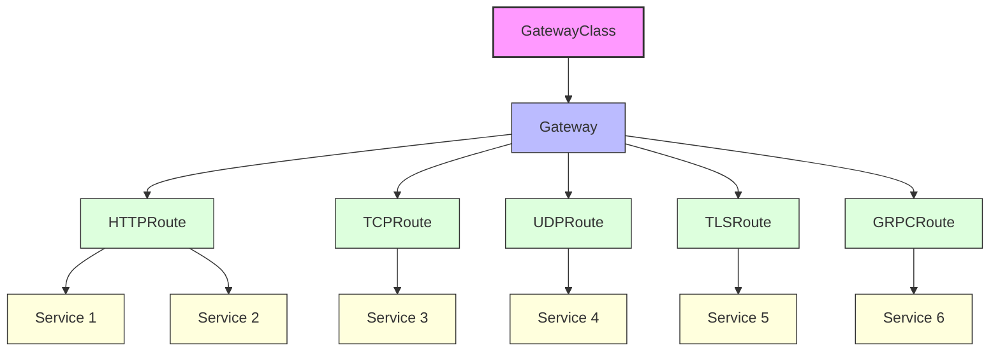
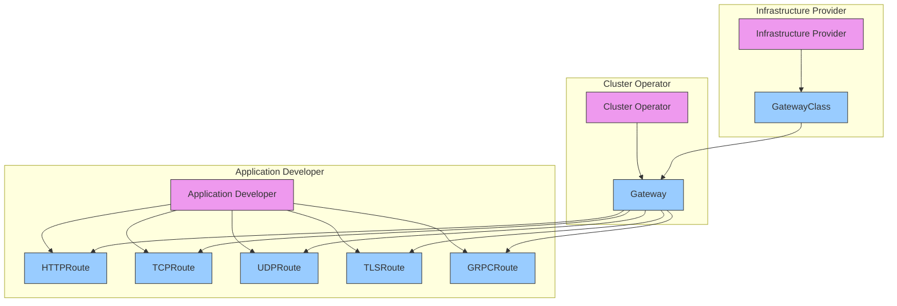
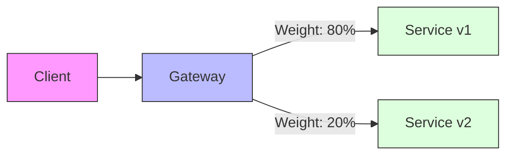
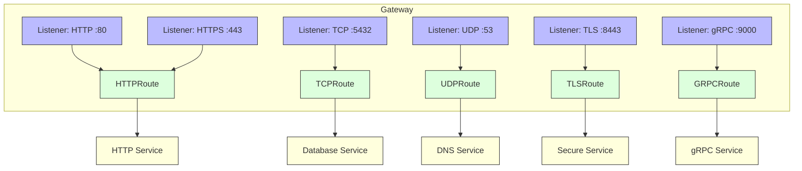
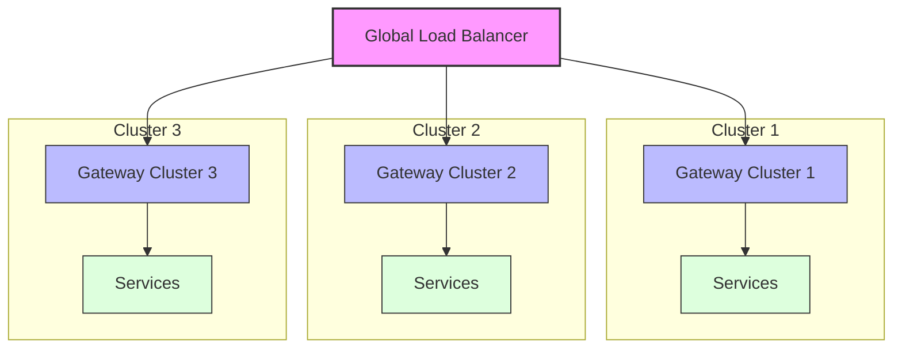
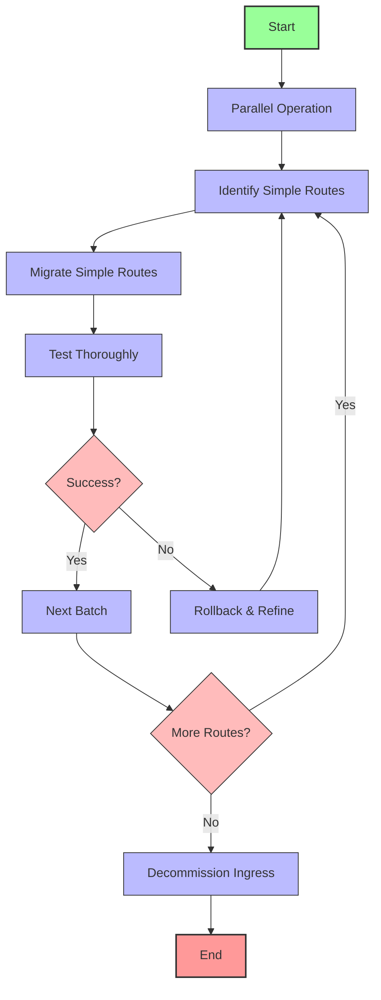

# Comprehensive Guide to Kubernetes Gateway API

## Introduction

The Gateway API represents the next generation of Kubernetes networking architecture, providing a more sophisticated approach to managing traffic within cluster environments. Developed as a deliberate evolution from the original Ingress resource, the Gateway API introduces a more thoughtful, expressive, and extensible model for routing external traffic to Kubernetes services.

This guide explores the Gateway API's architecture, capabilities, and operational considerations. We'll examine how it provides finer-grained control and introduces a hierarchy of purpose-built resources that create clear separation of concerns between different roles within an organization.

## Gateway API Fundamentals

### The Networking Evolution

The Gateway API emerged from the Kubernetes networking community's recognition that the original Ingress resource had significant limitations. As organizations deployed increasingly complex applications in Kubernetes, the simplistic Ingress model couldn't elegantly express many common routing needs.

The Gateway API was designed with several core principles in mind:

- Role-oriented architecture
- Enhanced expressiveness
- Portable configuration
- Support for diverse protocols beyond HTTP

This represents a fundamental rethinking of how network traffic management should operate in modern cloud-native environments.

### Key Advantages Over Ingress

The Gateway API offers numerous advantages compared to the traditional Ingress resource:

- **Role-Based Architecture**: Unlike Ingress, which combines infrastructure and application concerns in a single resource, the Gateway API introduces clear separation between infrastructure providers, cluster operators, and application developers.
    
- **Reduced Annotation Dependence**: The Ingress API relied heavily on non-standardized annotations to implement advanced features, leading to significant implementation differences between controllers. Gateway API reduces this fragmentation by providing standardized fields for common routing features.
    
- **Enhanced Expressiveness**: Many routing features that required custom annotations in Ingress are now first-class concepts in Gateway API. This includes header-based matching, traffic weighting, method-based routing, and direct cross-namespace service selection.
    
- **Cross-Namespace Capabilities**: The Gateway API includes explicit support for routing traffic across namespace boundaries with appropriate security controls, enabling more flexible service composition models.
    
- **Expanded Protocol Support**: Moving beyond HTTP/HTTPS, the Gateway API natively supports TCP, UDP, TLS passthrough, and gRPC, making it suitable for diverse application protocols.
    
- **Policy Attachment Model**: Gateway API introduces a modular policy attachment framework, allowing security, observability, and traffic management policies to be defined separately and attached to routes and gateways.
    
- **Consistent Status Reporting**: The Gateway API defines standardized status conditions across resources, making it easier to understand the current state and diagnose issues.
    

## Core Resources and Architecture

The Gateway API introduces a hierarchical resource model with distinct responsibilities.

### Resource Hierarchy

### GatewayClass

At the top level, GatewayClass defines a type of Gateway implementation available in the cluster. This cluster-scoped resource is analogous to StorageClass, defining the implementation that can be instantiated. GatewayClass resources are typically created by infrastructure providers or cluster administrators.

A GatewayClass might represent different implementation types with varying capabilities, performance characteristics, or service levels. For example, a cluster might offer both a standard and enterprise GatewayClass with different feature sets.

### Gateway

The Gateway resource represents a deployed instance of a GatewayClass. It defines actual listener configurations that accept traffic on specific ports and protocols. Gateways specify important networking details such as:

- The GatewayClass implementation to use
- Listener ports and protocols
- TLS certificate configuration
- Namespace selection rules for routing

Gateways are typically managed by cluster operators or network administrators who are responsible for infrastructure management.

### Route Resources

Route resources define the actual rules for matching and processing traffic. The primary route types include:

- **HTTPRoute**: For HTTP/HTTPS traffic routing, including path-based routing, header matching, and traffic splitting.
- **TCPRoute**: For TCP traffic routing.
- **UDPRoute**: For UDP traffic routing.
- **TLSRoute**: For TLS passthrough routing based on SNI.
- **GRPCRoute**: For gRPC-specific routing (in beta).

Route resources are typically created and managed by application developers or service owners who understand the traffic patterns for their specific applications.

### The Role-Oriented Approach

This hierarchical model creates clear lines of responsibility:

- Infrastructure providers implement and manage GatewayClasses
- Cluster operators create and configure Gateways
- Application developers define Routes to direct traffic to their services

Each role operates within their domain of expertise without needing to coordinate extensively with others, reducing organizational friction while enabling complex routing scenarios.

## HTTP Routing Capabilities

The HTTPRoute resource provides rich functionality for HTTP traffic management.

### Path-Based Routing

HTTPRoute supports various path matching methods:

- **Path Prefix**: Matches any URL path that starts with the specified prefix, useful for directing traffic based on URL structure.
- **Exact Path**: Matches only the exact path specified, providing precise control over specific endpoints.
- **Regular Expression**: Some implementations support regex-based path matching for complex pattern matching.

### Host-Based Routing

The hostname field in HTTPRoute allows routing based on the requested host header. This enables multiple domains to be served through a single Gateway, with different routing rules for each domain.

Multiple hostnames can be specified for a single HTTPRoute, and wildcard matching is supported for subdomain handling.

### Header-Based Routing

Gateway API provides sophisticated header-based routing capabilities. Routes can match on:

- **Header Presence**: Route based on whether a specific header exists or doesn't exist.
- **Header Values**: Match header values exactly or using regular expressions.
- **Multiple Headers**: Combine multiple header conditions for complex matching rules.

This enables advanced use cases like routing based on API versions, client types, feature flags, or geographic regions.

### Method-Based Routing

HTTPRoutes can route traffic based on HTTP methods like GET, POST, PUT, and DELETE. This allows for different backend services to handle different types of operations on the same resource.

### Query Parameter Matching

Some Gateway API implementations support matching on URL query parameters, enabling routing decisions based on values provided in the query string.

## Traffic Management

The Gateway API provides several traffic management capabilities that go beyond simple routing:

### Traffic Weighting and Splitting

HTTPRoute supports weighted traffic distribution between multiple backend services. This is essential for:

- **Canary Deployments**: Gradually shifting traffic from an old version to a new version of a service.
- **A/B Testing**: Splitting traffic between different implementations to compare performance or user behavior.
- **Blue-Green Deployments**: Maintaining two production environments and switching between them.

The weight values determine the percentage of matching traffic that should be sent to each backend.

### Request Timeouts

Gateway API implementations allow configuring request timeouts at various levels. This helps prevent slow backends from consuming excessive resources and provides a better user experience when services are degraded.

### Retries

Many Gateway API implementations support automatic retry policies for failed requests, improving application resilience in the face of transient failures.

### Circuit Breaking

Advanced Gateway API implementations provide circuit breaking capabilities that can detect failing backends and temporarily redirect traffic away from them, preventing cascading failures.

### Rate Limiting

While not part of the core specification, most Gateway API implementations offer rate limiting features to protect backend services from traffic spikes and potential denial-of-service scenarios.

## Advanced HTTP Features

The Gateway API supports numerous advanced HTTP features for sophisticated traffic handling.

### URL Rewriting

Routes can rewrite URLs before forwarding them to backend services. This includes:

- **Path Prefix Replacement**: Replace one prefix with another before forwarding.
- **Full Path Replacement**: Replace the entire path with a new value.
- **Host Header Rewriting**: Change the host header sent to the backend.

This allows backends to receive requests in the format they expect, regardless of how they were originally submitted.

### Header Manipulation

Gateway API supports extensive header manipulation capabilities:

- **Adding Headers**: Insert new headers not present in the original request.
- **Setting Headers**: Set or override existing header values.
- **Removing Headers**: Delete specific headers before forwarding the request.

These can be applied to both requests and responses, enabling use cases like adding authentication information, removing sensitive headers, or ensuring consistent header formats.

### Request Mirroring

Traffic mirroring copies incoming requests to a secondary backend without affecting the primary request flow. This is valuable for:

- **Testing New Versions**: Validate new service versions with real production traffic without impacting users.
- **Debugging**: Send copies of problematic traffic to specialized analysis services.
- **Parallel Processing**: Process the same requests in multiple ways simultaneously.

### Cross-Origin Resource Sharing (CORS)

Gateway API implementations typically provide CORS configuration to control how web applications in one domain can interact with resources from another domain. This includes options for allowed origins, methods, headers, and credentials.

## Security Features

Gateway API includes robust security capabilities for protecting applications and controlling access.

### TLS Management

Gateway resources provide flexible TLS configuration options:

- **TLS Termination**: Decrypt TLS traffic at the Gateway level, with support for multiple certificates.
- **TLS Passthrough**: Forward encrypted TLS traffic directly to backend services for applications that must handle their own TLS.
- **Certificate References**: Specify Kubernetes Secrets containing TLS certificates and private keys.
- **SNI Support**: Use Server Name Indication for routing TLS connections to different backends based on the requested hostname.

### Authentication

Many Gateway API implementations support various authentication methods:

- **JWT Validation**: Verify and validate JSON Web Tokens.
- **OAuth/OIDC Integration**: Work with OAuth 2.0 and OpenID Connect providers.
- **Basic Authentication**: Support simple username/password authentication.
- **mTLS**: Mutual TLS authentication for service-to-service communication.

### Authorization

Authorization capabilities typically include:

- **Role-Based Access Control**: Control access based on user roles and permissions.
- **Attribute-Based Access Control**: Make access decisions based on request attributes like IP address or header values.
- **External Authorization**: Integrate with external authorization services for complex policy enforcement.

### Web Application Firewall (WAF)

Some Gateway API implementations include WAF capabilities to protect against common web vulnerabilities and attacks, such as SQL injection, cross-site scripting, and OWASP Top 10 threats.

## Multi-Protocol Support

Beyond HTTP, Gateway API supports various protocols for different application needs.

### TCP Routing

TCPRoute resources enable layer 4 routing for TCP-based protocols that don't use HTTP. This is crucial for databases, message queues, and custom protocols.

### UDP Routing

UDPRoute supports connectionless UDP protocols, necessary for DNS, some gaming applications, and real-time streaming services.

### TLS Routing

TLSRoute enables routing based on TLS Server Name Indication (SNI) without decrypting the traffic. This provides the security benefits of TLS while still allowing intelligent routing decisions.

### gRPC Routing

The GRPCRoute resource (in beta) provides specialized routing for gRPC services, with support for method-based routing and advanced traffic management.

## Multi-Cluster Patterns

As organizations adopt multi-cluster architectures, the Gateway API facilitates consistent traffic management across environments.

### Federated Gateway Pattern

Deploy consistent Gateway configurations across multiple clusters, with global load balancing directing traffic to the appropriate regional Gateway.

### Multi-Cluster Service Discovery

Gateway API implementations can integrate with multi-cluster service discovery mechanisms to route traffic across cluster boundaries.

### Global-Local Gateway Hierarchy

Implement a hierarchy of Gateways with global Gateways handling external traffic and routing to local Gateways in different clusters based on routing rules and load distribution policies.

## Observability

Effective monitoring is crucial for Gateway API implementations, with support for standard observability approaches.

### Metrics

Gateway controllers typically expose Prometheus-compatible metrics for:

- **Request Volume**: Requests per second, broken down by various dimensions.
- **Latency**: Response time distributions (average, percentiles).
- **Error Rates**: Percentage of responses with 4xx and 5xx status codes.
- **Connection Metrics**: Active connections, connection establishment rate.
- **TLS Metrics**: Handshake times, cipher usage, certificate expiration warnings.

### Logging

Centralized logging provides visibility into Gateway operations:

- **Access Logs**: Detailed records of all requests and responses.
- **Error Logs**: Information about failed requests and internal errors.
- **Audit Logs**: Security-relevant events for compliance and troubleshooting.

### Distributed Tracing

Integration with distributed tracing systems like OpenTelemetry enables end-to-end visibility of request flows across services, critical for diagnosing performance issues in complex architectures.

## Operational Considerations

### Implementation Selection

When choosing a Gateway API implementation, consider:

- **Feature Support**: Which Gateway API resources and extensions are supported.
- **Performance Characteristics**: Request handling capacity, latency, and resource requirements.
- **Operational Model**: How the implementation is deployed, scaled, and managed.
- **Community and Support**: Availability of documentation, community help, and commercial support.

### Resource Planning

Gateway resources should be carefully planned for production environments:

- **High Availability**: Deploy multiple Gateway pods across failure domains.
- **Scaling**: Understand the scaling characteristics and limits of your implementation.
- **Resource Allocation**: Properly size CPU, memory, and network capacity for expected traffic.
- **Certificate Management**: Plan for automated certificate renewal and management.

### Security Best Practices

Follow these security guidelines for Gateway deployments:

- **Principle of Least Privilege**: Use ReferenceGrants sparingly and with deliberate scope.
- **Network Policies**: Implement network policies to restrict traffic flows to and from Gateway components.
- **Regular Updates**: Keep Gateway implementations updated to address security vulnerabilities.
- **Audit and Monitoring**: Implement logging and alerting for security-relevant events.

### Migration Strategies

When migrating from Ingress to Gateway API:

- **Parallel Operation**: Run both systems simultaneously during migration.
- **Incremental Approach**: Start with simple routes and gradually migrate complex configurations.
- **Testing Strategy**: Implement comprehensive testing to validate routing behavior.
- **Rollback Plan**: Maintain the ability to revert to Ingress if issues arise.

## Future Directions

The Gateway API continues to evolve with several important future directions:

### Policy Framework Expansion

The policy attachment model is expanding to cover more security, reliability, and observability concerns with a consistent approach.

### Enhanced Service Mesh Integration

Tighter integration between Gateway API and service mesh implementations will provide consistent traffic management from edge to internal services.

### Advanced Protocol Support

Planned support for additional protocols like QUIC, HTTP/3, and WebSockets will expand the Gateway API's capabilities.

### Multi-Cluster Standardization

Standard approaches for multi-cluster traffic management are being developed to simplify complex deployment topologies.

