# Kustomize: The Comprehensive Guide

## Introduction to Kustomize

Kustomize is a powerful, template-free configuration management tool for Kubernetes manifests. Unlike template-based tools that mix logic and structure, Kustomize embraces a purely declarative approach. It treats Kubernetes YAML as data that can be transformed through a series of operations, preserving the original structure while enabling customizations for different environments.

## Kustomize Architecture Overview

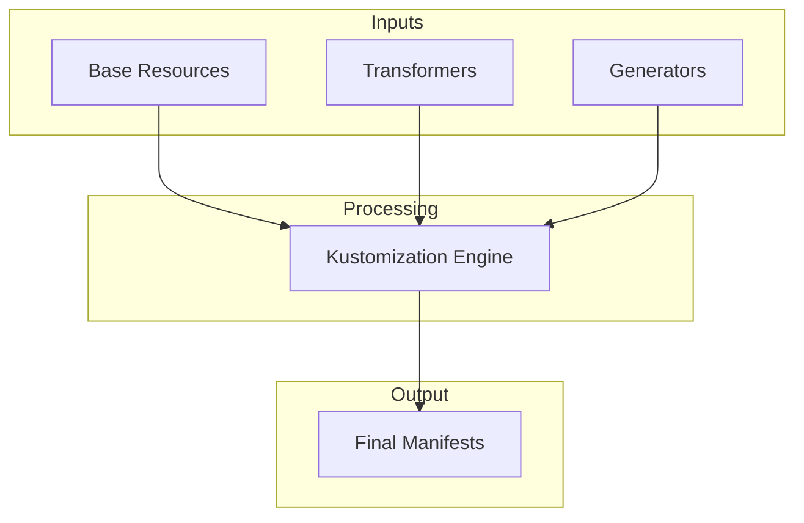

## Core Concepts and Components

### 1. Base and Overlays Pattern

The foundational design pattern in Kustomize is the base/overlays structure:

- **Base**: Contains the common, foundational resources shared across all environments
- **Overlays**: Environment-specific directories that customize the base 

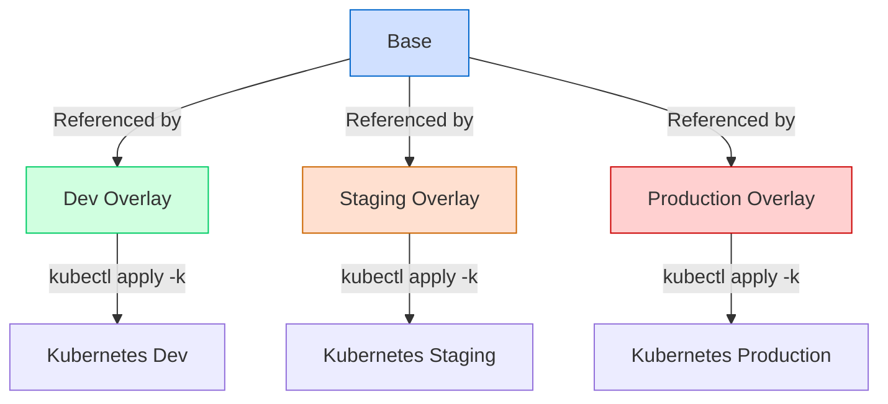

A typical directory structure implementing this pattern looks like:

```
./kustomize/
├── base/
│   ├── deployment.yaml
│   ├── service.yaml
│   └── kustomization.yaml
└── overlays/
    ├── dev/
    │   └── kustomization.yaml
    ├── staging/
    │   └── kustomization.yaml
    └── prod/
        └── kustomization.yaml
```

### 2. The kustomization.yaml File

The `kustomization.yaml` file is the configuration that controls how Kustomize processes resources:

```yaml
apiVersion: kustomize.config.k8s.io/v1beta1
kind: Kustomization

# Resources to include
resources:
- deployment.yaml
- service.yaml

# Common labels
labels:
  pairs:
    app: my-application
    environment: production

# Add name prefixes
namePrefix: prod-

# Patches to apply
patches:
- path: increase-replicas.yaml
  target:
    kind: Deployment
    name: my-deployment
```

### 3. Resource Processing Flow

The following diagram shows how Kustomize processes resources:

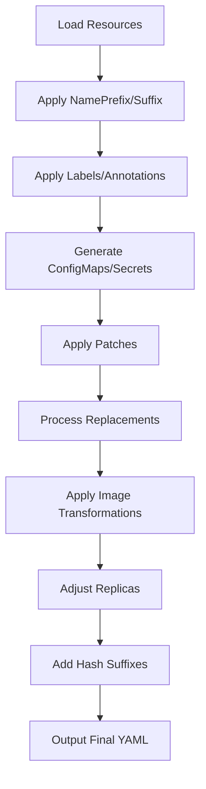

## Kustomize Path Security Model

### Why Path Restrictions Exist

You asked specifically why you can't reference files outside your kustomization directory. This is due to Kustomize's path security model, which is a deliberate design choice.

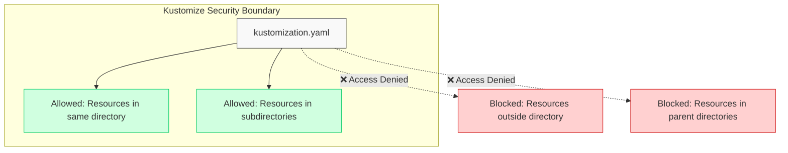

When you try to reference external resources like this:

```yaml
apiVersion: kustomize.config.k8s.io/v1beta1
kind: Kustomization

resources:
- ../../pkg/pkg1/manifests/deployment.yaml
- ../../pkg/pkg1/manifests/service-account.yaml
```

Kustomize will produce an error like:

```
error: accumulating resources: accumulation err='accumulating resources from 
'../../pkg/pkg1/manifests/deployment.yaml': security; file not in or below current directory'
```

### Reasons Behind This Security Model

This restriction serves critical purposes:

1. **Security Against Path Traversal Attacks**: Prevents malicious kustomization files from accessing unauthorized files outside their boundary.

2. **Hermetic Builds**: Ensures reproducibility by making builds self-contained and independent of arbitrary directory structures.

3. **Clear Resource Boundaries**: Creates explicit boundaries around what files can affect your build.

4. **Modularity**: Encourages proper self-contained modules that can be shared and reused.

## Solving the Path Restriction Issue

To address the path restriction issue, you have several options:

### Option 1: Copy Resources to Your Base Directory

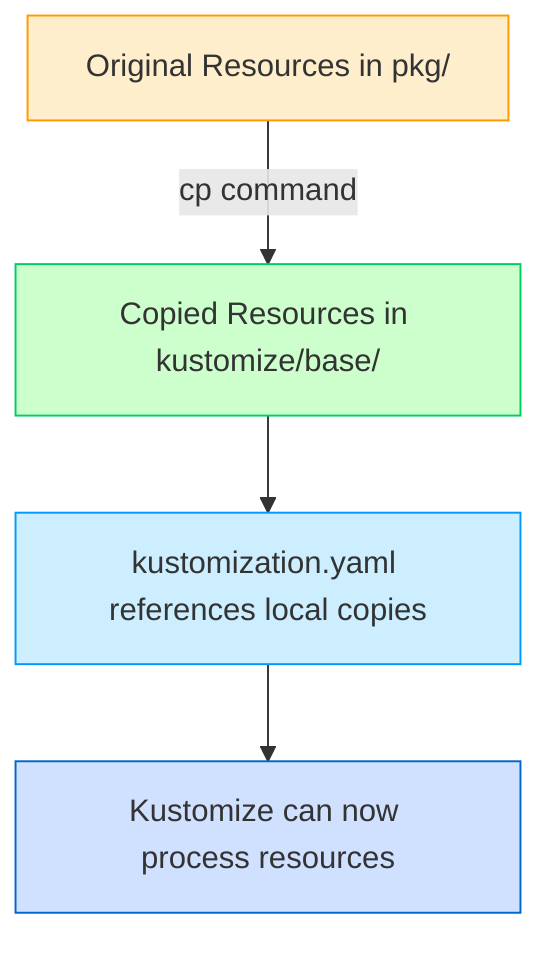

Implementation steps:

```bash
mkdir -p kustomize/base/manifests
cp pkg/pkg1/manifests/deployment.yaml kustomize/base/manifests/
cp pkg/pkg1/manifests/service-account.yaml kustomize/base/manifests/
# Copy remaining files...
```

Then update your `kustomization.yaml`:

```yaml
apiVersion: kustomize.config.k8s.io/v1beta1
kind: Kustomization

resources:
- manifests/deployment.yaml
- manifests/service-account.yaml
# Additional resources...
```

### Option 2: Restructure Your Repository

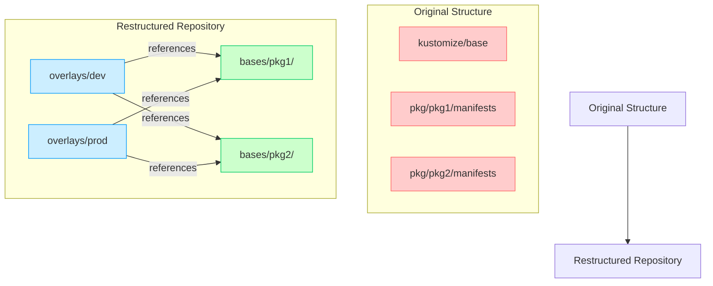

### Option 3: Run Kustomize from a Higher Directory

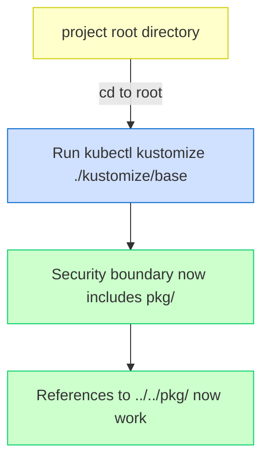

However, this approach has drawbacks:
- Depends on specific directory structure
- Reduces portability
- Works around security rather than working with it

## The Complete Kustomize Workflow

### 1. Building and Rendering

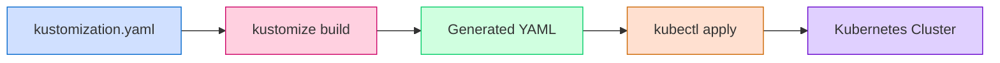

### 2. Overlay Inheritance and Composition

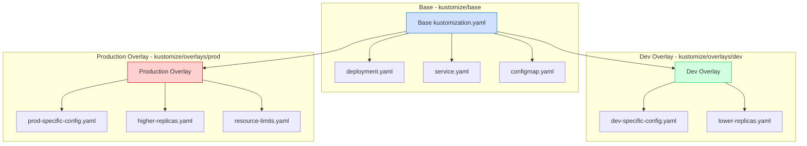

## Advanced Kustomize Features

### 1. Patches

Kustomize supports multiple patch types:

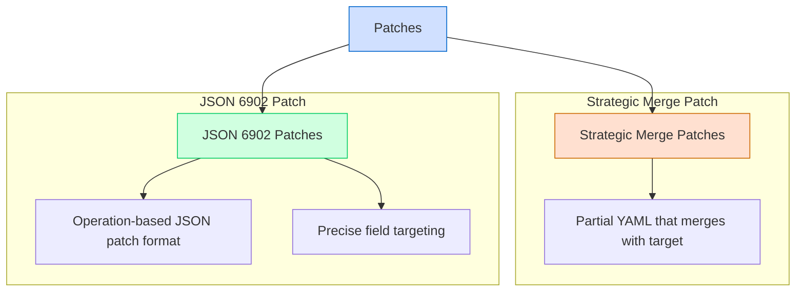

Example of both patch types:

```yaml
# Strategic Merge Patch
patches:
- patch: |-
    apiVersion: apps/v1
    kind: Deployment
    metadata:
      name: deployment
    spec:
      replicas: 3
  target:
    kind: Deployment
    name: my-deployment

# JSON 6902 Patch  
patches:
- patch: |-
    - op: replace
      path: /spec/replicas
      value: 5
  target:
    kind: Deployment
    name: another-deployment
```

### 2. ConfigMap and Secret Generation

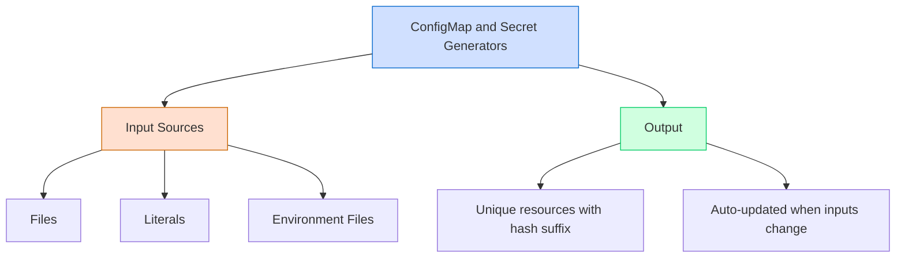

Example generator configuration:

```yaml
configMapGenerator:
- name: app-config
  files:
  - config.properties
  literals:
  - API_URL=https://api.example.com
  - DEBUG=true

secretGenerator:
- name: app-secrets
  files:
  - tls.key
  - tls.crt
  envs:
  - .env.secret
```

### 3. Field Replacements

Modern Kustomize uses replacements for variable substitution:

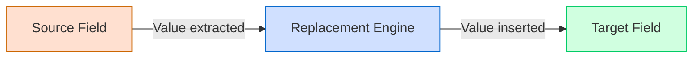

```yaml
replacements:
- source:
    kind: ConfigMap
    name: app-config
    fieldPath: data.log-level
  targets:
  - select:
      kind: Deployment
    fieldPaths:
    - spec.template.spec.containers.[name=logger].env.[name=LOG_LEVEL].value
```

## Implementation for Your Repository Structure

### Original Problem Structure

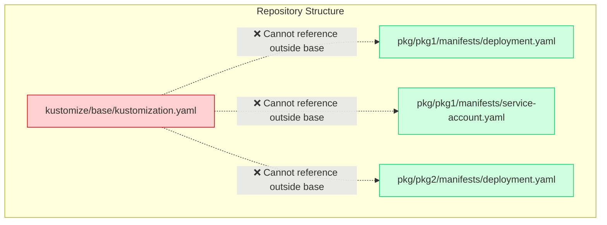

### Solution Structure

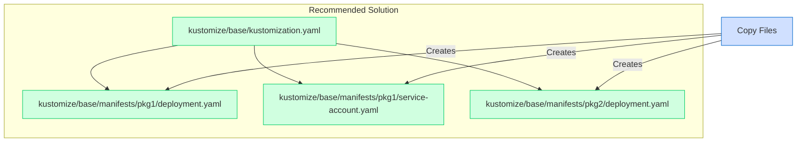

Implementation steps:

```bash
# Create directory structure
mkdir -p kustomize/base/manifests/pkg1
mkdir -p kustomize/base/manifests/pkg2

# Copy files
cp pkg/pkg1/manifests/*.yaml kustomize/base/manifests/pkg1/
cp pkg/pkg2/manifests/*.yaml kustomize/base/manifests/pkg2/

# Update kustomization.yaml
```

Updated `kustomization.yaml`:

```yaml
apiVersion: kustomize.config.k8s.io/v1beta1
kind: Kustomization

resources:
- manifests/pkg1/deployment.yaml
- manifests/pkg1/service-account.yaml
- manifests/pkg1/role.yaml
- manifests/pkg1/role-binding.yaml
- manifests/pkg2/deployment.yaml
- manifests/pkg2/car-service.yaml

labels:
  pairs:
    app: car-app
    environment: base
```

## Kustomize Under the Hood

### Resource Loading and Processing

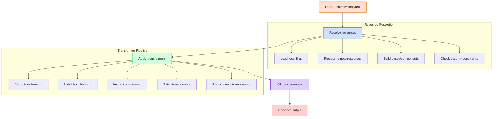

### Transformer Order

The order of transformers is carefully designed to handle dependencies properly:

1. Namespace transformer
2. Name transformers (prefix/suffix)
3. Label and annotation transformers
4. Generator transformers (ConfigMaps/Secrets)
5. Patch transformers (strategic merge/JSON)
6. Replacement/variable transformers
7. Image transformers
8. Replica transformers
9. Hash transformers

## Best Practices for Kustomize

### Directory Structure Best Practices

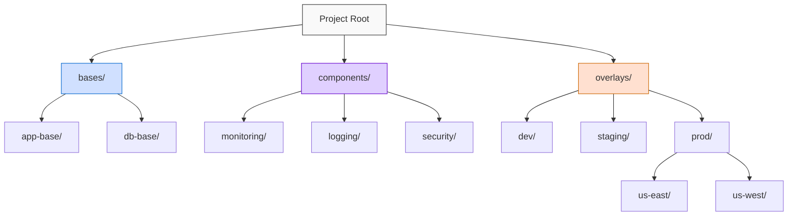

### Base Design Principles

- Keep bases minimal and focused on common elements
- Include only essential resources in the base
- Avoid environment-specific configurations in the base
- Structure bases around logical components or applications

### Overlay Organization

- Create separate overlays for each environment or variant
- Keep overlay-specific patches in the overlay directory
- Use clear, consistent naming conventions
- Minimize the number of patches per overlay

### Path Management 

- Use relative paths within the kustomization directory
- Keep resources close to the kustomization that uses them
- Avoid complex directory traversal
- Remember the security boundary: all references must be within or below the kustomization directory

## Troubleshooting Kustomize Issues

### Common Problems and Solutions

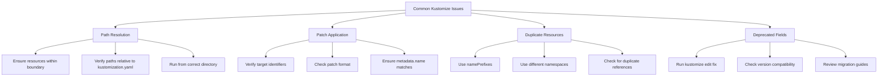

### Debugging Techniques

- Use `kubectl kustomize . | less` to inspect output
- Add `--enable-alpha-plugins --load-restrictor LoadRestrictionsNone` for advanced debugging
- Count resources with `kubectl kustomize . | grep kind: | sort | uniq -c`
- Validate with `kubectl kustomize . | kubectl apply --dry-run=client -f -`

## Working with the Command Line

### Essential Commands

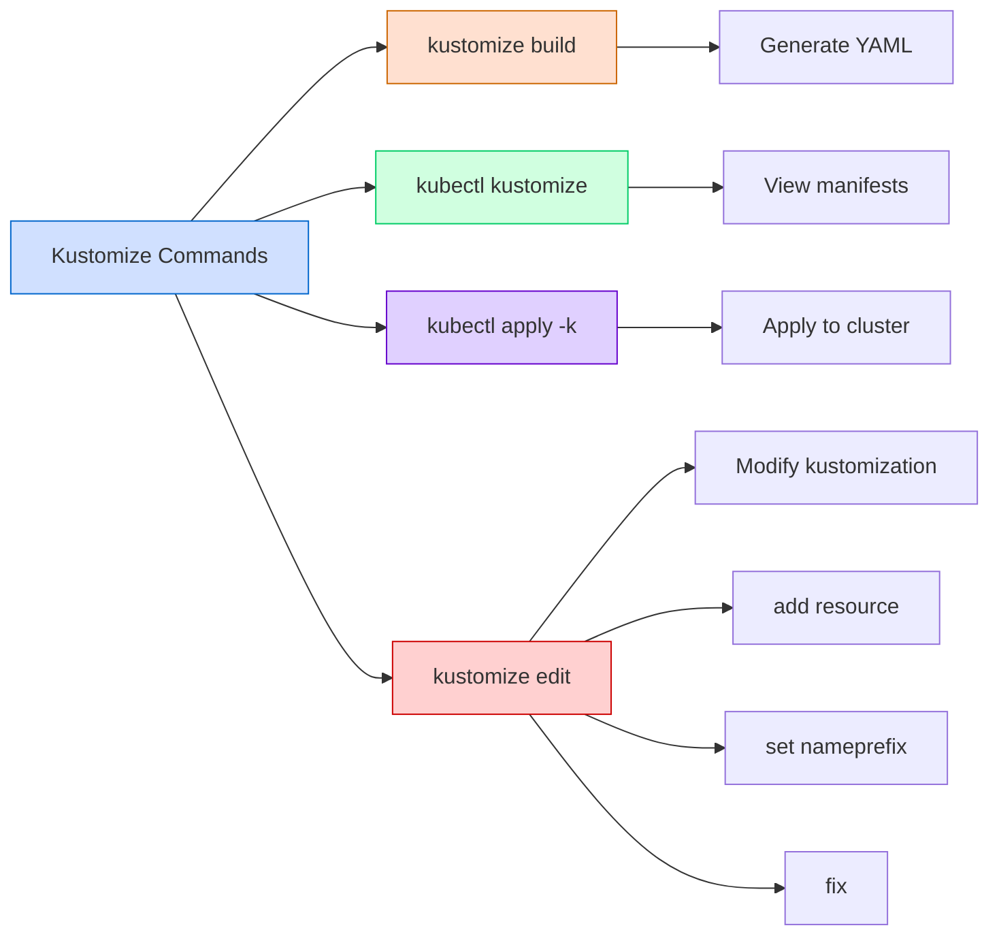

Common commands:

```bash
# Build and view manifests
kubectl kustomize ./kustomize/overlays/dev

# Apply to cluster
kubectl apply -k ./kustomize/overlays/prod

# Edit kustomization file
kustomize edit add resource deployment.yaml
kustomize edit set nameprefix prod-
kustomize edit fix
```

## Migrating from Legacy Fields

Kustomize evolves over time, and some fields are deprecated:

| Deprecated Field | Modern Replacement | Description |
|------------------|-------------|-------------|
| `commonLabels` | `labels` | Labels for all resources |
| `commonAnnotations` | `annotations` | Annotations for all resources |
| `patchesStrategicMerge` | `patches` | Strategic merge patches |
| `patchesJson6902` | `patches` | JSON patches |
| `vars` | `replacements` | Variable substitution |

The `kustomize edit fix` command helps migrate to newer syntax.

## Real-World Examples

### Multi-Tier Application Example

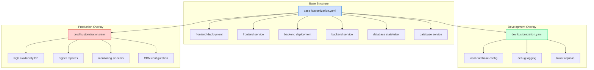

### Using Components for Cross-Cutting Concerns

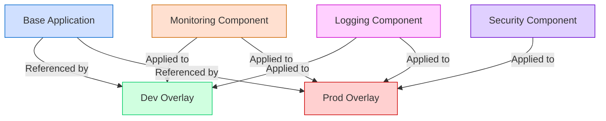

## Conclusion

Kustomize's path security model, which prevents referencing files outside your kustomization directory, is a deliberate design feature that promotes security, reproducibility, and proper modularization. While it may initially seem restrictive, embracing this model leads to more robust, portable, and maintainable Kubernetes configurations.

The need to copy files into your base directory isn't a limitation but an invitation to structure your configuration for better modularity and security. By creating proper self-contained bases and leveraging overlays for customization, you can build a powerful, declarative configuration system that scales across environments while maintaining a single source of truth.

Whether you choose to copy files to maintain your current structure or embark on a more comprehensive restructuring to align with Kustomize's design philosophy, understanding the rationale behind the path restrictions empowers you to work effectively with the tool rather than fighting against its fundamental design principles.