# GitOps Workflow: Managing Multiple Environments with ArgoCD

## Introduction

Managing multiple environments (development, staging, production) in Kubernetes presents unique challenges around consistency, security, and automation. This document explores best practices for structuring repositories and configuring ArgoCD to maintain separation of environments while leveraging the power of GitOps workflows.

## Repository Structure Patterns

### Single Repository Approach (Monorepo)

The repository structure you've implemented follows the industry-standard monorepo pattern for Kubernetes configurations:

```
/kustomize
  /base         # Common configuration shared across all environments
  /overlays
    /dev        # Development-specific overrides
    /staging    # Staging-specific overrides
    /prod       # Production-specific overrides
```

This structure leverages Kustomize's patch-based approach to manage environment-specific changes while maintaining a single source of truth in the base directory.

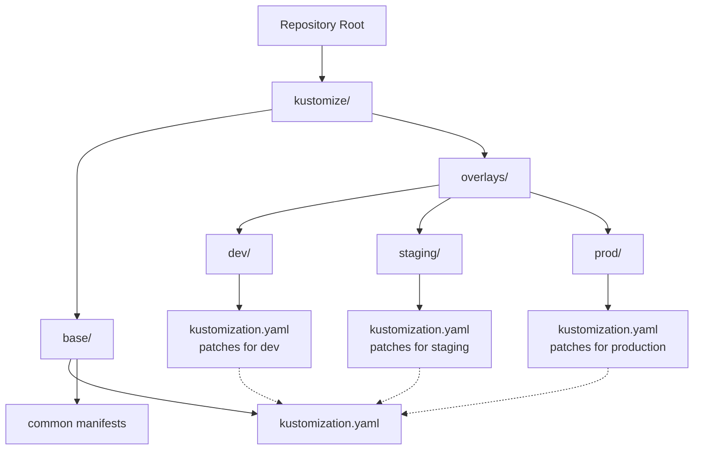

### Benefits of the Monorepo Approach

1. **Single Source of Truth**: All environment configurations derive from the same base
2. **Clear Promotion Path**: Changes naturally flow from dev → staging → production
3. **Simplified Maintenance**: Shared components live in one location
4. **Reduced Duplication**: Common configurations aren't repeated
5. **Enhanced Visibility**: Easier to see environment-specific differences during code reviews

### Multi-Repository Alternatives

Some organizations prefer separating environments into different repositories:

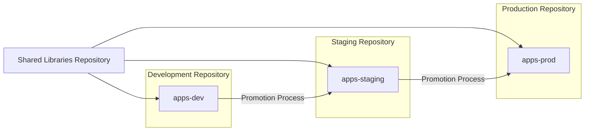

This approach provides stricter separation but introduces synchronization challenges between repositories.

## ArgoCD Configuration Patterns

The key to successfully managing multiple environments in ArgoCD lies in how applications are defined and synchronized. Here are the primary patterns:

### Pattern 1: Environment-Specific Applications

Create separate ArgoCD Applications for each environment, all pointing to the same repository but different paths:

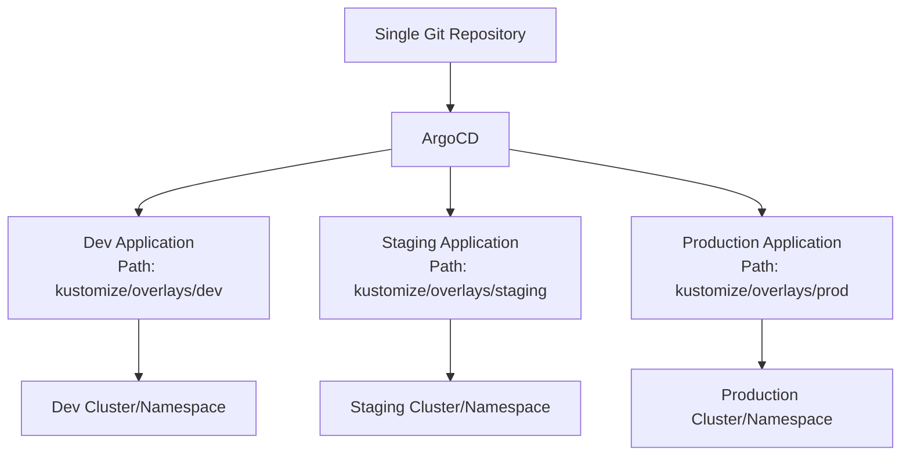

### Pattern 2: Branch-Based Environments

Configure ArgoCD to watch different branches for different environments:

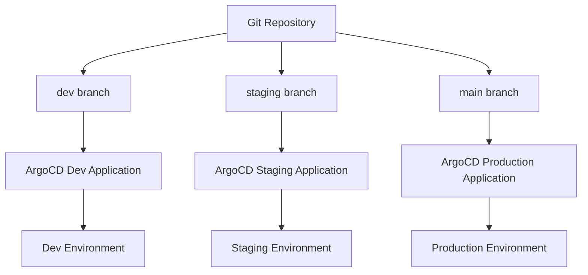

### Pattern 3: ApplicationSets with Path-Based Targeting

```
apiVersion: argoproj.io/v1alpha1
kind: ApplicationSet
metadata:
  name: production-apps
spec:
  generators:
  - git:
      repoURL: https://github.com/your-org/your-repo.git
      revision: main
      directories:
      - path: kustomize/overlays/prod/*
  template:
    metadata:
      name: '{{path.basename}}'
    spec:
      project: production
      source:
        repoURL: https://github.com/your-org/your-repo.git
        targetRevision: main
        path: '{{path}}'
      destination:
        server: https://kubernetes.default.svc
        namespace: production
```

Use ArgoCD ApplicationSets to automatically discover and manage applications based on directory structure:

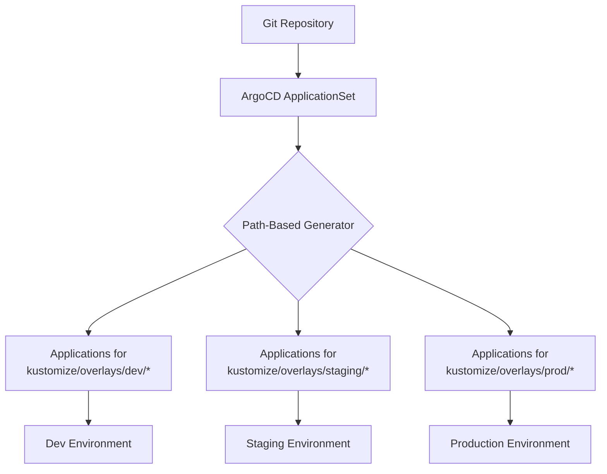

## Security Considerations for Production

Protecting production environments requires additional security controls:

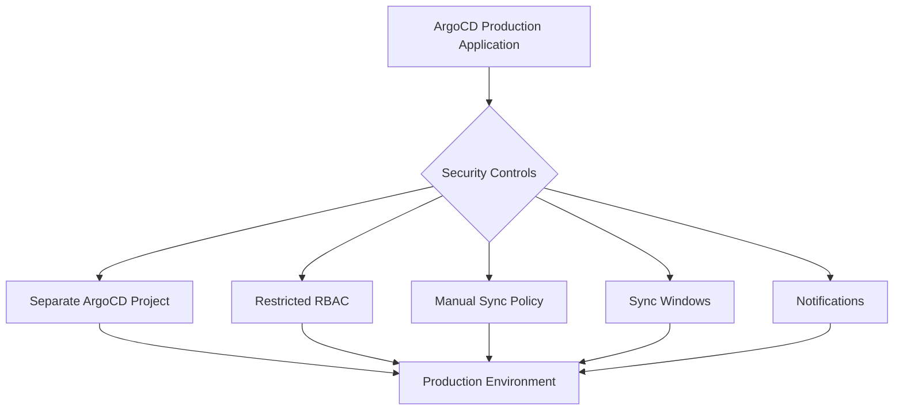

### ArgoCD Security Best Practices

1. **Separate ArgoCD Projects**: Create a dedicated project for production applications with stricter permissions
2. **RBAC Controls**: Limit who can create or sync production applications
3. **Manual Sync Policies**: Require human approval for production changes
4. **Sync Windows**: Restrict when production changes can be applied (e.g., business hours only)
5. **Notifications**: Alert appropriate teams when production changes are pending or applied
6. **SSO Integration**: Enforce organizational identity for access control

## CI/CD Workflows with ArgoCD

The recommended GitOps workflow combines CI (testing and validation) with CD (ArgoCD):

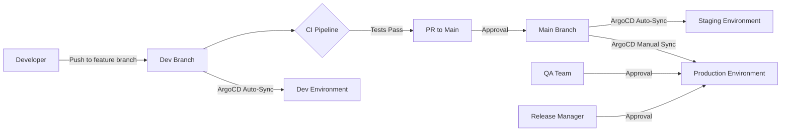

### Workflow Details

1. **Development Phase**:
    
    - Developers work on feature branches
    - Changes merge to development branch
    - ArgoCD automatically syncs to development environment
2. **Promotion to Staging**:
    
    - Pull request from development to main branch
    - CI runs tests and validations
    - After approval, changes merge to main
    - ArgoCD automatically syncs to staging environment
3. **Production Deployment**:
    
    - Changes are ready in main branch
    - ArgoCD detects changes but doesn't auto-apply them
    - Release manager reviews and approves
    - ArgoCD syncs to production environment

## Separating Production from Dev/Staging

To achieve cleaner separation between production and other environments while maintaining a monorepo structure, consider these approaches:

### Approach 1: ApplicationSet Filtering

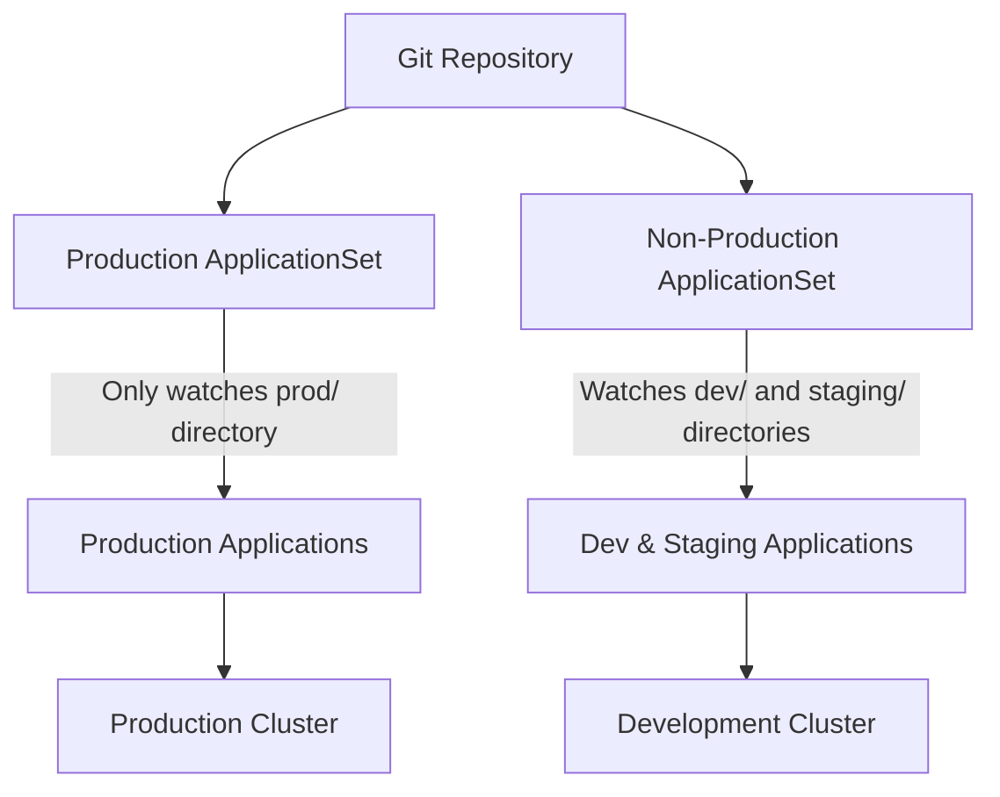

### Approach 2: Multiple ArgoCD Instances

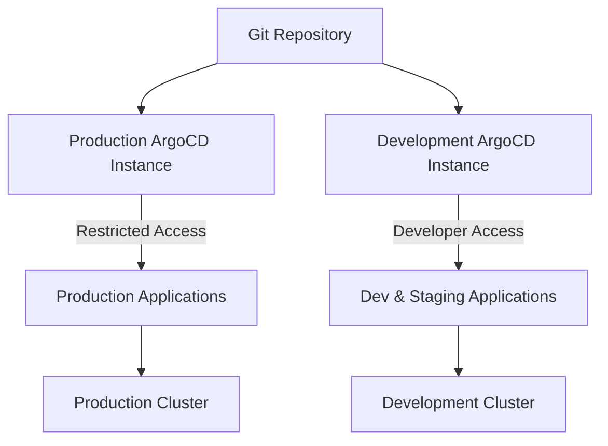

### Approach 3: Environment-Specific Access Controls

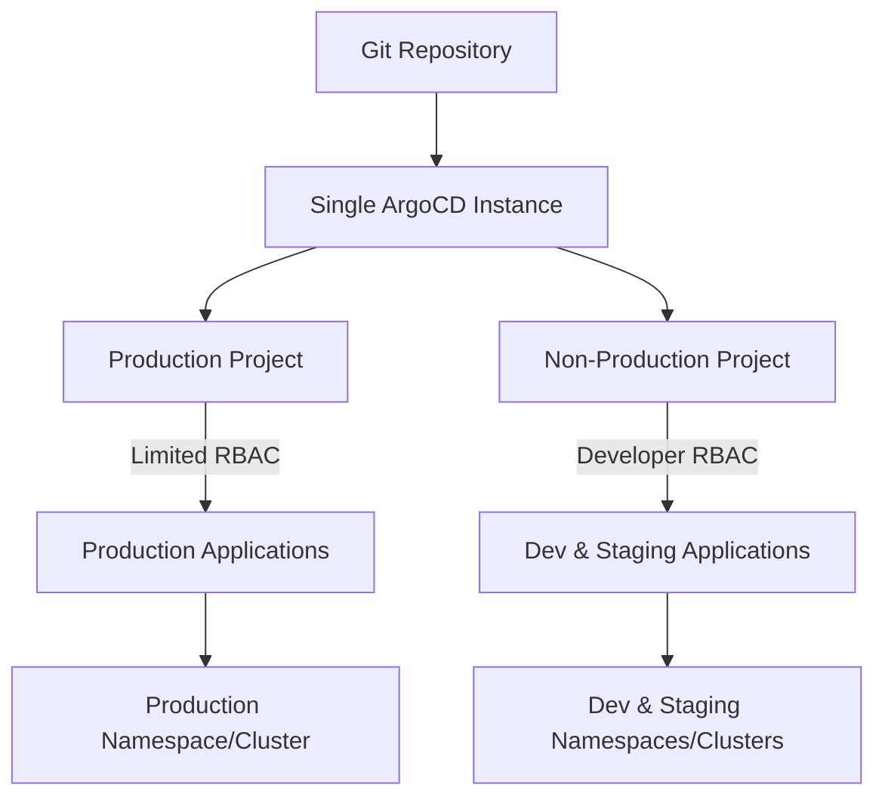

## Common Organizational Patterns

Different organizations structure their repositories based on their scale and needs:

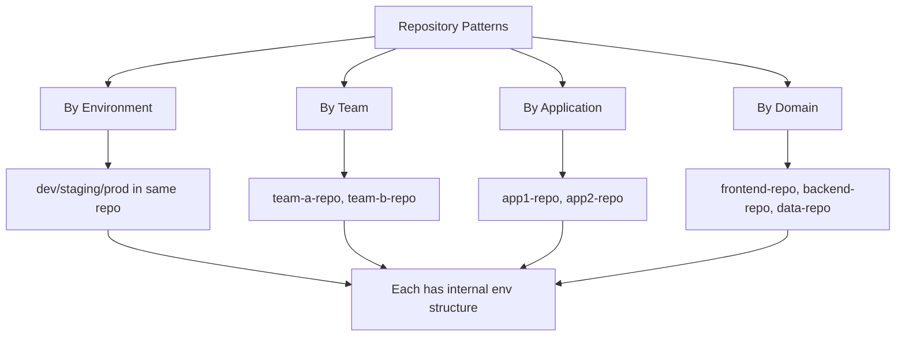

### Enterprise-Scale Approach

Large enterprises often use a hybrid approach:

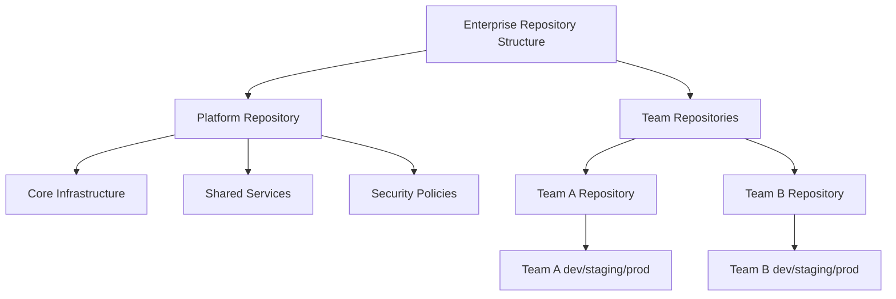

## Implementation Recommendations

Based on your current structure and workflow with ArgoCD, here are concrete recommendations:

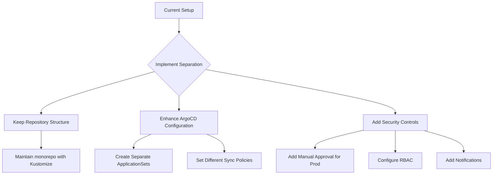

### Short-Term Steps

1. **Create Environment-Specific ArgoCD Projects**:
    
    - Production project with restricted access
    - Development project with broader access
2. **Configure Different Sync Policies**:
    
    - Auto-sync for development environment
    - Manual sync for production environment
3. **Set Up Notifications**:
    
    - Email/Slack alerts for pending production changes

### Long-Term Improvements

1. **Implement ApplicationSets**:
    
    - Automate application discovery based on directory structure
    - Separate production and non-production with different ApplicationSets
2. **Consider Cluster Separation**:
    
    - Physically separate production and development clusters
    - Use network policies to isolate environments
3. **Enhance CI Integration**:
    
    - Add pre-sync validation hooks
    - Implement progressive delivery with canary deployments

## Conclusion

The monorepo structure you've implemented with Kustomize and separate environment overlays is an industry-standard approach that works well with ArgoCD. By enhancing your ArgoCD configuration with appropriate security controls and sync policies, you can maintain the advantages of a single repository while ensuring production environments remain secure and controlled.

The key is not necessarily to separate the code physically (though that's an option), but rather to implement logical separation through ArgoCD's configuration features. This allows you to maintain the simplicity of a single source of truth while providing the necessary safeguards for production environments.