# Kubernetes Network Policies: Controlling Pod-to-Pod Communication

## Introduction

Kubernetes networking enables pods to communicate across a cluster seamlessly. By default, all pods can communicate with all other pods without restrictions—a model known as "flat networking." While convenient for development, this open access model presents security challenges in production environments. Network Policies provide the mechanism to control and restrict traffic flow between pods, implementing the principle of least privilege and creating security boundaries within your cluster.

## Core Concepts

### Default Networking Behavior

Without Network Policies, Kubernetes follows these default behaviors:

- All pods can communicate with all other pods in the cluster
- All network traffic (ingress and egress) is allowed
- Pods are accessible from any source

### Network Policy Resource

Network Policies are Kubernetes resources that specify how groups of pods are allowed to communicate with each other and with other network endpoints. They use labels to select pods and define rules that specify what traffic is allowed to and from those pods.

### Policy Types

Network Policies can control:

- **Ingress traffic**: Incoming connections to pods
- **Egress traffic**: Outgoing connections from pods
- **Both**: Applying rules to both directions simultaneously

## Network Policy Architecture

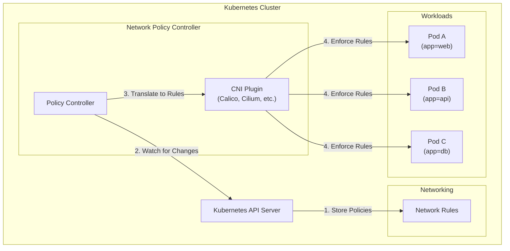

## Kubernetes Service Types and Network Exposure

Kubernetes Services provide networking abstractions that enable pod discovery and communication. Understanding how different Service types work is crucial for designing effective Network Policies.

### ClusterIP

The default Service type that exposes the Service on an internal IP within the cluster. This makes the Service only reachable from within the cluster.

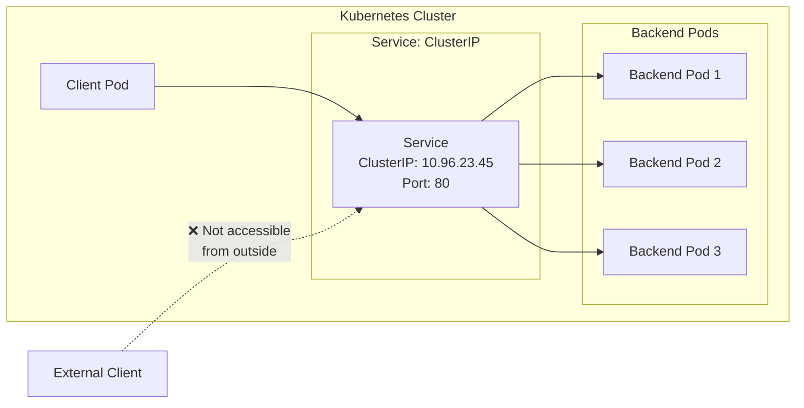

ClusterIP Services:

- Provide stable internal IP addresses for pod-to-pod communication
- Load balance traffic across matching backend pods
- Allow service discovery within the cluster
- Are the foundation for other Service types

### NodePort

Exposes the Service on each Node's IP at a static port. A ClusterIP Service is automatically created, and the NodePort Service routes to it.

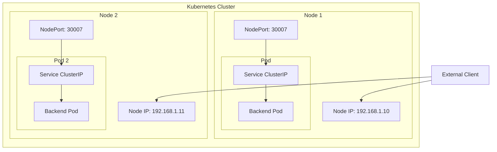

NodePort Services:

- Expose applications on a static port on every cluster node
- Port range is typically limited to 30000-32767
- Allow direct external access without additional infrastructure
- Best suited for development or temporary external access

### LoadBalancer

Exposes the Service externally using a cloud provider's load balancer. The external load balancer routes to NodePort and ClusterIP Services that are automatically created.

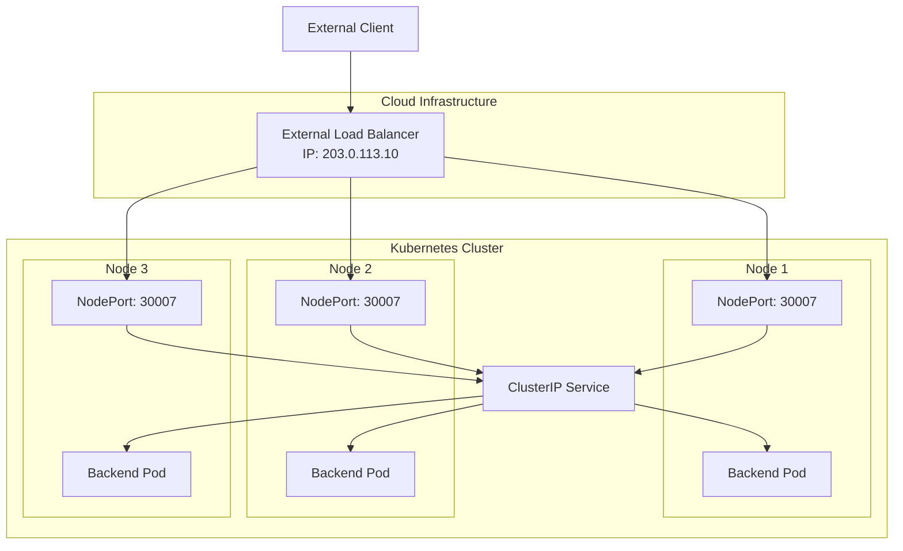

LoadBalancer Services:

- Provide an externally accessible IP address
- Automatically distribute traffic to cluster nodes
- Integrate with cloud provider load balancing services
- Are ideal for production workloads requiring external access

### ExternalName

Maps the Service to the contents of the `externalName` field (e.g., `foo.bar.example.com`). Creates a CNAME DNS record, not proxying or forwarding traffic.

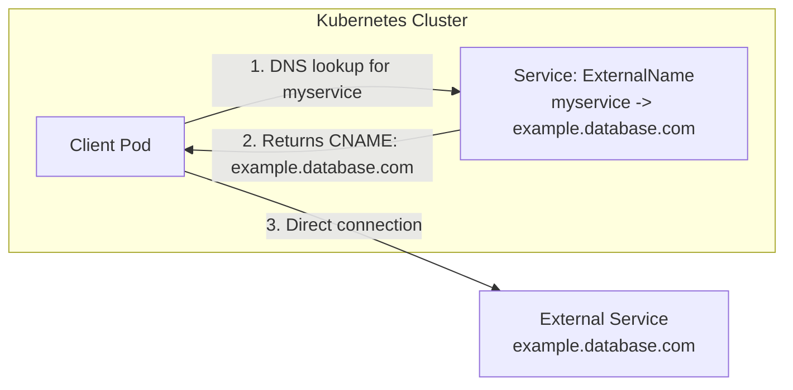

ExternalName Services:

- Provide a method to represent external services as Kubernetes Services
- Work through DNS redirection rather than proxying
- Create no selector and no endpoints
- Are useful for integrating external databases or APIs with cluster applications

### Headless Services

A Service defined with `.spec.clusterIP: None`, providing no load balancing or proxying, just DNS records for direct pod addressing.

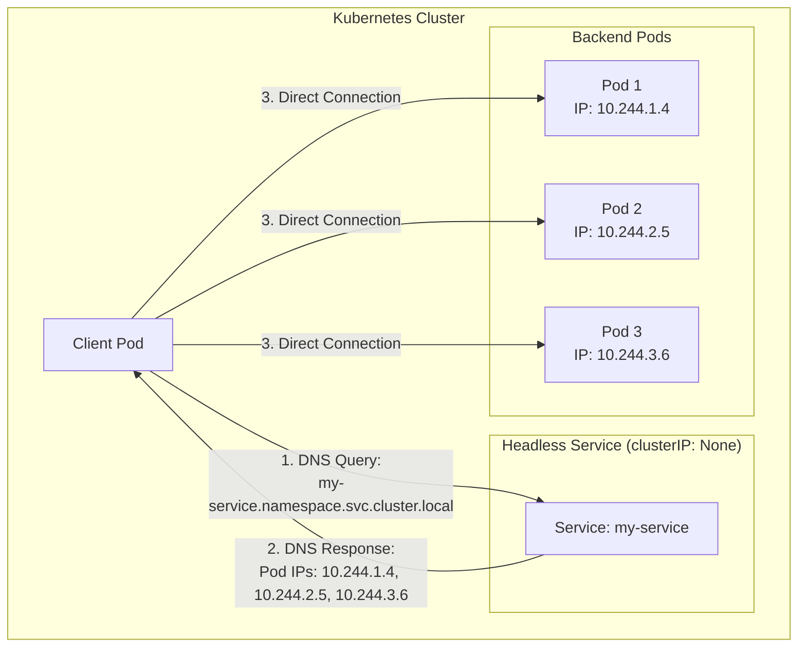

Headless Services:

- Return A records that point directly to the pods backing the service
- Enable direct pod-to-pod communication
- Are ideal for stateful applications requiring stable network identities
- Work well with StatefulSets for predictable addressing

### Ingress

Not a Service type but a separate resource that manages external access to Services within a cluster, typically via HTTP/HTTPS.

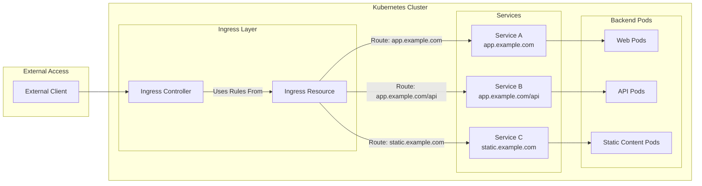

Ingress capabilities:

- Provide externally reachable URLs for services
- Offer load balancing, SSL termination, and name-based virtual hosting
- Enable path-based routing to different backends
- Consolidate routing rules to minimize external load balancers
- Require an Ingress Controller to function (NGINX, Traefik, etc.)

### Gateway API

An evolution of the Ingress API, providing more expressive, extensible, role-oriented interfaces for routing.

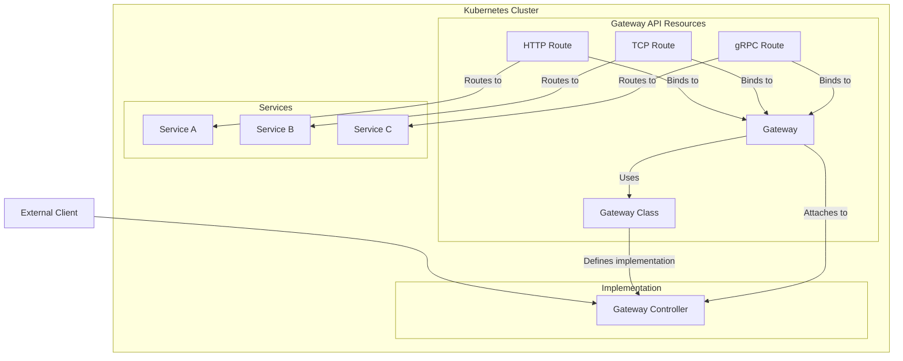

Gateway API advantages:

- Separates concerns through role-oriented resources
- Provides more expressive routing capabilities
- Supports multiple protocols beyond HTTP
- Enables cross-namespace routing
- Allows for more extensibility through custom resources
- Is designed for diverse infrastructure environments

## Network Policy Components

A Network Policy specification includes:

1. **podSelector**: Identifies the pods to which the policy applies
2. **policyTypes**: Specifies whether the policy applies to ingress, egress, or both
3. **ingress**: Rules defining allowed incoming traffic
4. **egress**: Rules defining allowed outgoing traffic

### The Anatomy of a Policy

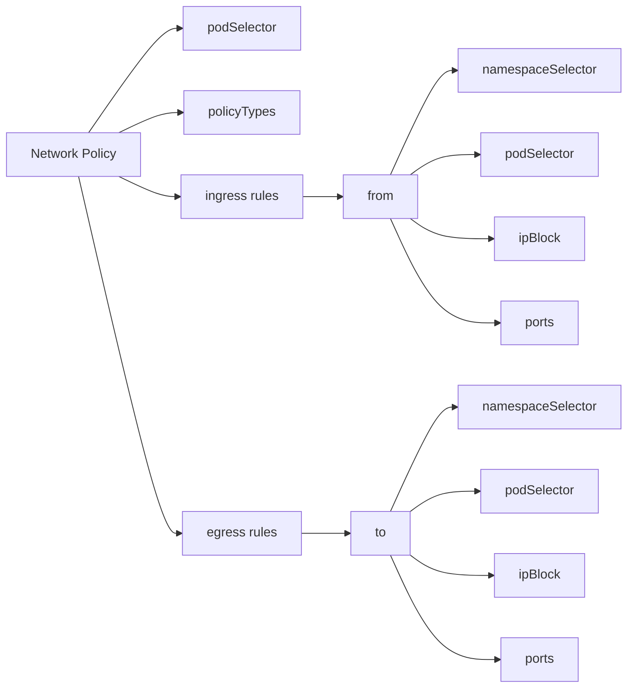

## Service Types and Network Policies

Each service type interacts differently with Network Policies:

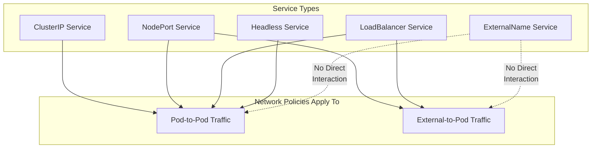

### Network Policy Considerations for Service Types

- **ClusterIP**: Network Policies control which pods can access the service within the cluster.
- **NodePort/LoadBalancer**: Network Policies control pod access but do not directly restrict external client traffic to exposed node ports or load balancer IPs. Additional security measures (like firewall rules) are needed.
- **ExternalName**: Network Policies don't affect the DNS resolution but can control traffic to pods that might be making the external connections.
- **Headless Services**: Network Policies directly apply to the underlying pod IPs that headless services expose.
- **Ingress/Gateway API**: Network Policies apply to the pods implementing the ingress controller or gateway, not to the routing rules themselves.

## Common Network Policy Patterns

### 1. Default Deny All Ingress Traffic

This policy ensures that selected pods reject all incoming traffic unless explicitly allowed by another policy.

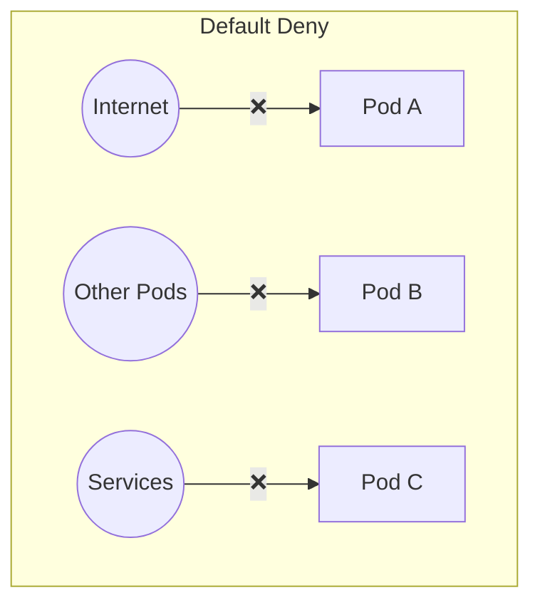

### 2. Allow Traffic from Specific Pods

This pattern allows pods with specific labels to communicate with each other.

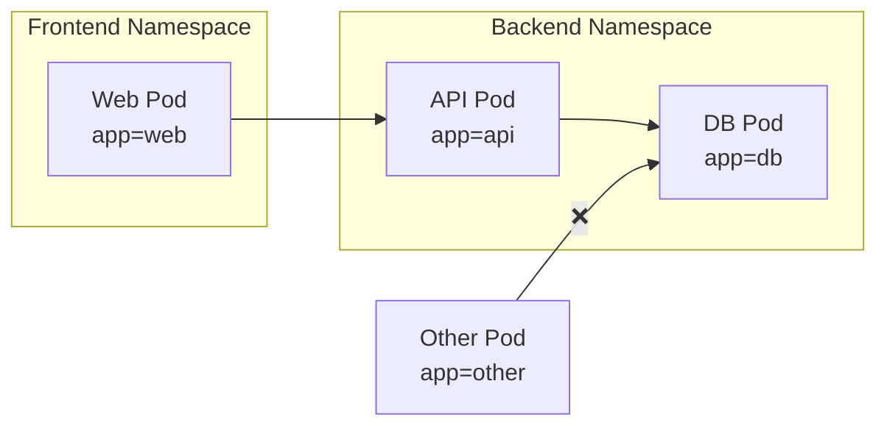

### 3. Allow Traffic to Specific External Endpoints

This pattern allows pods to access specific external services while blocking other outbound traffic.

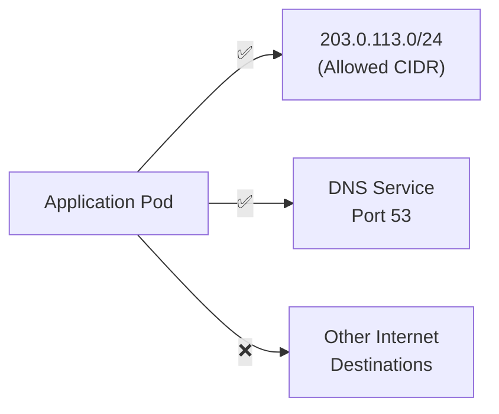

### 4. Namespace Isolation

This pattern isolates pods in different namespaces, allowing communication only within the same namespace.

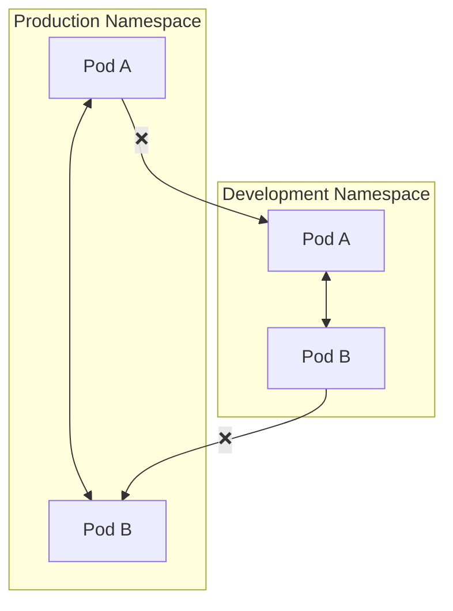

## Advanced Use Cases

### Multi-tier Application Segmentation

For a typical three-tier application architecture:

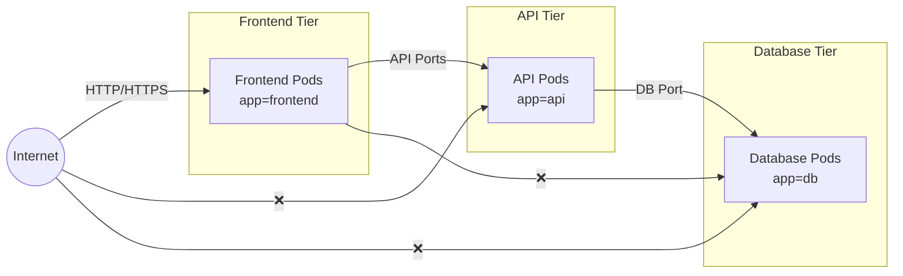

### Zero Trust Architecture

Implementing a zero trust model where all communication is explicitly approved:

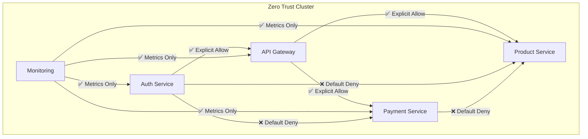

## Network Policy Best Practices

### 1. Start with Restrictive Default Policies

Create default policies that deny all traffic and then add specific allow rules. This follows the principle of least privilege.

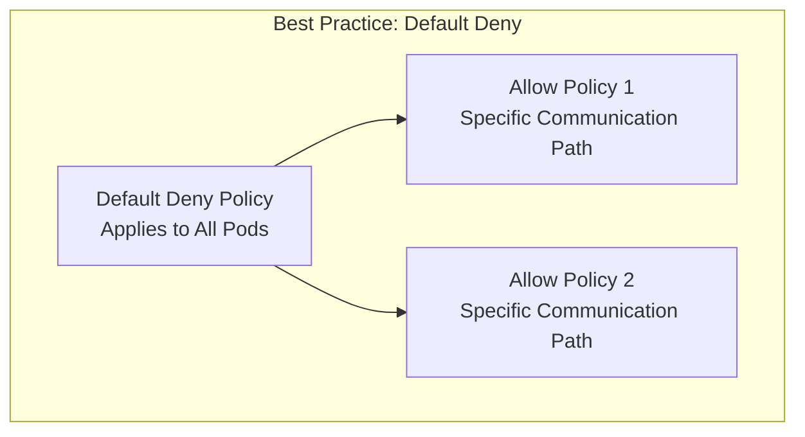

### 2. Use Namespaces for Isolation

Group related resources in namespaces and create policies for namespace-level isolation.

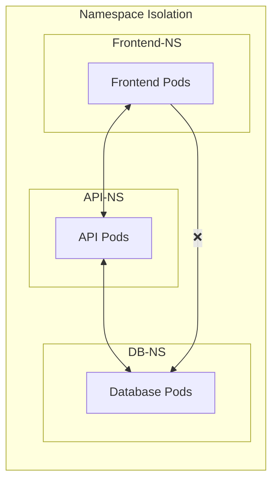

### 3. Label-based Selections

Use consistent and meaningful labels to select pods for network policies.

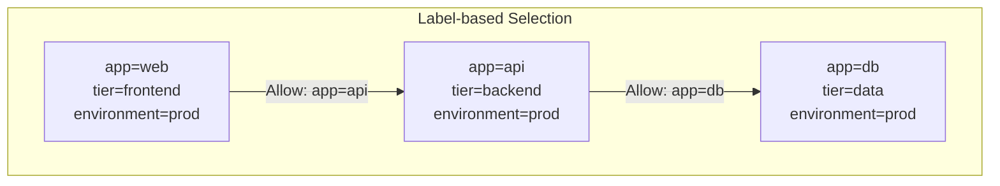

### 4. Allow Required System Communication

Ensure policies allow necessary system traffic such as DNS, monitoring, and logging.

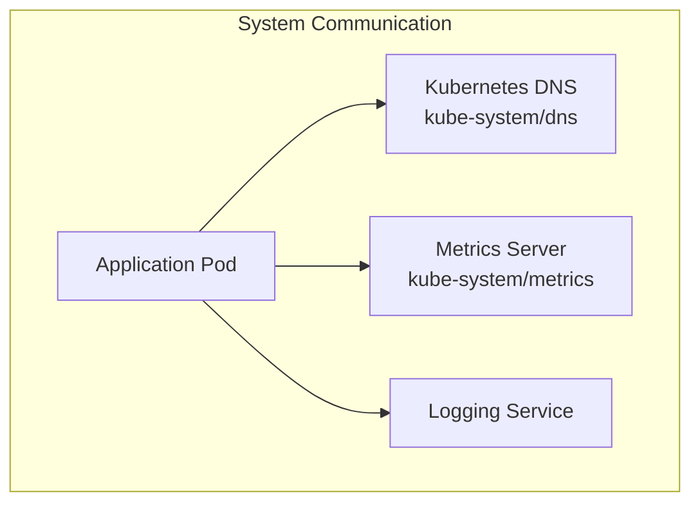

### 5. Test Policies in Non-production First

Validate your network policies in development or staging environments before applying them in production.

```mermaid
flowchart LR
    Policy["Network Policy"] --> Dev["Development\nEnvironment"]
    Dev --> |"Validate"| Stage["Staging\nEnvironment"]
    Stage --> |"Verify"| Prod["Production\nEnvironment"]
    
    Dev --> |"Issues Found"| Revise["Revise Policy"]
    Stage --> |"Issues Found"| Revise
    Revise --> Dev
```

### 6. Service Type-Specific Considerations

```mermaid
flowchart TB
    subgraph "Service-Specific Network Policy Strategy"
        S1["ClusterIP Services\nStandard Network Policies"]
        S2["NodePort/LoadBalancer\nCombine with External Firewalls"]
        S3["Headless Services\nPod-specific Policies"]
        S4["Ingress/Gateway\nPolicy for Controller Pods"]
    end
```

- For ClusterIP services, focus on pod selectors and namespaces
- For NodePort and LoadBalancer services, combine Network Policies with external firewalls
- For Headless services, create precise pod-to-pod communication rules
- For Ingress and Gateway API, secure the controller pods and implement additional authentication

## Common Network Policy Examples

### 1. Deny All Ingress Traffic to a Namespace

Blocks all incoming connections to pods in a namespace unless explicitly allowed.

### 2. Allow Ingress from a Specific Pod

Permits connections from specific pods based on pod labels.

### 3. Allow Specific External Traffic

Allows connections from specific IP ranges outside the cluster.

### 4. Restrict Egress Traffic

Limits outbound connections from pods to specific destinations.

### 5. Allow DNS Communication

Ensures pods can resolve DNS queries by allowing traffic to the DNS service.

## Troubleshooting Network Policies

### Common Issues

1. **Policy Not Applied**: Verify that your CNI plugin supports Network Policies
2. **Unexpected Blocking**: Check for conflicting policies or missing label selectors
3. **DNS Resolution Failures**: Ensure policies allow traffic to kube-dns service
4. **Metrics Collection Issues**: Verify policies allow traffic to monitoring services

### Debugging Tips

1. **Use Simple Test Pods**: Deploy debug pods to test connectivity
2. **Log Traffic**: Enable network traffic logging in your CNI
3. **Visualize Policies**: Use tools like Cilium Network Policy Editor or Calico visualization
4. **Policy Simulation**: Some CNIs offer policy simulation features

```mermaid
flowchart TB
    Start["Connectivity Issue"] --> Check1["Check CNI Support"]
    Check1 --> Check2["Verify Pod Labels"]
    Check2 --> Check3["Inspect Active Policies"]
    Check3 --> Check4["Test with Debug Pods"]
    Check4 --> Check5["Check CNI Logs"]
    Check5 --> Solution["Resolve Issue"]
```

## Network Policy Limitations

1. **Protocol Limitations**: Most implementations focus on TCP/UDP and may have limited support for other protocols
2. **Application Layer**: Network Policies operate at L3/L4, not at L7 (application layer)
3. **Performance Impact**: Complex policies may impact network performance
4. **State Tracking**: Limited stateful inspection capabilities

```mermaid
flowchart TD
    NP["Kubernetes Network Policies"]
    
    subgraph "What They Can Do"
        L3L4["Control L3/L4 Traffic\n(IP/Port based)"]
        IPBlock["Filter by IP CIDR Blocks"]
        NS["Namespace-based Controls"]
        Label["Label-based Selection"]
    end
    
    subgraph "What They Can't Do"
        L7["Deep L7 Inspection\n(HTTP Headers, etc.)"]
        DPI["Deep Packet Inspection"]
        SPI["Stateful Packet Inspection"]
        Content["Content Filtering"]
    end
    
    NP --> L3L4
    NP --> IPBlock
    NP --> NS
    NP --> Label
    
    L7 -.-> |"Requires Service Mesh\nor Advanced CNI"| NP
    DPI -.-> |"Requires Additional\nSecurity Tools"| NP
    SPI -.-> |"Limited Support\nin Some CNIs"| NP
    Content -.-> |"Requires API Gateway\nor Service Mesh"| NP
```

## Extending Network Policies

Many CNI providers offer extended capabilities beyond standard Kubernetes Network Policies:

- **Calico**: Global network policies, DNS policies, and more granular rules
- **Cilium**: L7 filtering based on HTTP/gRPC attributes
- **Istio**: Service mesh capabilities with mTLS and more advanced traffic controls

```mermaid
flowchart TB
    K8s["Kubernetes Network Policies\nBasic L3/L4 Control"]
    
    K8s --> Calico["Calico\n- Global Policies\n- DNS Policies\n- Advanced RBAC"]
    K8s --> Cilium["Cilium\n- L7 Filtering\n- API-aware\n- Identity-based"]
    K8s --> Istio["Istio\n- mTLS\n- Traffic Shifting\n- Circuit Breaking"]
    
    Calico --> Advanced["Advanced Network\nSecurity Posture"]
    Cilium --> Advanced
    Istio --> Advanced
```

## Implementation Strategies

### Progressive Lockdown Approach

A methodical way to implement network policies without disrupting existing services:

```mermaid
flowchart LR
    Start["Current State:\nAll Traffic Allowed"] --> Observe["Observe & Document\nTraffic Patterns"]
    Observe --> Defaults["Apply Default\nDeny Policies"]
    Defaults --> Allow["Add Explicit\nAllow Rules"]
    Allow --> Monitor["Monitor for\nDisruptions"]
    Monitor --> Refine["Refine Policies"]
    Refine --> |"Iterate"| Observe
```

1. **Observe**: Document existing traffic patterns
2. **Apply Defaults**: Create default deny policies
3. **Add Explicit Rules**: Allow necessary traffic
4. **Monitor**: Watch for disruptions
5. **Refine**: Adjust policies as needed

### Security Zones Model

Organize your cluster into security zones with different trust levels:

```mermaid
flowchart TB
    subgraph "Public Zone"
        Ingress["Ingress Controllers"]
        FrontEnd["Public-facing Apps"]
    end
    
    subgraph "Restricted Zone"
        API["Internal APIs"]
        Auth["Authentication Services"]
    end
    
    subgraph "Private Zone"
        DB["Databases"]
        Secrets["Secret Stores"]
    end
    
    Public["External Traffic"] --> Ingress
    Ingress --> FrontEnd
    FrontEnd --> API
    API --> Auth
    Auth --> DB
    Auth --> Secrets
    
    Public -- ❌ --> API
    Public -- ❌ --> Auth
    Public -- ❌ --> DB
    Public -- ❌ --> Secrets
    FrontEnd -- ❌ --> DB
    FrontEnd -- ❌ --> Secrets
```

## Real-World Network Policy Examples

### Microservices Architecture

```mermaid
flowchart TD
    subgraph "Frontend Services"
        UI["UI Service"]
        Mobile["Mobile API"]
    end
    
    subgraph "API Layer"
        Gateway["API Gateway"]
        Auth["Auth Service"]
        Products["Product Service"]
        Orders["Order Service"]
    end
    
    subgraph "Data Layer"
        ProductDB["Product DB"]
        OrderDB["Order DB"]
        UserDB["User DB"]
    end
    
    Client((Client)) --> UI
    Client --> Mobile
    
    UI --> Gateway
    Mobile --> Gateway
    
    Gateway --> Auth
    Gateway --> Products
    Gateway --> Orders
    
    Auth --> UserDB
    Products --> ProductDB
    Orders --> OrderDB
    Orders --> ProductDB
    
    Client -- ❌ --> Gateway
    Client -- ❌ --> Auth
    Client -- ❌ --> Products
    Client -- ❌ --> Orders
    Client -- ❌ --> ProductDB
    Client -- ❌ --> OrderDB
    Client -- ❌ --> UserDB
    
    UI -- ❌ --> ProductDB
    UI -- ❌ --> OrderDB
    UI -- ❌ --> UserDB
    UI -- ❌ --> Auth
    UI -- ❌ --> Products
    UI -- ❌ --> Orders
    
    Mobile -- ❌ --> ProductDB
    Mobile -- ❌ --> OrderDB
    Mobile -- ❌ --> UserDB
    Mobile -- ❌ --> Auth
    Mobile -- ❌ --> Products
    Mobile -- ❌ --> Orders
    
    Gateway -- ❌ --> ProductDB
    Gateway -- ❌ --> OrderDB
    Gateway -- ❌ --> UserDB
```

### PCI Compliance Example

Isolating payment processing components for PCI DSS compliance:

```mermaid
flowchart TD
    subgraph "Non-PCI Scope"
        UI["UI Services"]
        Products["Product Services"]
        Analytics["Analytics"]
    end
    
    subgraph "PCI Scope" 
        style PCI Scope fill:#f96,stroke:#333
        Payment["Payment Processing"]
        CardData["Card Data Storage"]
        TokenService["Tokenization Service"]
    end
    
    UI --> Products
    UI --> Payment
    Products --> Payment
    
    Payment --> TokenService
    TokenService --> CardData
    
    UI -- ❌ --> CardData
    UI -- ❌ --> TokenService
    Products -- ❌ --> CardData
    Products -- ❌ --> TokenService
    
    Analytics --> Products
    Analytics -- ❌ --> Payment
    Analytics -- ❌ --> CardData
    Analytics -- ❌ --> TokenService
```

## Comparison with Other Security Controls

Network Policies work alongside other Kubernetes security mechanisms:

```mermaid
flowchart TD
    subgraph "Kubernetes Security Controls"
        NP["Network Policies\nTraffic Control"]
        RBAC["RBAC\nAPI Access Control"]
        PSP["Pod Security\nContainer Security"]
        SA["Service Accounts\nIdentity"]
        
        NP <--> RBAC
        NP <--> PSP
        NP <--> SA
        RBAC <--> PSP
        RBAC <--> SA
        PSP <--> SA
    end
```

### Complementary Controls

- **RBAC**: Controls who can access Kubernetes APIs and resources
- **Pod Security**: Restricts container capabilities and privileges
- **Service Accounts**: Provides identity for pods
- **Network Policies**: Controls pod-to-pod and external communication

## Conclusion

Network Policies are essential for securing Kubernetes workloads by controlling pod-to-pod communication. They enforce the principle of least privilege, segment network traffic, and establish clear security boundaries. By implementing the patterns and best practices outlined in this document, you can significantly improve your cluster's security posture.

The combination of properly configured Network Policies with appropriate Service types allows for fine-grained control over both internal and external network traffic. Understanding how different Service types interact with Network Policies is crucial for building a secure and well-designed Kubernetes networking architecture.

Remember that Network Policies are just one layer in a defense-in-depth strategy. They should be combined with other security practices such as RBAC, seccomp, AppArmor, and regular security audits for comprehensive protection.

By starting with a "default deny" approach and carefully allowing only necessary communication paths, you can create a secure and well-defined network architecture in your Kubernetes clusters, reducing your attack surface and improving your overall security posture.