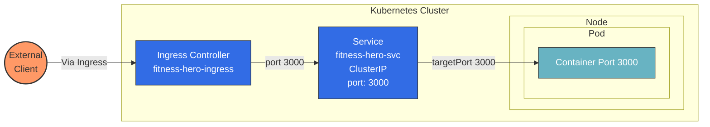
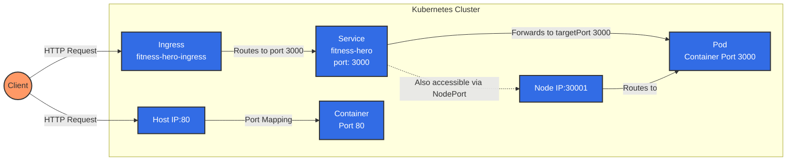
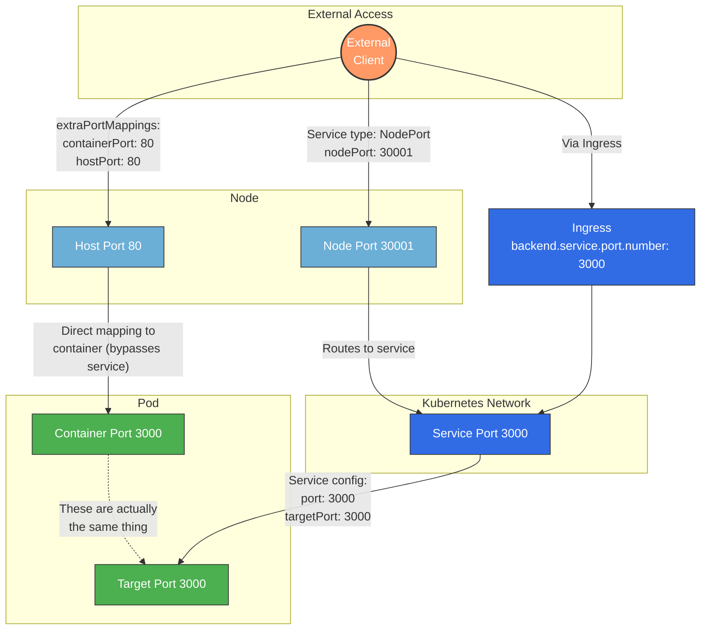

# Kubernetes Networking: Understanding Port Mappings

## Introduction

Kubernetes offers a sophisticated networking model with multiple layers of abstraction to route traffic from external clients to application containers. This document explains the different port types, their relationships, and how traffic flows through a Kubernetes cluster across various scenarios.

## Port Types and Relationships

### Core Port Types

1. **containerPort**
   - Where your application listens inside the container
   - Defined in Pod/Deployment specifications
   - Example: `containers: [{ ports: [{ containerPort: 3000 }] }]`

2. **targetPort**
   - Where the Service directs traffic on the Pods
   - Defined in Service specifications
   - Example: `ports: [{ targetPort: 3000 }]`

3. **port**
   - The port exposed by the Service within the cluster
   - Defined in Service specifications
   - Example: `ports: [{ port: 3000 }]`

4. **nodePort**
   - External port opened on every node's IP
   - Used with Service type: NodePort
   - Valid range: 30000-32767
   - Example: `ports: [{ nodePort: 30001 }]`

5. **hostPort**
   - Maps a container port directly to the host node
   - Bypasses Kubernetes networking
   - Example: `extraPortMappings: [{ hostPort: 80, containerPort: 80 }]`

### Critical 1:1 Relationships

- **containerPort = targetPort**: The most fundamental relationship. These ports must match because they represent the same thing - where your application listens for traffic.

- **Service port → targetPort**: Defines how the Service's internal port maps to the application's port. This allows for port translation if needed.

- **nodePort → Service port**: Links the externally accessible port on all nodes to the Service's internal port.

- **hostPort → containerPort**: Creates a direct path from a node's external port to a specific container, bypassing Kubernetes Services.

## Traffic Flow Diagrams

### Scenario 1: Basic Ingress to ClusterIP Service



**Explanation:**
- External clients can only access the application through the Ingress
- The Ingress routes to the Service based on hostname and path rules
- The ClusterIP Service forwards traffic to Pods with matching labels
- ClusterIP Services are only accessible from within the cluster (most secure)
- This is the recommended pattern for production environments

### Scenario 2: Multiple Access Paths (NodePort)



**Explanation:**
- Multiple entry points exist into the application
- Path 1: External client → Ingress → Service → Pod (fully managed)
- Path 2: External client → NodePort → Service → Pod (bypasses Ingress)
- Path 3: External client → hostPort → Container (bypasses both Ingress and Service)
- NodePort and hostPort create additional attack surfaces

### Scenario 3: Detailed Port Relationships



**Explanation of 1:1 Relationships:**

1. **containerPort ↔ targetPort**
   - These represent the same thing: the port where your application listens inside the container
   - If your application code listens on port 3000, both should be set to 3000
   - This is the most critical relationship to get right

2. **Service port → targetPort**
   - Service port (3000) is what other services in the cluster use to communicate with this service
   - The Service then forwards traffic to the targetPort (3000) on the Pod
   - These can be different (e.g., service port 80 → targetPort 3000), enabling port translation

3. **nodePort → Service port**
   - nodePort (30001) exposes the Service externally on all node IPs
   - Traffic arriving at nodePort gets forwarded to the Service port (3000)
   - Only applicable with Service type: NodePort or LoadBalancer

4. **hostPort → containerPort**
   - Creates a direct mapping from the node's network interface to the container
   - Bypasses the Kubernetes Service network entirely
   - Generally used only in development environments or specific use cases

## Service Types and Their Impact

### ClusterIP (Internal Only)
```yaml
spec:
  type: ClusterIP  # Default type
  selector:
    app: fitness-hero
  ports:
    - port: 3000        
      targetPort: 3000
```
- Only accessible from within the cluster
- Most secure option for production environments
- Requires an Ingress or API Gateway for external access

### NodePort (External via Node IPs)
```yaml
spec:
  type: NodePort
  selector:
    app: fitness-hero
  ports:
    - port: 3000        
      targetPort: 3000  
      nodePort: 30001    
```
- Exposes the service on every node's IP at the specified nodePort
- Creates an additional entry point beyond the Ingress
- Increases the attack surface
- Useful for development or testing

### LoadBalancer (External via Cloud Provider)
```yaml
spec:
  type: LoadBalancer
  selector:
    app: fitness-hero
  ports:
    - port: 3000        
      targetPort: 3000
```
- Provisions an external load balancer from the cloud provider
- Automatically distributes traffic to nodes
- Each service gets its own external IP (potentially costly)

## Common Configurations and Best Practices

### Production Configuration
For production environments, prefer ClusterIP services with Ingress:
```yaml
# Service
apiVersion: v1
kind: Service
metadata: 
  name: fitness-hero
  namespace: frontend
spec:
  type: ClusterIP
  selector:
    app: fitness-hero
  ports:
    - port: 3000        
      targetPort: 3000

# Ingress
apiVersion: networking.k8s.io/v1
kind: Ingress
metadata:
  name: fitness-hero-ingress
  namespace: frontend
  annotations:
    nginx.ingress.kubernetes.io/rewrite-target: /
spec:
  rules:
  - host: fitness-hero.example.com
    http:
      paths:
      - path: /
        pathType: Prefix
        backend:
          service:
            name: fitness-hero
            port:
              number: 3000
```

### Security Considerations

1. **Minimize Direct Access Points**
   - Avoid NodePort and hostPort in production
   - Use ClusterIP services with properly configured Ingress resources

2. **Network Policies**
   - Implement Kubernetes NetworkPolicies to restrict which pods/services can access your service

3. **Node Security**
   - Ensure cluster nodes are in private subnets where external traffic can't directly reach NodePorts
   - Configure firewall rules at the infrastructure level

4. **Service Name Consistency**
   - Ensure Ingress backend.service.name matches your actual Service name
   - Mismatches will prevent traffic from flowing properly

## Troubleshooting

### Service-to-Pod Connectivity Issues
- Verify that Service selector matches Pod labels
- Ensure containerPort matches targetPort
- Check Pod health and readiness

### Ingress-to-Service Issues
- Verify Service name matches what's configured in the Ingress
- Ensure Service port matches Ingress backend port configuration
- Check Ingress controller logs for routing errors

### External Access Issues
- For NodePort: Verify node IPs are reachable and firewall rules allow traffic
- For Ingress: Check DNS configuration points to Ingress controller
- For both: Ensure cluster network policies don't block traffic

## Conclusion

Understanding Kubernetes port mappings is essential for properly configuring application networking. The relationships between containerPort, targetPort, Service port, nodePort, and hostPort define how traffic flows through the system. For production environments, the most secure approach is to use ClusterIP services with Ingress resources, providing a controlled and manageable entry point to your applications.