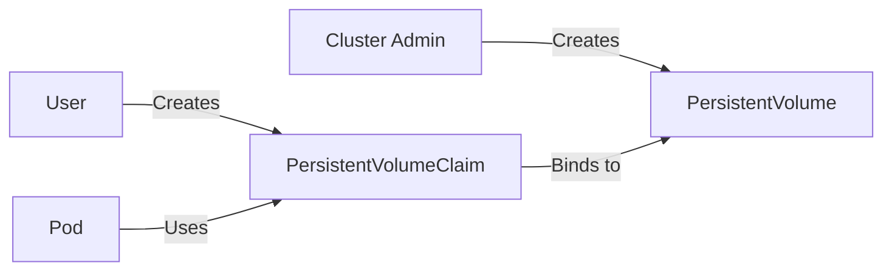
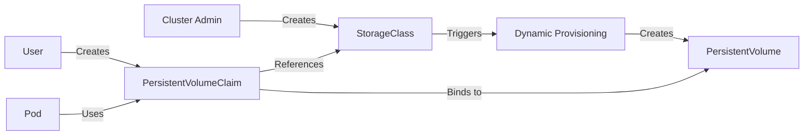
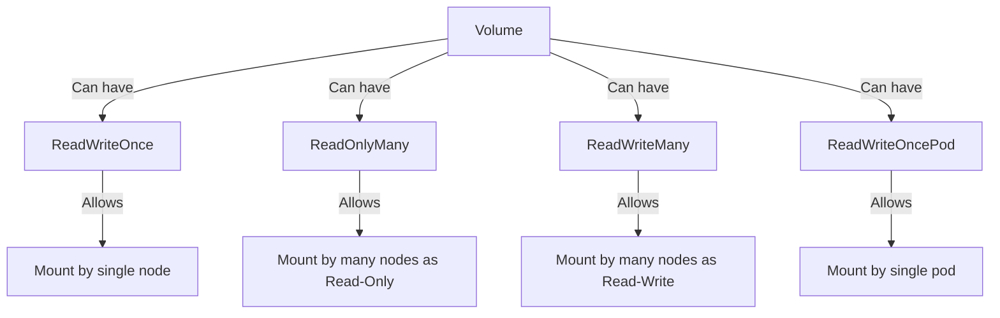
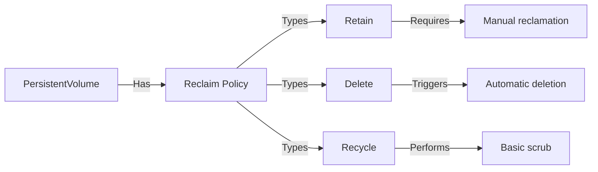
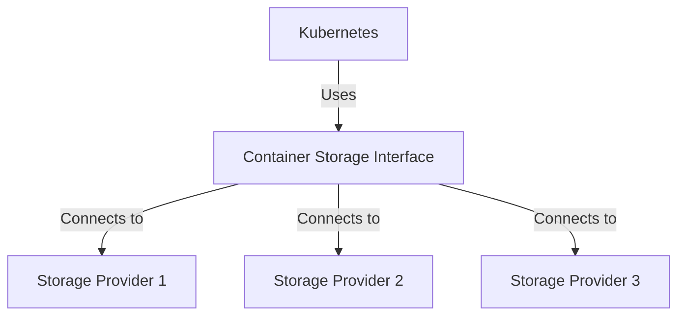

# Kubernetes Volumes: The Complete Guide

## Introduction

Kubernetes (k8s) volumes provide persistent storage solutions for containerized applications. Since containers are ephemeral by design, any data stored within them disappears when the container crashes or restarts. Volumes solve this problem by providing storage that exists independently of containers, allowing data to persist across container lifecycles.

## Volume Fundamentals

### Basic Volume Concepts

A volume in Kubernetes is a directory that is accessible to containers in a pod. Unlike containers, volumes have a lifecycle tied to the pod rather than individual containers, meaning they survive container restarts within the same pod.

### Volume Types

Kubernetes supports numerous volume types, which can be categorized as:

1. **Ephemeral Volumes**
   - **emptyDir**: Created when a pod is assigned to a node; deleted when the pod is removed
   - **configMap**: Provides a way to inject configuration data into pods
   - **secret**: Similar to configMap but for sensitive data
   - **downwardAPI**: Exposes pod and container information to applications

2. **Persistent Volumes**
   - **hostPath**: Mounts a file or directory from the host node's filesystem
   - **nfs**: Mounts an NFS share
   - **csi**: Container Storage Interface that enables using storage drivers
   - **Cloud Provider Volumes**: AWS EBS, Azure Disk, GCP Persistent Disk, etc.

## Persistent Volume System

The Persistent Volume (PV) system provides an API for users and administrators to abstract storage implementation details. This system introduces key API resources:

### PersistentVolume (PV)

A PersistentVolume is a piece of storage in the cluster provisioned by an administrator or dynamically provisioned using StorageClasses. It exists independently of any pod that uses it.

```yaml
apiVersion: v1
kind: PersistentVolume
metadata:
  name: pv-example
spec:
  capacity:
    storage: 10Gi
  accessModes:
    - ReadWriteOnce
  persistentVolumeReclaimPolicy: Retain
  storageClassName: standard
  nfs:
    path: /data
    server: nfs-server.example.com
```

### PersistentVolumeClaim (PVC)

A PersistentVolumeClaim is a request for storage by a user. Claims can request specific size and access modes.

```yaml
apiVersion: v1
kind: PersistentVolumeClaim
metadata:
  name: pvc-example
spec:
  accessModes:
    - ReadWriteOnce
  resources:
    requests:
      storage: 5Gi
  storageClassName: standard
```

### StorageClass

StorageClasses provide a way to describe the "classes" of storage offered in a cluster. Different classes might map to quality-of-service levels, backup policies, or arbitrary policies determined by the cluster administrators.

```yaml
apiVersion: storage.k8s.io/v1
kind: StorageClass
metadata:
  name: standard
provisioner: kubernetes.io/aws-ebs
parameters:
  type: gp2
reclaimPolicy: Delete
allowVolumeExpansion: true
```

## Static vs Dynamic Provisioning

### Static Provisioning

In static provisioning, a cluster administrator creates a number of PVs that carry the details of the real storage. They exist in the Kubernetes API and are available for consumption.



### Dynamic Provisioning

Dynamic provisioning eliminates the need for cluster administrators to pre-provision storage. Instead, it automatically provisions storage when requested by users.



## Volume Access Modes

Kubernetes supports different access modes for volumes:

1. **ReadWriteOnce (RWO)**: The volume can be mounted as read-write by a single node
2. **ReadOnlyMany (ROX)**: The volume can be mounted read-only by many nodes
3. **ReadWriteMany (RWX)**: The volume can be mounted as read-write by many nodes
4. **ReadWriteOncePod (RWOP)**: The volume can be mounted as read-write by a single pod

Not all volume types support all access modes. For example, AWS EBS volumes only support ReadWriteOnce.



## Reclaim Policies

When a user is done with a volume, they can delete the PVC objects from the API, allowing reclamation of the resource. The reclaim policy tells the cluster what to do with the volume after it has been released:

1. **Retain**: Manual reclamation (default)
2. **Delete**: Automatically delete the PV and associated storage
3. **Recycle**: Basic scrub (rm -rf /thevolume/*)



## Mounting Volumes in Pods

To use a PVC in a pod, include it in the pod's volume section and then mount it to a container.

```yaml
apiVersion: v1
kind: Pod
metadata:
  name: mypod
spec:
  containers:
    - name: mycontainer
      image: nginx
      volumeMounts:
        - mountPath: "/var/www/html"
          name: mypd
  volumes:
    - name: mypd
      persistentVolumeClaim:
        claimName: pvc-example
```

The volumeMounts section defines where the volume is mounted within the container's filesystem.

## Volume Mount Propagation

Mount propagation allows sharing volume mounts between containers in the same pod, or even with other pods on the same node. The field is configured in the `volumeMounts` section:

1. **None**: This volume mount will not receive any subsequent mounts
2. **HostToContainer**: This volume mount will receive all subsequent mounts
3. **Bidirectional**: This mount behaves the same as HostToContainer but any mounts created by the container will be propagated back to the host

## Volume Expansion

Some storage providers allow expanding the size of a persistent volume after creation. To enable volume expansion, set `allowVolumeExpansion: true` in the StorageClass.

To resize a volume:
1. Edit the PVC to request more storage
2. If the underlying storage provider supports online expansion, no further action is needed
3. If offline expansion is required, the pod using the volume must be deleted and recreated

## CSI (Container Storage Interface)

The Container Storage Interface (CSI) defines a standard interface for container orchestration systems like Kubernetes to expose arbitrary storage systems to their containerized workloads.

Benefits of CSI:
- Storage providers can develop a plugin once and have it work across container orchestrators
- Kubernetes can add support for new storage systems without modifying core Kubernetes code
- CSI plugins can be deployed independently of Kubernetes releases



## Volume Snapshots

Kubernetes supports volume snapshots, allowing users to create copies of their data at specific points in time.

Components:
1. **VolumeSnapshotContent**: A snapshot taken of a volume in the cluster
2. **VolumeSnapshot**: A request for a snapshot of a volume by a user
3. **VolumeSnapshotClass**: Similar to StorageClass, allows setting parameters for snapshots

Like PVs and PVCs, VolumeSnapshots and VolumeSnapshotContents are separate objects in the Kubernetes API. The separate objects enable security models where users with different permissions can interact with snapshots.

## Best Practices

### Capacity Planning
- Estimate your storage needs carefully
- Set resource limits and requests appropriately
- Consider using quotas to manage storage consumption
- Plan for growth and implement monitoring

### Security
- Use RBAC to restrict access to PVs and PVCs
- Consider using encryption for sensitive data
- Implement network policies for storage traffic
- Use security contexts to restrict container permissions

### Data Protection
- Implement regular backup solutions
- Use volume snapshots where appropriate
- Test recovery procedures
- Consider multi-region replication for critical data

### Performance Tuning
- Choose appropriate storage classes for your workloads
- Consider local storage for high-performance needs
- Use the right access mode for your application
- Profile your application's I/O patterns

## Troubleshooting Common Issues

### PVC Stuck in Pending State
- Check if there's a matching PV available
- Verify the storage class exists and is configured correctly
- Check if the requested size is available
- Look for events related to the PVC

### Volume Mount Failures
- Check if the PV is properly bound to the PVC
- Verify node access to the storage backend
- Check file permissions on the volume
- Review the kubelet logs

### Performance Issues
- Check if the storage backend is overloaded
- Verify network connectivity to storage
- Consider using a different storage class
- Review resource requests and limits

